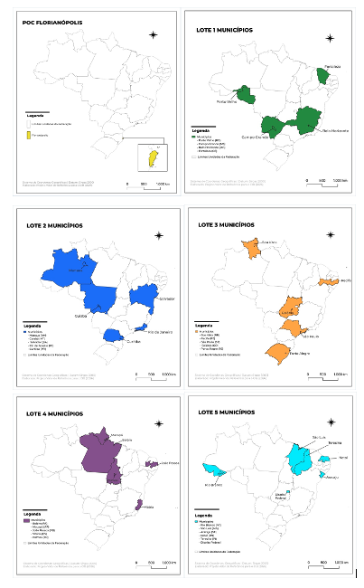
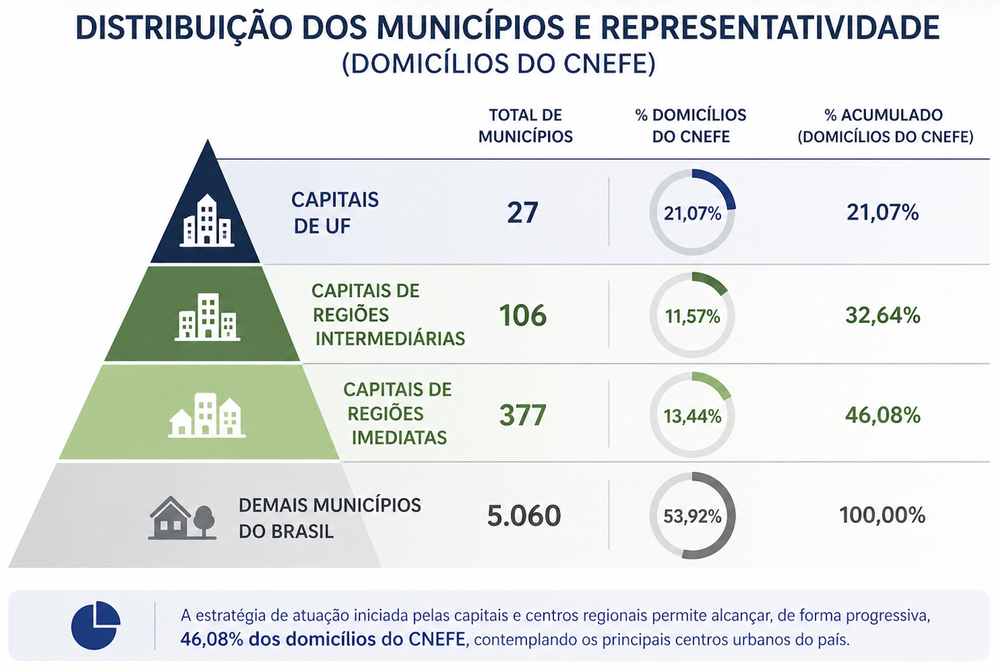
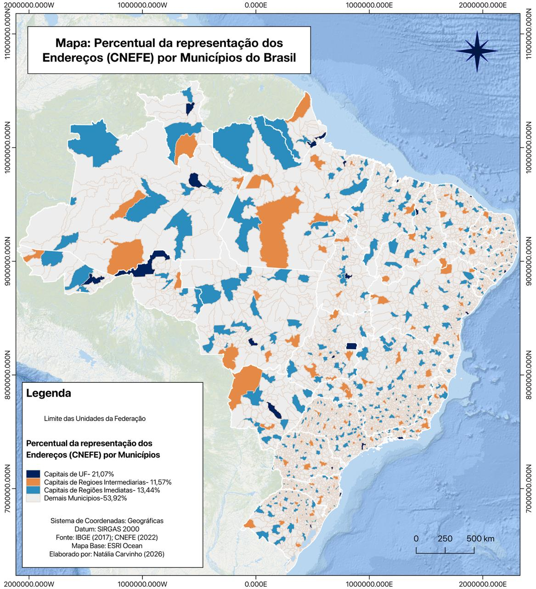
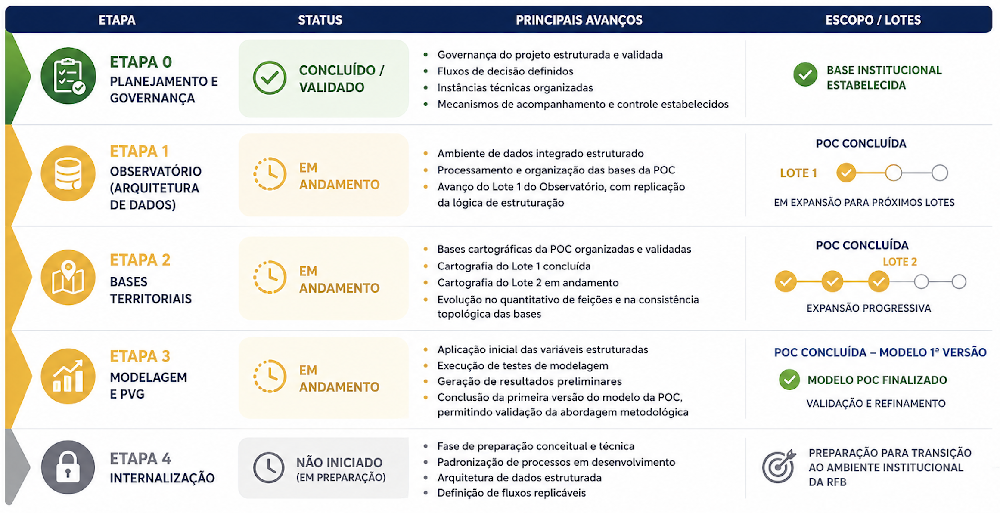

# Status Geral do Projeto por Etapa

A avaliação do status do projeto no período foi realizada com base no avanço físico das atividades, considerando a execução das etapas previstas no plano de trabalho, bem como a evolução dos diferentes lotes de produção associados à Prova de Conceito (POC) de Florianópolis e à estratégia de expansão territorial.

Para fins de acompanhamento, foi estruturado um cronograma físico de execução, complementado por painéis de monitoramento (dashboards), que permitem visualizar de forma quantitativa o progresso das atividades. Esses instrumentos consolidam informações como volume de dados processados, número de registros estruturados, variáveis geradas e modelos testados, possibilitando uma leitura integrada do avanço do projeto, tanto sob a perspectiva técnica quanto operacional.

No âmbito da execução, foi definida uma estratégia baseada em lotes de trabalho, com o objetivo de organizar o desenvolvimento de forma escalonada, controlada e progressiva. A abordagem adotada teve início com a POC de Florianópolis, que atua como ambiente de validação metodológica, permitindo testar, ajustar e consolidar os processos antes da expansão para outros contextos territoriais.

A partir dessa etapa inicial, foi estruturada uma lógica de expansão baseada em capitais, considerando critérios de diversidade regional e heterogeneidade de porte urbano. Foram definidos, inicialmente, cinco lotes de trabalho, cuja organização está apresentada no Quadro 2 - estrutura de execução por lotes, contemplando a distribuição dos municípios selecionados e a lógica de expansão controlada adotada no projeto. A definição dos municípios dentro desses lotes considerou, inicialmente, a seleção de capitais representativas de diferentes regiões do país e distintos portes populacionais, de forma a capturar a variabilidade estrutural do território nacional.

| Lote | Municipio | Descricao |
|----|----|----|
| POC Florianópolis | Florianópolis | Ambiente de validação metodológica |
| Lote 1 | Porto Velho, Fortaleza, Belo Horizonte, Campo Grande | Primeira expansão controlada |
| Lote 2 | Curitiba, Manaus, Salvador, Rio de Janeiro, Cuiabá | Segunda expansão controlada |
| Lote 3 | Porto Alegre, Boa Vista, Recife, São Paulo, Goiânia | Terceira expansão controlada |
| Lote 4 | Belém, Macapá, João Pessoa, Vitória, Palmas | Quarta expansão controlada |
| Lote 5 | Rio Branco, São Luís, Aracaju, Teresina, Natal, Distrito Federal | Quinta expansão controlada |

: Quadro 2: estrutura de execução por lote

Adicionalmente, foram elaboradas representações cartográficas específicas para cada lote de trabalho, por meio de mapas temáticos que destacam os estados correspondentes às capitais selecionadas (FIGURA 1). Esses mapas permitem visualizar de forma clara a distribuição territorial dos lotes, facilitando a compreensão da estratégia de expansão progressiva adotada no projeto, bem como a cobertura geográfica inicial da metodologia em nível nacional.

Paralelamente, foi estruturada uma proposta de escalonamento nacional das atividades, baseada na hierarquia urbana e na representatividade territorial dos municípios, construída a partir dos dados de domicílios do Cadastro Nacional de Endereços para Fins Estatísticos (CNEFE). Essa base contempla o universo de endereços de imóveis (residenciais e não residenciais), permitindo uma leitura mais abrangente da distribuição territorial e maior aderência às necessidades do projeto.

Inicialmente, são apresentados, na Figura 2, os quantitativos de municípios e a representatividade percentual dos endereços do CNEFE por categoria de centralidade urbana, evidenciando a concentração dos endereços nas capitais e centros regionais.

Na sequência, a Figura 3 ilustra espacialmente essa distribuição, por meio de um mapa temático que apresenta o percentual de representação dos endereços por município, permitindo visualizar a lógica de concentração territorial e reforçando a estratégia de escalonamento adotada no projeto.

Essa distribuição evidencia que a estratégia de atuação iniciada pelas capitais e centros regionais permite alcançar, de forma progressiva, uma parcela significativa do território nacional, considerando o universo de endereços de imóveis cadastrados, o que é particularmente relevante para a modelagem de valores de referência.

Os dados do CNEFE diferem dos dados censitários tradicionais, uma vez que não se restringem aos domicílios residenciais, mas abrangem o conjunto de endereços existentes no território, tornando-se mais aderentes às necessidades do projeto, especialmente no contexto da avaliação imobiliária e da construção de uma base nacional de valores de referência.

Importante destacar que a definição dos próximos lotes de trabalho encontra-se em fase de análise, com a incorporação de abordagens mais avançadas de seleção territorial. Nesse sentido, está sendo aplicada uma metodologia baseada em lógica fuzzy (agrupamento por similaridade), que permitirá classificar e agrupar municípios com características semelhantes, considerando múltiplos atributos (sociais, econômicos, territoriais e cadastrais). Essa abordagem visa garantir maior coerência técnica na formação dos lotes e maior eficiência na replicação da metodologia.

De forma geral, essa organização por lotes permite testar, ajustar e consolidar os processos em diferentes contextos territoriais, assegurando robustez, adaptabilidade e aderência da metodologia antes de sua ampliação em escala nacional.

A Figura 4 apresenta a visão consolidada do avanço das atividades e dos lotes de execução do projeto, permitindo uma leitura integrada do seu estágio atual. Nela é sintetizado o status geral por etapa, evidenciando o nível de desenvolvimento de cada frente de trabalho, bem como a evolução das atividades ao longo dos diferentes lotes, sob uma perspectiva técnica e operacional.

Na Etapa 0 – Planejamento e Governança, as atividades voltadas à estruturação da governança do projeto foram integralmente concluídas e devidamente validadas. Destacam-se a definição dos fluxos de tomada de decisão, a organização das instâncias técnicas e de gestão, bem como o estabelecimento dos mecanismos de acompanhamento, monitoramento e controle das atividades.

Essa etapa foi fundamental para a consolidação da base institucional do projeto, assegurando alinhamento entre as partes envolvidas e criando as condições necessárias para o desenvolvimento estruturado, controlado e escalável das demais fases.

Na Etapa 1 – Observatório (Arquitetura de Dados), atualmente em andamento, observa-se avanço significativo na consolidação da arquitetura de dados, com destaque para os resultados alcançados no âmbito da Prova de Conceito (POC) de Florianópolis e o início da expansão para novos lotes de execução. Dentre os principais avanços, destacam-se a estruturação de um ambiente de dados integrado, o processamento e a organização das bases utilizadas na POC, bem como o avanço das atividades no Lote 1 e do Lote 2 do Observatório, com a replicação da lógica de estruturação para outros municípios.

Os painéis de monitoramento (dashboards) evidenciam um crescimento consistente no volume de dados tratados e integrados, indicando uma maturidade progressiva da arquitetura de dados, tanto sob a perspectiva técnica quanto operacional.

Na Etapa 2 – Bases Territoriais, atualmente em desenvolvimento, observa-se avanço relevante tanto no âmbito da Prova de Conceito (POC) de Florianópolis quanto nos lotes iniciais de expansão. Dentre os principais avanços, destacam-se a organização e validação das bases cartográficas da POC, o avanço das atividades no Lote 1 da cartografia, com a estruturação inicial das bases territoriais, e o início do Lote 2, voltado à preparação e organização dos dados territoriais.

Os indicadores de monitoramento evidenciam evolução no quantitativo de feições territoriais estruturadas, bem como melhoria na consistência topológica das bases, indicando uma progressão consistente na consolidação e expansão da base territorial do projeto.

Na Etapa 3 – Modelagem e Planta de Valores Genéricos (PVG), observa-se um avanço inicial concentrado na Prova de Conceito (POC) de Florianópolis, com o desenvolvimento de modelos preliminares. Dentre os principais resultados, destacam-se a aplicação inicial das variáveis estruturadas, a execução de testes de modelagem, a geração de resultados preliminares e a conclusão da primeira versão do modelo da POC, permitindo uma validação inicial da abordagem metodológica proposta.

Os dashboards de acompanhamento evidenciam evolução no número de modelos testados e na capacidade de processamento das variáveis, indicando um progresso consistente da etapa, ainda em fase de validação, calibração e refinamento metodológico.

A Etapa 4 – Internalização ainda não foi iniciada formalmente, encontrando-se em fase de preparação conceitual e técnica. Apesar disso, as atividades desenvolvidas nas etapas anteriores já incorporam elementos estruturantes essenciais para a futura internalização da metodologia, tais como a padronização de processos, a estruturação da arquitetura de dados e a definição de fluxos operacionais replicáveis.

Essa preparação é fundamental para assegurar que a transição da solução para o ambiente institucional da Receita Federal do Brasil ocorra de forma estruturada, segura, auditável e escalável, garantindo sua sustentabilidade em nível nacional.

A análise integrada do cronograma físico e dos indicadores operacionais demonstra que o projeto se encontra em estágio consistente de desenvolvimento, com:

-   Consolidação da POC Florianópolis como ambiente de validação

-   Avanço progressivo dos primeiros lotes de expansão

-   Estruturação das bases necessárias para escalabilidade

-   Evolução contínua da arquitetura de dados, cartografia e modelagem

A estratégia baseada em lotes tem se mostrado adequada, permitindo controle do processo, validação incremental e preparação estruturada para expansão em nível nacional.
