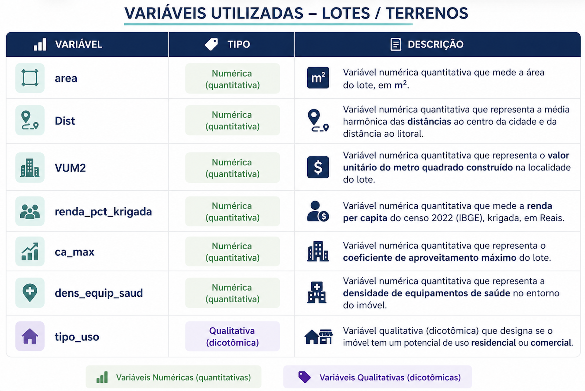
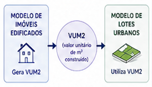
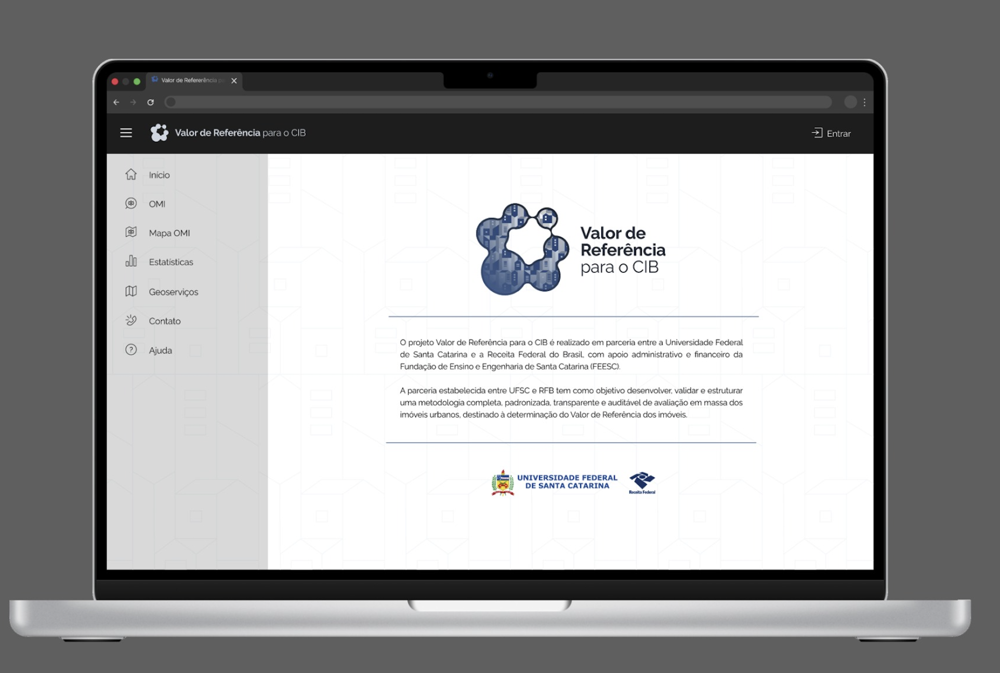
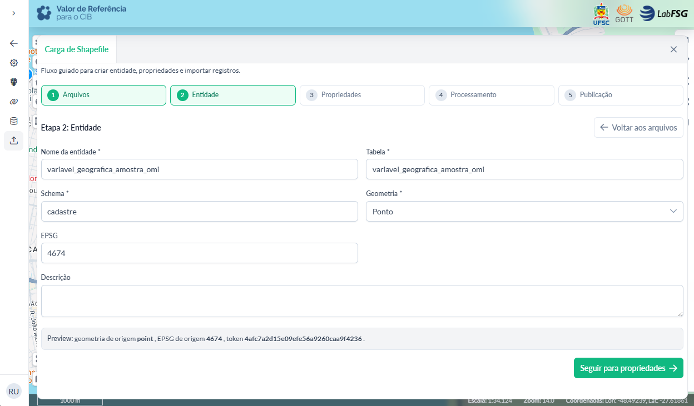
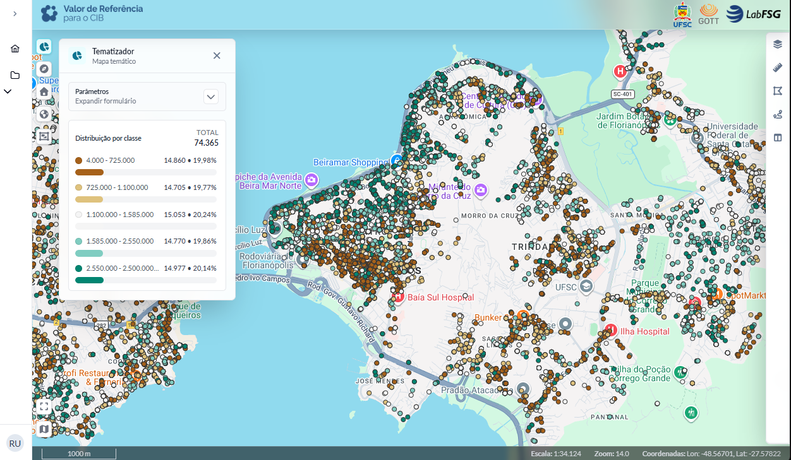
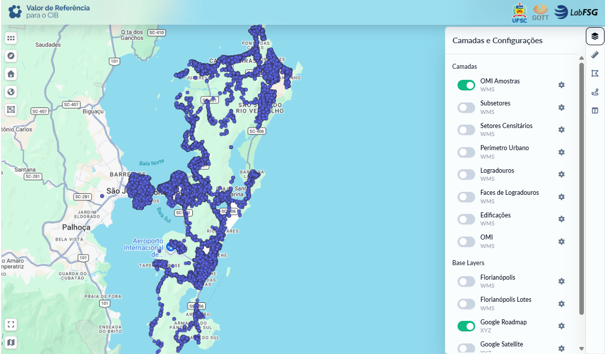
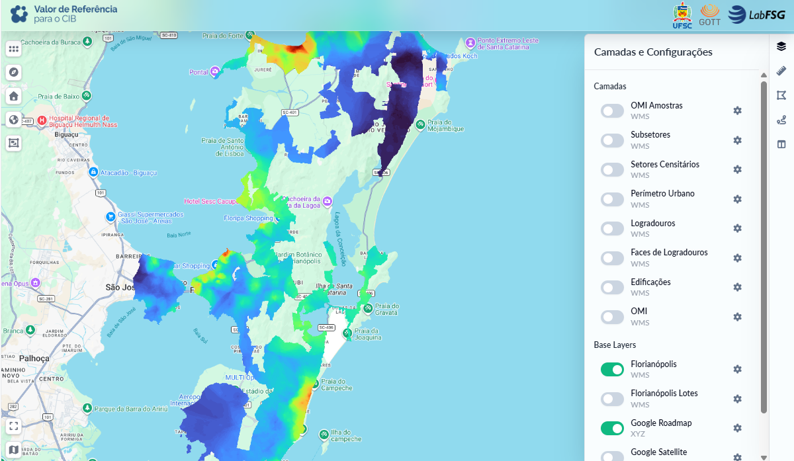
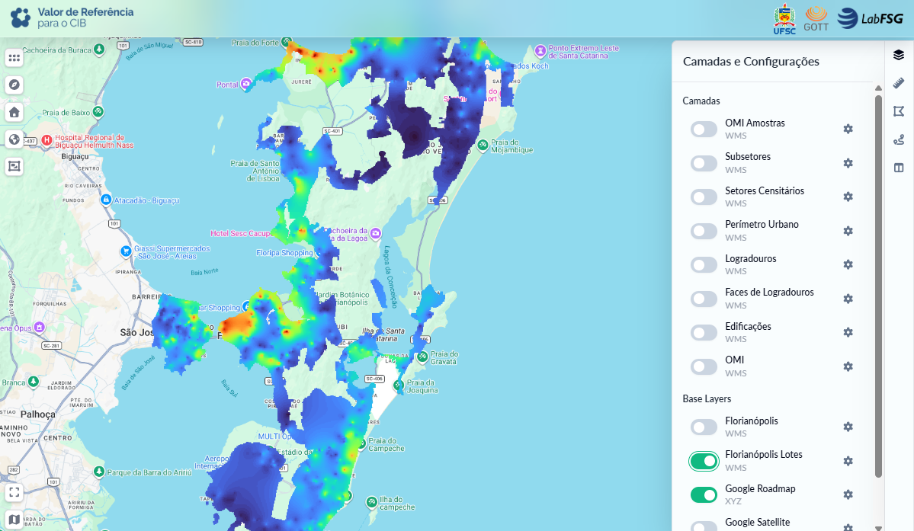

# Principais Resultados Estratégicos

Os resultados alcançados no período vão além da execução operacional das
atividades, evidenciando avanços estruturais relevantes para a consolidação da
metodologia proposta no âmbito do projeto. Esses resultados refletem a
maturidade progressiva das soluções desenvolvidas, especialmente no que se
refere à integração entre dados, modelagem, infraestrutura e governança, bem
como à capacidade de replicação em diferentes contextos territoriais.

Outro aspecto de destaque no período foi o avanço na formalização e consolidação
do fluxo metodológico do projeto, com a definição mais clara das etapas, dos
encadeamentos entre processos e da padronização dos procedimentos técnicos. Essa
evolução se refletiu na estruturação de um fluxo integrado para as Etapas 1 a 3
— Observatório, Bases Territoriais e Modelagem — contemplando desde a ingestão e
tratamento dos dados, passando pela organização territorial e geração de
variáveis, até a aplicação dos modelos de avaliação.

Paralelamente, houve avanço na organização e padronização dos scripts de
processamento, garantindo maior consistência na execução das rotinas e controle
sobre as transformações realizadas nos dados. Esses elementos são fundamentais
para assegurar reprodutibilidade, transparência, rastreabilidade e
auditabilidade, requisitos essenciais para a validação técnica e futura adoção
institucional da metodologia pela Receita Federal do Brasil.

O detalhamento completo do fluxo metodológico estruturado, incluindo suas
etapas, dependências e principais processos, encontra-se apresentado no Apêndice
1.

A seguir, são apresentados os principais resultados estratégicos do projeto,
organizados em três dimensões complementares, com foco na Prova de Conceito
(POC) de Florianópolis, na evolução da infraestrutura tecnológica e nos blocos
transversais.

No âmbito da POC, são evidenciados os avanços metodológicos e operacionais
alcançados nas Etapas 1 a 3 do projeto. Na dimensão de infraestrutura, são
apresentados os progressos relacionados à organização dos ambientes
computacionais, armazenamento de dados e suporte às atividades técnicas. Por
fim, nos blocos transversais, destacam-se os estudos desenvolvidos ao longo do
período e a plataforma de visualização dos dados, que contribuem para a análise,
validação e comunicação dos resultados.

## Validação da POC

A seguir, são apresentados os resultados referentes à validação da Prova de
Conceito (POC) de Florianópolis, que constitui o principal ambiente de teste e
consolidação da metodologia proposta no projeto. Essa etapa tem como objetivo
avaliar, de forma integrada, a consistência dos dados, a robustez dos processos
e a aderência dos resultados obtidos, permitindo verificar a viabilidade técnica
da abordagem adotada e sua capacidade de replicação em escala nacional. Os
resultados estão organizados por etapa do projeto, evidenciando os avanços
alcançados e o nível de maturidade metodológica em cada frente de atuação.

Nesse contexto, inicia-se a análise pela Etapa 1 – Observatório do Mercado
Imobiliário, responsável pela estruturação, qualificação e validação dos dados
de mercado. Trata-se de uma etapa fundamental para o projeto, uma vez que
estabelece a base informacional sobre a qual se apoiam as demais fases,
influenciando diretamente a consistência das variáveis, a qualidade da modelagem
e a confiabilidade dos resultados finais.

### Etapa 1: Observatório do Mercado Imobiliário

No âmbito da Etapa 1 – Observatório do Mercado Imobiliário, foram identificados
e sistematizados dez resultados estratégicos principais, que refletem os avanços
alcançados na validação da Prova de Conceito (POC) de Florianópolis. Esses
resultados evidenciam a evolução da arquitetura de dados, a consolidação dos
processos de tratamento e validação das informações e o nível de maturidade
alcançado na estruturação do Observatório, constituindo a base para o
desenvolvimento das etapas subsequentes.

#### Construção de uma base confiável de ofertas imobiliárias

No âmbito da Prova de Conceito (PoC) de Florianópolis, foi estruturado um
processo completo de qualificação de dados imobiliários, superando a lógica
tradicional baseada exclusivamente na coleta bruta de anúncios. A metodologia
adotada contemplou rotinas integradas de ingestão, saneamento cadastral,
padronização textual, eliminação de duplicidades, validação de consistência e
controle de integridade dos registros.

A base inicial foi composta por 83.869 ofertas imobiliárias provenientes de
portais de mercado, contendo elevado nível de ruído posicional e cadastral,
incluindo inconsistências de endereçamento, ausência de atributos obrigatórios,
duplicidades e divergências entre registros equivalentes. Para enfrentar essas
limitações, foram aplicadas rotinas automáticas e semiautomáticas de tratamento,
associadas a mecanismos de classificação e validação da qualidade dos dados.

O processo permitiu reduzir significativamente as inconsistências estruturais da
base, elevando o nível de confiabilidade das informações utilizadas nas etapas
subsequentes do projeto. Além da melhoria da consistência cadastral, a
metodologia possibilitou maior rastreabilidade dos registros, padronização
operacional e controle sobre a origem e transformação dos dados ao longo do
pipeline analítico.

Dessa forma, a PoC demonstrou a viabilidade de construção de uma base de mercado
estruturada e tecnicamente confiável para uso fiscal, reduzindo a dependência de
informações puramente autodeclaradas e ampliando o potencial de utilização dos
dados de mercado na geração do Valor de Referência.

**Resultado estratégico**:

Criação de uma base de mercado qualificada, com maior consistência,
rastreabilidade e confiabilidade para uso fiscal, reduzindo a dependência de
dados autodeclarados ou sem validação, constituindo o núcleo de dados do
Observatório do Mercado Imobiliário.

#### Estruturação de um pipeline completo de dados

Foi desenvolvido um pipeline técnico integrado para processamento de dados
imobiliários em larga escala, contemplando todas as etapas do fluxo operacional
do Observatório: ingestão, tratamento, validação, classificação e armazenamento
dos dados.

A arquitetura implementada integrou o Datalake em formato Parquet ao ambiente
analítico PostgreSQL/PostGIS, permitindo processamento eficiente de grandes
volumes de dados espaciais e alfanuméricos. O fluxo operacional foi estruturado
de forma modular e reprodutível, possibilitando rastreabilidade integral das
transformações realizadas em cada etapa do processamento.

A metodologia implementada contemplou:

-   ingestão automatizada e normalização dos dados;

-   padronização textual e cadastral;

-   geocodificação via ArcGIS;

-   validação cruzada com a base oficial do CNEFE;

-   classificação de qualidade posicional e cadastral;

-   armazenamento estruturado em ambiente espacial relacional.

Essa estrutura permitiu processar de forma controlada os 83.869 registros da PoC
de Florianópolis, assegurando desempenho computacional, escalabilidade
operacional e controle metodológico sobre os resultados obtidos.

Além do ganho operacional, a adoção de um pipeline estruturado permitiu separar
claramente as etapas de transformação, validação e qualificação dos dados,
favorecendo auditoria técnica, repetibilidade metodológica e futura replicação
do modelo em outros municípios.

**Resultado estratégico**:

Operação baseada em processo técnico (pipeline) reprodutível, documentado e
escalável, com capacidade de processamento de grandes volumes de dados,
garantindo rastreabilidade, desempenho, controle de qualidade e potencial de
replicação nacional.

#### Uso do CNEFE como referência oficial de validação posicional

O Cadastro Nacional de Endereços para Fins Estatísticos (CNEFE/IBGE) foi adotado
como referência oficial de validação espacial da Prova de Conceito, atuando como
ground truth para qualificação das coordenadas provenientes do mercado
imobiliário.

A utilização do CNEFE permitiu incorporar ao processo metodológico uma base
governamental com cobertura nacional, padronização textual de endereços e
classificação do nível de precisão geográfica (nv_geo_coord), proporcionando
maior rigor técnico à validação posicional dos registros.

A metodologia foi estruturada para realizar correspondências progressivas entre
os dados de mercado e a base oficial, utilizando critérios hierárquicos de
validação e thresholds ajustados conforme o nível de precisão espacial do CNEFE.
Essa abordagem permitiu reduzir inconsistências de localização e aumentar a
confiabilidade espacial dos dados utilizados no projeto.

A integração com o CNEFE foi decisiva para viabilizar os 54.007 matches válidos
obtidos na PoC, consolidando um modelo metodológico aderente às exigências
técnicas da Receita Federal do Brasil para construção do Valor de Referência.

Além da validação espacial, a utilização do CNEFE permitiu incorporar uma camada
institucional de confiabilidade ao Observatório, reduzindo a dependência
exclusiva das coordenadas oriundas dos portais comerciais.

**Resultado estratégico**:

Fortalecimento da robustez metodológica por meio do uso de base governamental
oficial (CNEFE) como referência para validação espacial, garantindo maior
confiabilidade dos resultados e alinhamento institucional.

#### Desenvolvimento e aplicação do Geocoder V3

No desenvolvimento da Prova de Conceito de Florianópolis, foi concebido e
implementado o Geocoder V3, um motor avançado de validação espacial estruturado
especificamente para enfrentar os elevados níveis de ruído presentes nos dados
do mercado imobiliário.

A metodologia foi baseada em uma lógica hierárquica de decisão em cascata
(níveis L1 a L6), priorizando inicialmente correspondências determinísticas de
maior rigor — como CEP, logradouro e número — e avançando progressivamente para
abordagens mais flexíveis, incluindo fuzzy matching, interpolação espacial e
regras adaptativas de aceitação.

Os _thresholds_ de validação foram calibrados dinamicamente conforme o nível de
precisão geográfica do CNEFE (nv_geo_coord), permitindo equilibrar taxa de
recuperação dos registros e controle da qualidade posicional.

A aplicação da metodologia resultou em 54.007 registros com correspondência
válida na base oficial, representando uma taxa de sucesso de 87,9% sobre os
61.416 registros elegíveis para validação espacial.

Além da elevada capacidade de correspondência, destacou-se o desempenho
computacional do modelo, permitindo o processamento de aproximadamente 52 mil
registros em cerca de 2,4 minutos, com desempenho aproximadamente 17 vezes
superior às abordagens inicialmente avaliadas durante o desenvolvimento da PoC.

Os resultados demonstram não apenas a viabilidade técnica do Geocoder V3, mas
também sua capacidade operacional para aplicação em larga escala, consolidando o
modelo como componente central da arquitetura metodológica do Observatório.

**Resultado estratégico**:

Implementação de solução técnica própria para validação e qualificação espacial
das ofertas imobiliárias, com elevada precisão, alto desempenho computacional e
capacidade de operação em larga escala, com potencial de replicação em nível
nacional.

#### Processamento expressivo da base da POC Florianópolis

A Prova de Conceito demonstrou de forma consistente a capacidade operacional do
Observatório para processamento de dados imobiliários em larga escala,
abrangendo todo o ciclo de tratamento, validação e qualificação das informações
de mercado.

A base inicial foi composta por 83.869 ofertas imobiliárias, integralmente
submetidas às rotinas estruturadas do pipeline analítico, incluindo filtros de
elegibilidade, validação posicional, classificação de qualidade e controle de
integridade cadastral.

Desse universo, 61.416 registros foram considerados elegíveis para validação
espacial, atendendo aos critérios mínimos de completude e consistência cadastral
definidos na metodologia. Na sequência, 54.007 registros apresentaram
correspondência válida com a base oficial do CNEFE, evidenciando elevada
capacidade de integração entre dados de mercado e referência governamental.

Após aplicação dos filtros de qualidade posicional e cadastral, o processo
resultou em aproximadamente 14.921 registros classificados como duplamente
validados, correspondendo ao núcleo de maior confiabilidade da base analítica, o
que resultou em uma taxa de retenção final da ordem de 30% com alta qualidade
posicional, refletindo o rigor metodológico adotado na qualificação da base.

Além dos resultados quantitativos, destacou-se o desempenho computacional da
infraestrutura implementada, evidenciando capacidade operacional para
processamento massivo sem comprometimento da qualidade ou do tempo de resposta.

A PoC validou não apenas a metodologia sob o ponto de vista técnico, mas também
sua viabilidade operacional em ambiente real, demonstrando potencial para
expansão em escala nacional.

**Resultado estratégico**:

Validação da capacidade operacional para processamento de grandes volumes de
dados imobiliários, com eficiência computacional, controle de qualidade e
viabilidade em escala urbana.

#### Criação de filtros independentes de qualidade

Foi estruturado um modelo metodológico baseado em dois eixos independentes de
validação: qualidade posicional e qualidade cadastral/econômica. Permitindo uma
análise mais precisa e controlada dos dados de mercado. Essa abordagem separa
explicitamente a qualidade posicional que está relacionada à acurácia da
localização do imóvel, da qualidade cadastral/econômica que está associada à
consistência dos atributos da oferta, como área, valor e características
físicas.

A qualidade posicional foi avaliada por meio das rotinas de validação espacial
implementadas no Geocoder V3, permitindo classificar os registros conforme o
grau de confiabilidade da localização do imóvel (flag is_problematic).

Paralelamente, a qualidade cadastral/econômica foi tratada por meio de rotinas
específicas de detecção de inconsistências, duplicidades, campos ausentes e
outliers estatísticos (flag is_outlier), garantindo controle sobre integridade
dos atributos descritivos e econômicos dos imóveis.

Os resultados evidenciaram a importância dessa separação metodológica. Do
conjunto analisado, 25.325 registros apresentaram validação posicional
satisfatória; entretanto, apenas 14.921 registros atenderam simultaneamente aos
critérios de qualidade espacial e integridade cadastral.

Esse comportamento demonstrou que a validação espacial isoladamente não é
suficiente para garantir a confiabilidade fiscal do dado, tornando necessária a
análise combinada dos dois eixos de qualidade.

A estrutura implantada amplia a flexibilidade analítica do Observatório,
permitindo utilização diferenciada dos registros conforme o objetivo técnico da
análise e aumentando a transparência sobre os critérios de qualificação
utilizados.

**Resultado estratégico**:

Implementação de modelo de validação baseado em filtros independentes de
qualidade (posicional e cadastral), ampliando o controle sobre os dados e
permitindo análises mais precisas, transparentes e tecnicamente consistentes.
Essa estrutura possibilita tratar de forma distinta a validação espacial e a
integridade dos atributos, reconhecendo que uma oferta pode estar corretamente
localizada, mas apresentar inconsistências em variáveis como valor, área ou
duplicidade.

#### Geração da base duplamente validada

A aplicação integrada dos critérios de qualidade posicional e cadastral resultou
na construção de uma base final duplamente validada, representando o principal
produto técnico da Prova de Conceito (POC) de Florianópolis. Essa base
corresponde ao subconjunto de registros que atendem simultaneamente:

- aos critérios de validação posicional;

- aos critérios de consistência cadastral e econômica;

- aos controles de integridade e ausência de inconsistências relevantes.

Como resultado, foram identificados 14.921 registros plenamente validados, o que
corresponde a aproximadamente 17,8% da base total de ofertas analisadas. Estes
registros foram classificados como aptos para utilização em análises fiscais e
modelagem de valor, constituindo a camada de maior confiabilidade do
Observatório. Além disso, a qualidade espacial dessa base é evidenciada por uma
mediana de erro posicional de 8,86 metros, indicando alta precisão na
localização dos registros, compatível com aplicações fiscais e análises
territoriais detalhadas.

Metodologicamente, essa estrutura representa uma evolução relevante em relação
às abordagens tradicionais de monitoramento imobiliário, pois reconhece que a
qualidade espacial e a qualidade cadastral devem ser avaliadas de forma
independente e complementar.

Esse conjunto de dados representa, portanto, uma base qualificada e confiável,
apta para utilização direta em processos de avaliação em massa, modelagem de
valores e definição de políticas públicas. Ao restringir a análise aos registros
que atendem aos dois critérios de qualidade, o projeto reduz significativamente
o risco de distorções decorrentes de inconsistências ou imprecisões, assegurando
maior robustez aos resultados.

Dessa forma, a geração dessa base duplamente validada consolida a efetividade da
metodologia adotada, demonstrando sua capacidade de transformar dados
heterogêneos de mercado em informação estruturada, confiável e aderente às
exigências institucionais.

**Resultado estratégico**:

Disponibilização de uma base de dados duplamente validada, com elevado rigor
técnico e alta precisão posicional, representando um conjunto qualificado de
imóveis apto para análises fiscais diretas e aplicações em políticas de
avaliação em massa, com elevado nível de confiabilidade.

#### Melhoria da cobertura analítica com vias curtas

No âmbito da Prova de Conceito (PoC) de Florianópolis, foi desenvolvida e
aplicada uma metodologia específica de recuperação espacial para registros
classificados com precisão intermediária (precisão = 3), com o objetivo de
ampliar a cobertura analítica da base sem comprometer os critérios de qualidade
posicional estabelecidos pelo projeto.

A metodologia foi estruturada a partir da análise de proximidade espacial entre
os imóveis e a malha viária, com foco na identificação de vias curtas —
logradouros integralmente inseridos em um único setor censitário. A premissa
técnica adotada considera que imóveis posicionados mais próximos de vias curtas
apresentam maior confiabilidade territorial, mesmo em situações de endereçamento
incompleto ou parcialmente inconsistente.

Essa abordagem permitiu implementar um processo controlado de inferência
espacial para reaproveitamento de registros que, em metodologias convencionais,
seriam descartados por insuficiência de precisão cadastral. O modelo foi
concebido com caráter conservador, incorporando apenas registros cuja evidência
espacial apresentasse consistência suficiente para manutenção da confiabilidade
analítica da base.

A aplicação da metodologia foi realizada sobre um universo de 12.077 registros
classificados com precisão intermediária, dos quais 1.236 foram considerados
aptos para reaproveitamento espacial, correspondendo a uma taxa de recuperação
de 10,23%.

Como resultado, a cobertura analítica da base foi ampliada de aproximadamente
73% para 81%, representando ganho expressivo na disponibilidade de dados
utilizáveis para as etapas subsequentes de modelagem e análise territorial.

Além do aumento quantitativo da cobertura, a estratégia demonstrou a capacidade
do modelo de equilibrar expansão analítica e controle de qualidade, evitando
introdução de distorções relevantes na base final.

Os resultados evidenciam que técnicas controladas de inferência espacial podem
atuar como mecanismo complementar de qualificação territorial, especialmente em
cenários urbanos caracterizados por baixa completude cadastral ou
inconsistências de endereçamento.

**Resultado estratégico**:

Ampliação da cobertura analítica da base por meio de técnicas controladas de
inferência espacial, possibilitando o reaproveitamento de registros inicialmente
considerados frágeis, com manutenção dos critérios de qualidade e sem
comprometimento da precisão posicional.

#### Identificação de limitações para lotes e terrenos

Durante a execução da Prova de Conceito (PoC) de Florianópolis, foi identificado
desempenho significativamente inferior no processamento de imóveis não
edificados, especialmente lotes vagos e terrenos urbanos, quando comparado aos
demais tipos de imóveis analisados. Esse comportamento evidenciou uma limitação
estrutural relevante tanto das bases disponíveis quanto da própria metodologia
de validação posicional aplicada no projeto.

Os resultados demonstraram que a taxa de processamento para lotes e terrenos
atingiu aproximadamente 55,0%, valor significativamente inferior à média geral
observada para os demais tipos de imóveis, cuja taxa de correspondência
situou-se em torno de 89,6%. Além da menor capacidade de validação, esse
segmento apresentou maior distância média entre coordenadas, da ordem de 569,92
metros, indicando maior dispersão espacial e menor aderência aos critérios de
precisão estabelecidos pelo modelo.

A análise metodológica permitiu identificar como principais fatores associados a
esse desempenho:

-   ausência ou inconsistência de numeração predial, situação recorrente em 
lotes vagos;

-   menor cobertura do CNEFE para imóveis não edificados, uma vez que a base 
oficial é predominantemente estruturada a partir de endereços vinculados a 
edificações;

-   degradação dos scores de matching durante os processos de validação, 
especialmente em registros com baixa completude cadastral ou divergência 
significativa entre os dados informados e os registros oficiais disponíveis.

Os resultados evidenciam que, embora o modelo desenvolvido apresente elevada 
robustez para imóveis edificados, existem desafios específicos relacionados à 
validação territorial de lotes e terrenos urbanos, sobretudo em áreas de 
expansão urbana ou baixa padronização cadastral.

A identificação dessas limitações constitui um resultado metodológico importante
da PoC, pois permite orientar de forma objetiva os aprimoramentos necessários 
para evolução do modelo, incluindo:

-   revisão e calibração de thresholds específicos;

-   incorporação de bases territoriais complementares;

-   utilização de referências espaciais auxiliares;

-   desenvolvimento de estratégias diferenciadas para imóveis não edificados.

Além disso, a análise demonstrou que parte das limitações observadas decorre não
apenas da metodologia implementada, mas também das próprias fragilidades 
estruturais existentes nas bases territoriais urbanas atualmente disponíveis.

Dessa forma, a PoC contribuiu para delimitar tecnicamente um dos principais
desafios associados à expansão nacional do modelo, fornecendo subsídios
concretos para futuras evoluções metodológicas e operacionais do Observatório.

**Resultado estratégico**:

Identificação de limitações estruturais no processamento de lotes e terrenos,
configurando um ponto crítico metodológico que demanda tratamento específico
antes da expansão em nível nacional, orientando o aprimoramento da abordagem
para assegurar maior abrangência, consistência e qualidade das análises.

#### Validação comparativa com Google Maps

Foi realizada uma análise de acurácia posicional utilizando o Google Maps como
referência externa de validação (ground truth), com o objetivo de avaliar o
desempenho relativo das coordenadas provenientes do mercado (ArcGIS) e da base
oficial (CNEFE). A análise foi conduzida com uma amostra de aproximadamente
3.200 registros, geocodificados manualmente, permitindo maior no processo de
comparação e avaliação da qualidade espacial.

Os resultados demonstraram que:

-   ArcGIS apresentou melhor desempenho médio geral para posicionamento imediato
dos registros;

-   CNEFE apresentou desempenho superior nos níveis mais rigorosos de precisão 
espacial (níveis 1 e 2);

-   nível L1 do modelo apresentou aproximadamente 88,3% dos registros 
posicionados a menos de 50 metros da referência.

Os resultados também evidenciaram heterogeneidade espacial na qualidade dos 
dados, indicando diferenças relevantes de desempenho conforme a região urbana e 
o nível de precisão analisado.

A análise confirmou que nenhuma fonte isolada é suficiente para atender 
integralmente aos requisitos de qualidade espacial do projeto, demonstrando que 
a solução mais robusta reside na combinação metodológica entre dados de mercado 
e base oficial.

Essa validação externa constituiu um importante mecanismo de calibração das 
regras de decisão do modelo, permitindo definir de forma mais criteriosa qual 
fonte deve prevalecer em diferentes cenários operacionais.

**Resultado estratégico**:

Validação externa da qualidade do modelo, confirmando a robustez da abordagem
híbrida baseada na integração entre dados de mercado (ArcGIS) e base oficial
(CNEFE), bem como a construção de uma base empírica para calibração das regras
de decisão, permitindo definir, de forma criteriosa, qual coordenada deve
prevalecer em diferentes contextos operacionais.

### Etapa 2: Bases Cartográficas Territoriais

No âmbito da Etapa 2 – Bases Cartográficas Territoriais, foram identificados e
sistematizados dez resultados estratégicos principais, que refletem os avanços
alcançados na estruturação, organização e qualificação das bases territoriais
utilizadas no projeto. Esses resultados evidenciam a evolução da arquitetura
geoespacial, a consolidação dos fluxos de tratamento, padronização e validação
dos dados cartográficos, bem como o nível de maturidade atingido na produção e
gestão das informações territoriais. Tais avanços constituem a base fundamental
para a geração de variáveis geográficas e para o desenvolvimento das etapas
subsequentes, em especial a modelagem de avaliação em massa e a elaboração das
Plantas de Valores Genéricos (PVG).

#### Transformação da Etapa 2 em frente produtiva real

A Etapa 2 deixou de se restringir ao planejamento metodológico e passou a operar
como uma frente efetiva de produção territorial. No primeiro trimestre de 2026,
foram consolidados fluxos operacionais, definidos critérios de organização,
armazenamento, nomenclatura, governança, acompanhamento por sprints e integração
com as demais frentes do projeto.

Esse avanço permitiu transformar a base cartográfica territorial em um produto
técnico concreto, com geração de dados por município, estruturação de banco
espacial, documentação metodológica e produção de variáveis geográficas. A etapa
passou, portanto, a produzir insumos efetivos para a modelagem de avaliação em
massa.

**Resultado estratégico**:

Consolidação da Etapa 2 como frente produtiva real do projeto, com capacidade de
gerar bases territoriais, organizar dados espaciais e fornecer insumos
qualificados para as etapas seguintes. A cartografia passou a funcionar como uma
linha de produção territorial organizada, e não apenas como atividade de apoio.

#### Implantação do fluxo Bronze–Prata–Ouro

Foi implantado o fluxo de maturidade dos dados em três camadas: Bronze, Prata e
Ouro. A camada Bronze reúne os dados brutos cartográficos e secundários; a
camada Prata concentra os dados organizados, integrados, padronizados e
qualificados; e a camada Ouro representa a versão final consolidada, validada e
pronta para publicação e catalogação.

No trimestre, o fluxo avançou do desenho conceitual para a execução prática. A
camada Bronze foi efetivamente materializada para 11 municípios, com 16 camadas
cartográficas por município, enquanto a camada Prata também foi estruturada para
11 municípios, com 14 camadas por município. A camada Ouro ainda não foi
concluída, mas já orienta o planejamento das entregas finais.

**Resultado estratégico**: 

Implantação de uma arquitetura territorial baseada em maturidade de dados, com
separação entre dados brutos, dados qualificados e produtos finais, garantindo
rastreabilidade, controle de versões e qualidade progressiva. Criação de um
modelo operacional replicável para produção cartográfica em escala.

#### Produção territorial em 11 municípios

A produção cartográfica alcançou escala inicial concreta, com geração de bases 
territoriais para 11 municípios: Florianópolis, Fortaleza, Campo Grande, Porto 
Velho, Belo Horizonte, Rio de Janeiro, Curitiba, Salvador, Manaus, Cuiabá e 
Cajuri.

Foram produzidos 11 municípios na camada Bronze, cada um com 16 camadas 
cartográficas, e 11 municípios na camada Prata, cada um com 14 camadas, ainda 
que em diferentes níveis de maturidade e completude. Esse resultado demonstra 
que a etapa deixou de ser experimental e passou a operar com produção 
territorial replicável.

**Resultado estratégico**:

Demonstração da capacidade operacional da Etapa 2 para produzir bases 
cartográficas municipais em escala inicial, com estrutura padronizada e 
potencial de expansão para novos lotes.

#### Consolidação da PoC Florianópolis como entrega integrada

A POC de Florianópolis foi consolidada como a principal entrega integrada e 
demonstradora da Etapa 2. Ela funcionou como ambiente de teste, validação e 
refinamento metodológico, integrando base cartográfica, variáveis geográficas, 
amostra do Observatório do Mercado Imobiliário e estrutura de banco espacial 
PostGIS.

Como resultado concreto, foram disponibilizadas à Etapa 3 as 14 camadas da base
Prata de Florianópolis, juntamente com 60 variáveis geográficas geradas para o
município. A PoC ultrapassou, assim, a condição de experimento interno e passou 
a operar como referência concreta de produto territorial para a modelagem.

**Resultado estratégico**:

Validação da PoC Florianópolis como caso demonstrador da integração entre
cartografia, variáveis geográficas, dados do mercado imobiliário e modelagem de
avaliação em massa. A POC deixou de ser apenas teste e passou a ser produto
territorial efetivo para a modelagem.

#### Estruturação do dicionário e modelagem de dados espaciais

Foi estruturado o dicionário de dados da Etapa 2, com o registro de 37 camadas
distribuídas entre Bronze e Prata. Esse dicionário organiza nomes de camadas,
atributos, tipos de dados, geometrias, chaves, campos obrigatórios e informações
de origem.

Além disso, foi desenvolvida uma modelagem preliminar do banco de dados
espacial, incluindo classes cartográficas, variáveis geográficas e relações
entre entidades territoriais. Esse trabalho subsidia a persistência estruturada
dos dados no PostGIS e prepara a futura consolidação da camada Ouro.

**Resultado estratégico**: Criação de uma base lógica e documental para 
padronização, interoperabilidade, rastreabilidades e governança dos dados 
espaciais da Etapa 2.

#### Geração de variáveis geográficas para avaliação em massa

A Etapa 2 avançou na definição, classificação e geração de variáveis geográficas
voltadas à avaliação em massa. Foram identificadas 76 variáveis geográficas com
potencial de uso na modelagem, das quais 60 já foram efetivamente geradas.

Essas variáveis foram organizadas conforme diferentes escalas territoriais,
incluindo setor censitário, município e amostra do Observatório do Mercado
Imobiliário. Entre os exemplos mencionados no relatório estão distância ao
litoral, distância à massa d’água, densidade de equipamentos, lote médio,
quantidade de lotes, renda, indicadores municipais e variáveis ambientais. A
relação das 76 variáveis geográficas com potencial de uso na modelagem e as 60
efetivamente geradas encontram-se listadas no Apêndice 2.

**Resultado estratégico**:

Geração de um conjunto inicial robusto de variáveis geográficas, capaz de
qualificar a base territorial e subsidiar tecnicamente os modelos de avaliação
em massa. A cartografia passou a produzir dados uteis para avaliação em massa, e
não apenas mapas.

#### Padronização de arquivos, nomenclatura e versionamento

Foi implantada uma lógica de padronização dos arquivos GeoPackage, com
identificação por geocódigo do município, nome do município, número da revisão e
data de produção. Também foi definida a organização por UF, município e camada
de maturidade dos dados.

Na camada Prata, foi estabelecida a separação entre área parcial, destinada a
arquivos transitórios e em edição, e área final, destinada a revisões congeladas
e imutáveis. Essa estrutura permite comparar versões, rastrear entregas e
garantir maior controle sobre a evolução dos dados.

**Resultado estratégico**:

Implantação de um padrão de organização, nomenclatura e versionamento que
fortalece a rastreabilidade, a auditabilidade e a escalabilidade da produção
cartográfica.

#### Implantação de infraestrutura geoespacial com PostGIS

Foi estruturada uma infraestrutura geoespacial baseada em PostgreSQL/PostGIS,
com organização em três bancos principais: bronze, prata e ouro. Cada banco
representa um estágio de maturidade dos dados, permitindo separar dados brutos,
dados qualificados e dados finais para publicação.

Também foram definidos schemas por unidade da federação, mecanismos de ingestão
automatizada de arquivos GeoPackage, tabela de controle de ingestão, colunas de
rastreabilidade e mecanismos de auditoria por trigger. Essa infraestrutura
permite evoluir de um fluxo baseado apenas em arquivos para uma arquitetura de
dados espacial mais robusta.

**Resultado estratégico**:

Transição de um fluxo baseaem arquivos para a implantação de uma infraestrutura
geoespacial capaz de suportar armazenamento, processamento, rastreabilidade,
auditoria e integração territorial em escala.

#### Qualidade espacial e consistência topológica como critério de aceite

A qualidade espacial foi incorporada como critério permanente de aceite da Etapa
2. O relatório destaca verificações de leitura dos arquivos, compatibilidade do
sistema de referência, presença de atributos mínimos, validade geométrica,
aderência ao município, coerência espacial, duplicidades, lacunas, sobreposições
e inconsistências topológicas.

Esses controles foram especialmente relevantes para camadas como setores
censitários, setores urbanos, logradouros, faces de logradouro, subsetores e
edificações. A passagem da Bronze para a Prata passou a depender desse processo
de conferência, saneamento e qualificação técnica.

**Resultado estratégico**:

Incorporação da qualidade espacial e da consistência topológica como requisitos
formais para aceitação das bases territoriais e redução do risco de propagação
de erros para a modelagem.

#### Preparação da etapa para a escalabilidade

A Etapa 2 encerrou o trimestre com uma base conceitual, operacional e
tecnológica favorável à escalabilidade. A produção de 11 municípios na Bronze,
11 municípios na Prata, 37 camadas no dicionário, 76 variáveis identificadas e
60 variáveis geradas demonstra capacidade inicial comprovada.

Ao mesmo tempo, a escalabilidade plena dependerá da consolidação da
infraestrutura tecnológica, da automação dos fluxos, da redução de etapas
manuais, do fortalecimento da rastreabilidade e da estabilização metodológica da
geração de variáveis geográficas.

**Resultado estratégico**:

Preparação da Etapa 2 para expansão em escala nacional, com base em fluxo
padronizado, infraestrutura geoespacial, governança dos dados e produção inicial
validada.

### Etapa 3: Bases Cartográficas Territoriais

No âmbito da Etapa 3 – Modelagem e Planta de Valores Genéricos (PVG), foram
identificados e sistematizados os principais resultados estratégicos, que
refletem os avanços alcançados na estruturação, implementação e validação dos
modelos de estimação de valores imobiliários no contexto da Prova de Conceito
(POC) de Florianópolis. Esses resultados evidenciam a evolução do fluxo
metodológico de modelagem, a consolidação das estratégias de tratamento,
classificação e integração dos dados provenientes das etapas anteriores, bem
como o nível de maturidade atingido na construção de modelos econométricos e
espaciais aplicados à avaliação em massa.

Destacam-se, ainda, os avanços na geração de outputs territoriais, na
incorporação da dimensão espacial por meio de técnicas como krigagem e
interpolação, e na definição de abordagens híbridas de modelagem, combinando
métodos estatísticos e de aprendizado de máquina. Tais elementos constituem a
base para a elaboração das Plantas de Valores Genéricos (PVG), garantindo maior
aderência ao mercado, consistência técnica e potencial de replicação em escala
nacional.

#### Desempenho dos modelos econométricos

A Etapa 3 demonstrou desempenho estatístico consistente na modelagem dos valores
imobiliários da POC Florianópolis. foram elaborados dois modelos econométricos
para os imóveis de Florianópolis: um modelo voltado à estimativa de valores de
imóveis edificados e outro específico para a modelagem dos lotes urbanos. Essa
abordagem dual permitiu tratar de forma diferenciada as dinâmicas de formação de
valor associadas às edificações e ao solo urbano, garantindo maior aderência
metodológica ao comportamento do mercado imobiliário.

No caso dos imóveis edificados, foi ajustado um modelo de regressão linear
múltipla, incorporando variáveis locacionais, socioeconômicas, tipológicas e
construtivas. As variáveis utilizadas encontram-se listadas na
@fig-variaveis-edificados.

{#fig-variaveis-edificados}

O modelo apresentou desempenho robusto, com R² = 0,86 e R² ajustado = 0,86, além
de erro-padrão dos resíduos de 0,17, considerando 32.128 graus de liberdade.
Esses resultados evidenciam elevada capacidade explicativa, permitindo a geração
consistente de fatores de homogeneização e a construção da superfície de valores
do metro quadrado construído (VUM2), posteriormente utilizada na integração com
o modelo de lotes.

Para os lotes urbanos, a modelagem seguiu uma estratégia em duas etapas.
Inicialmente, foi ajustado um modelo preliminar, cujos resíduos foram
espacializados por meio de krigagem. A partir desses resíduos krigados, foi
construída uma variável explicativa de localização, denominada layer,
incorporada ao modelo final de lotes. Essa variável capturou a componente
espacial não explicada pelas variáveis tradicionais, refinando
significativamente o desempenho do modelo. A @fig-variaveis-lotes apresenta as
variáveis utilizadas para compor o modelo.

{#fig-variaveis-lotes}

O modelo econométrico final para os lotes apresentou R² = 0,82 (R² ajustado =
0,82), com erro-padrão dos resíduos de aproximadamente 0,34 e cerca de 3.796
graus de liberdade, evidenciando um desempenho consistente. Em termos
interpretativos, o modelo explica cerca de 82% dos preços unitários de mercado,
resultado particularmente relevante quando se considera a ausência de diversas
variáveis relacionadas às características físicas dos lotes, como frente, forma,
pedologia, entre outras.

**Resultado estratégico**:

Consolidação de um arcabouço econométrico robusto e integrado, aplicável tanto a
imóveis edificados quanto a lotes urbanos, incorporando componente espacial
avançada e estabelecendo uma base técnica consistente para a geração da PVG e
dos valores de referência. Modelos estatisticamente robustos que garantem
precisão e confiabilidade para a avaliação em massa.

#### Modelo preliminar de lotes — base intermediária

Para a modelagem dos lotes urbanos de Florianópolis, foi inicialmente elaborado
um modelo preliminar utilizando um modelo linear generalizado (GLM), com família
Gamma e função de ligação log. Esse modelo incorporou como variáveis
explicativas a área do lote, a variável de distância (Dist), a variável VUM2
(previamente estimada a partir do modelo de imóveis edificados ), a renda per
capita krigada, o coeficiente de aproveitamento máximo, a densidade de
equipamentos de saúde e o tipo de uso.

A incorporação da variável VUM2 foi um elemento central nesse processo,
permitindo integrar a informação proveniente do mercado de imóveis edificados à
modelagem dos lotes. A partir dessa estrutura, foi possível ajustar o modelo
linear generalizado e avaliar o comportamento dos resíduos.

O modelo preliminar apresentou Pseudo-R² de Nagelkerke = 0,62, erro-padrão dos
resíduos de 0,50, com 3.820 graus de liberdade, e AIC de 62.643,75. Esses
indicadores confirmam que o modelo apresenta desempenho consistente para uma
etapa intermediária, ainda sem a incorporação explícita da componente espacial.

O papel desse modelo preliminar foi fundamental para a evolução metodológica da
Etapa 3, pois permitiu identificar a presença de dependência espacial nos
resíduos. Esses resíduos foram posteriormente krigados, possibilitando a
construção de uma variável explicativa de localização, denominada layer, que foi
incorporada ao modelo de regressão final dos lotes. Esse procedimento permitiu
capturar efeitos espaciais não explicados pelas variáveis tradicionais,
refinando significativamente o desempenho do modelo final.

**Resultado estratégico**:

Construção de uma base intermediária robusta para a modelagem de lotes,
permitindo a incorporação da componente espacial por meio da krigagem dos
resíduos e contribuindo para a evolução metodológica do modelo final, com ganho
consistente de capacidade explicativa.

#### Classificação objetiva de padrão construtivo

Para a classificação dos imóveis construídos, adotou-se como variável principal
o valor unitário (R\$/m²), calculado a partir da razão entre o preço anunciado e
a área privativa do imóvel. Essa escolha foi motivada por sua capacidade de
representar o posicionamento econômico do imóvel no mercado, refletindo de forma
indireta diferenças construtivas observáveis.

A metodologia foi aplicada separadamente para os conjuntos de apartamentos e
casas, de modo a preservar a heterogeneidade entre as tipologias e evitar
distorções na formação dos agrupamentos. Inicialmente, a variável de valor
unitário foi padronizada e, em seguida, submetida a um processo de agrupamento
não supervisionado utilizando o algoritmo K-Means (k = 3).

Os grupos resultantes foram ordenados com base na média do valor unitário e
posteriormente rotulados em três classes técnicas: baixo padrão, padrão normal e
alto padrão. Para apartamentos, o padrão baixo concentrou-se predominantemente
entre R\$ 5.000 e R\$ 15.000/m², o padrão normal entre R\$ 10.000 e R\$
20.000/m², e o padrão alto a partir de R\$ 20.000/m², com cauda longa atingindo
valores próximos a R\$ 70.000/m². Para casas, o padrão baixo concentrou-se até
R\$ 10.000/m², o padrão normal entre R\$ 8.000 e R\$ 15.000/m², e o padrão alto
acima de R\$ 15.000/m².

Essa abordagem elimina a necessidade de definição de limites arbitrários,
garantindo uma classificação baseada em evidência empírica e aderente à dinâmica
do mercado imobiliário local.

**Resultado estratégico**:

Criação de uma classificação técnica, objetiva e baseada em dados para o padrão
construtivo dos imóveis, reduzindo subjetividade e fortalecendo a homogeneização
das informações utilizadas na modelagem. Tipologia objetiva, replicável e
alinhada à estrutura econômica do mercado.

#### Regionalização geoespacial — submercados

A regionalização geoespacial do mercado imobiliário foi realizada com base nas
coordenadas geográficas dos registros (latitude e longitude), previamente
padronizadas, considerando separadamente cada tipologia de imóvel —
apartamentos, casas e lotes. Essa abordagem permitiu capturar as especificidades
locacionais de cada segmento, respeitando a heterogeneidade do mercado e
evitando distorções na análise.

Para a segmentação espacial, foi aplicado um método de agrupamento não
supervisionado (K-Means), de forma independente por tipologia. O algoritmo
possibilita a separação do território em zonas com comportamento locacional
semelhante, agrupando imóveis a partir da proximidade entre suas coordenadas, o
que permite identificar padrões espaciais de concentração de valores e delimitar
submercados imobiliários.

Foram testadas diferentes configurações de segmentação, com 3 e 5 clusters,
sendo posteriormente consolidada a variável class_5_cluster como referência
operacional no fluxo de modelagem e na construção da PVG. A escolha da
segmentação em cinco grupos foi motivada pelo melhor equilíbrio entre nível de
detalhamento territorial e estabilidade dos agrupamentos, garantindo
representatividade adequada dos submercados sem fragmentação excessiva.

Embora, no caso específico de Florianópolis, os modelos tenham apresentado bom
desempenho com a subdivisão administrativa por distritos, a regionalização
geoespacial foi mantida como abordagem metodológica estratégica, especialmente
visando sua aplicação em municípios onde essa divisão não é tão estruturada ou
homogênea.

**Resultado estratégico**: Estruturação de uma regionalização geoespacial 
baseada em dados, capaz de representar a heterogeneidade do mercado imobiliário 
e apoiar o desenvolvimento de modelos mais aderentes às dinâmicas territoriais.

#### Integração entre modelos

A Etapa 3 estruturou um fluxo integrado no qual os modelos não operam de forma
isolada. O modelo de imóveis edificados foi utilizado para estimar valores do
metro quadrado construído e gerar a variável VUM2, que posteriormente foi
incorporada ao modelo de lotes. A @fig-fluxo-modelos ilustra este processo.

{#fig-fluxo-modelos}

Além disso, os resíduos do modelo preliminar de lotes foram krigados e
transformados na variável espacial layer, incorporada ao modelo final. Esse
encadeamento permitiu combinar informações provenientes dos imóveis edificados,
dos lotes, das variáveis cartográficas e da dependência espacial não capturada
inicialmente.

No modelo final de lotes, a variável layer apresentou forte contribuição
explicativa, reforçando a importância da componente locacional no processo de
formação dos valores.

**Resultado estratégico**:

Integração metodológica entre modelos de imóveis edificados, lotes e componente
espacial, aumentando a coerência técnica e a capacidade explicativa da avaliação
em massa. A cadeia lógica entre modelos aumentou a consistência e qualidade das
estimativas.

#### Outputs territoriais gerados

A Etapa 3 resultou na geração de um conjunto estruturado de outputs
territoriais, fundamentais para a representação espacial do mercado imobiliário
e para a operacionalização da Planta de Valores Genéricos (PVG).

O principal produto foi a geração de superfícies contínuas de valores unitários
(R\$/m²), obtidas por meio da interpolação espacial dos valores estimados nos
modelos. Para essa finalidade, foi adotado o método IDW – Inverse Distance
Weighting, com os seguintes parâmetros:

-   Grade regular de 100 metros, garantindo resolução espacial compatível com a 
escala urbana;

-   Zona de influência de 1.000 metros, assegurando coerência local das 
estimativas;

-   Potência (idp = 2), priorizando a influência dos imóveis mais próximos;

-   Máximo de 50 vizinhos por célula, controlando a densidade de informação 
utilizada;

-   Distância máxima de 3.000 metros, limitando a extrapolação espacial.

Dessa forma, cada célula da superfície foi estimada com base em até 50 imóveis 
localizados em um raio máximo de 3 km, garantindo equilíbrio entre suavização 
espacial e aderência aos dados observados.

Além das superfícies contínuas, foram gerados os seguintes outputs territoriais 
complementares:

i.  Classificação geoespacial de submercados:

Realizada por meio de agrupamento não supervisionado (K-Means), aplicado às
coordenadas geográficas (latitude e longitude), previamente padronizadas. A
classificação foi conduzida separadamente para apartamentos, casas e lotes,
sendo testadas configurações com 3 e 5 clusters. A variável class_5_cluster foi
consolidada para uso operacional, por apresentar melhor equilíbrio entre
detalhamento territorial e estabilidade dos agrupamentos, permitindo a
delimitação de zonas com comportamento locacional homogêneo.

ii. Camadas territoriais integradas aos modelos:

Estruturadas a partir da integração entre os resultados dos modelos
econométricos e as variáveis espaciais derivadas. Destaca-se a incorporação da
variável VUM2 (valor unitário do metro quadrado construído) e da variável layer,
obtida a partir da krigagem dos resíduos do modelo preliminar de lotes. Essa
integração permite associar diretamente localização, atributos do imóvel e valor
estimado em uma base única e consistente.

iii. Base espacial estruturada para a PVG:

Os outputs foram organizados em formato geoespacial contínuo e padronizado,
permitindo sua utilização direta na construção da Planta de Valores Genéricos.
Essa base garante consistência entre a modelagem estatística, a representação
espacial e a aplicação tributária, possibilitando a definição de zonas
homogêneas de valor com respaldo técnico.

Do ponto de vista metodológico, a geração desses outputs representa a transição
de uma modelagem puramente estatística para uma abordagem espacialmente
explícita, na qual a localização passa a desempenhar papel estruturante na
formação dos valores.

**Resultado estratégico**:

Geração de outputs territoriais estruturados, com base em métodos e parâmetros
explicitamente definidos, permitindo representar a dinâmica espacial do mercado
imobiliário e viabilizar a aplicação consistente da PVG com elevado nível de
precisão, transparência e escalabilidade. Ou seja, geração de produtos concreto,
aplicáveis diretamente a política tributária.

#### Estratégia de modelagem escalável e controlada

A estratégia de modelagem adotada na Etapa 3 foi estruturada com base em um
fluxo metodológico controlado, incremental e auditável, evitando a automatização
integral sem validação técnica. O processo de construção dos modelos foi
conduzido por meio de seleção iterativa de variáveis, com inclusão e exclusão
sucessiva, buscando o equilíbrio entre capacidade explicativa, estabilidade dos
coeficientes e coerência econômica, além de reduzir o risco de overfitting.

A abordagem metodológica integrou diferentes componentes de forma estruturada, 
incluindo:

-   modelos econométricos paramétricos (regressão linear para imóveis edificados 
e GLM para lotes);

-   incorporação de variáveis geoespaciais, como a variável layer, derivada da 
krigagem dos resíduos do modelo preliminar;

-   uso da variável VUM2, proveniente do modelo de imóveis edificados, como 
elemento de integração entre modelos;

-   classificação de submercados por meio de técnicas de clusterização espacial;

-   validação contínua dos resultados com base em métricas estatísticas e 
análise crítica dos resíduos.

Os resultados obtidos na PoC Florianópolis demonstram a consistência dessa
estratégia. O modelo final de imóveis edificados apresentou R² de 0,86, enquanto
o modelo final de lotes atingiu aproximadamente R² de 0,82, mesmo na ausência de
variáveis físicas detalhadas dos terrenos. Esses resultados evidenciam que a
combinação entre modelagem econométrica e tratamento espacial permite alcançar
elevado poder explicativo com base em dados disponíveis em escala nacional.

Do ponto de vista da escalabilidade, o relatório destaca que a replicação da
metodologia para outros municípios deve ocorrer de forma controlada e
adaptativa, respeitando as especificidades locais de mercado, disponibilidade de
dados e estrutura urbana. Nesse contexto, o fluxo metodológico desenvolvido
permite:

-   padronização das etapas de modelagem (tratamento, classificação, estimação e
validação);

-   rastreabilidade completa dos dados e dos modelos utilizados;

-   replicação do processo com ajustes parametrizados, evitando reconfiguração 
completa a cada município;

-   manutenção de controle técnico sobre os resultados, mesmo em cenários de 
expansão.

Dessa forma, a estratégia não se baseia em uma reprodução automática e
indiscriminada dos modelos, mas sim em um processo padronizado, supervisionado e
tecnicamente fundamentado, que combina escalabilidade com governança e qualidade
analítica.

**Resultado estratégico**:

Consolidação de uma estratégia de modelagem escalável, baseada em fluxo
metodológico padronizado, integração entre modelos econométricos e componentes
espaciais, e validação técnica contínua, garantindo replicabilidade com controle
de qualidade e aderência às diferentes realidades municipais, em alinhamento com
as exigências de aplicação institucional pela RFB. Uma metodologia preparada
para a expansão nacional com governança e qualidade.

## Evolução da infraestrutura Tecnológica (LABFSG)

A evolução da infraestrutura tecnológica do projeto ocorreu de forma
incremental, planejada e orientada às necessidades operacionais identificadas ao
longo da execução da Prova de Conceito (PoC) desenvolvida no município de
Florianópolis. A consolidação do ambiente computacional não se limitou à
disponibilização de recursos de hardware e software, mas envolveu a definição de
uma arquitetura tecnológica estruturada, baseada em princípios de segregação
funcional, governança operacional, rastreabilidade, segurança e escalabilidade.

A estratégia adotada buscou criar um ambiente capaz de sustentar simultaneamente
o armazenamento persistente de grandes volumes de dados territoriais, a execução
de rotinas analíticas intensivas, o processamento geoespacial, a modelagem
estatística e a operação integrada dos sistemas de apoio à gestão e
desenvolvimento do projeto. Para isso, foi implantada uma arquitetura
distribuída composta por servidores especializados, ambientes segregados por
função operacional, mecanismos multicamadas de backup, versionamento técnico,
controle de acesso e organização estruturada dos dados.

Além da sustentação operacional da PoC, a infraestrutura foi concebida com foco
na futura expansão do projeto e na perspectiva de internalização institucional
pela Receita Federal do Brasil, considerando requisitos de auditabilidade,
continuidade operacional, interoperabilidade e capacidade de replicação
metodológica para diferentes contextos municipais.

Os resultados apresentados a seguir demonstram a evolução progressiva dessa
infraestrutura e os principais componentes tecnológicos, metodológicos e
operacionais implementados para garantir estabilidade, segurança, desempenho
analítico e maturidade institucional do ambiente do projeto.

### Estruturação de uma arquitetura distribuída e especializada

A infraestrutura tecnológica do projeto foi estruturada a partir de uma
arquitetura distribuída composta por três servidores especializados e
integrados, cada um desempenhando funções complementares dentro do fluxo
operacional do projeto. O servidor sv-labfsg foi configurado como núcleo de
persistência e serviços centrais, concentrando o banco PostgreSQL/PostGIS, a
pilha do OpenProject e os mecanismos de armazenamento persistente. O
sv-thinkcentre foi dedicado ao processamento técnico e analítico, operando
rotinas intensivas em Python e R, além da rstudio-vm para apoio às atividades de
modelagem e processamento geoespacial. Já o sv-acesso passou a operar como
camada institucional de entrada, publicação e controle de acesso aos serviços
internos.

A arquitetura foi concebida para reduzir o acoplamento entre persistência,
processamento e acesso, permitindo segmentação operacional, isolamento de riscos
e maior previsibilidade de desempenho. A distribuição das cargas em componentes
distintos favoreceu a estabilidade do ambiente, a escalabilidade futura e a
implementação de práticas formais de governança tecnológica.

**Resultado estratégico**:

Implantação de uma arquitetura distribuída e especializada, estruturada em
camadas funcionais independentes, permitindo maior controle operacional,
segurança dos serviços e preparação para expansão nacional da infraestrutura do
projeto.

### Consolidação de um ambiente de dados centralizado e confiável

O ambiente central de dados foi consolidado no servidor sv-labfsg, equipado com
PostgreSQL 16 e extensão PostGIS, configurado como núcleo analítico e
geoespacial do projeto. O armazenamento foi estruturado sobre RAID1 dedicado aos
dados persistentes, garantindo redundância física e maior resiliência
operacional.

Além da separação física dos dados, foi adotada uma estratégia de segregação
lógica entre o banco analítico geoespacial do projeto e o banco operacional do
OpenProject executado em container Docker, permitindo políticas independentes de
backup, restauração, auditoria e governança. O modelo foi complementado por uma
estrutura lógica em camadas bronze, prata e ouro, organizada territorialmente
por schemas estaduais e nacionais, favorecendo rastreabilidade, padronização e
maturidade progressiva dos dados.

**Resultado estratégico**:

Consolidação de um ambiente centralizado de dados geoespaciais com redundância
física, separação lógica de domínios e organização analítica escalável,
garantindo integridade, auditabilidade e suporte à avaliação em massa em escala
nacional.

### Implantação de capacidade analítica operacional integrada

A capacidade analítica do projeto foi estruturada no servidor sv-thinkcentre,
equipado com processador AMD Ryzen 7 5700G, 30 GiB de RAM, armazenamento NVMe
para operações rápidas e SSD SATA para persistência complementar. Esse ambiente
passou a sustentar as rotinas de ETL, modelagem estatística, processamento
espacial e execução de scripts em Python e R utilizados na Prova de Conceito de
Florianópolis.

A integração direta entre o ambiente analítico e o PostgreSQL/PostGIS permitiu
executar pipelines completos sem replicação intermediária de bases, reduzindo
sobrecarga operacional e aumentando a eficiência do fluxo de processamento. Essa
estrutura sustentou rotinas complexas do Observatório do Mercado Imobiliário,
incluindo validação cruzada via Geocoder V3, processamento de aproximadamente 52
mil registros em cerca de 2,4 minutos e execução integrada das rotinas
estatísticas de modelagem e geração de variáveis geoespaciais.

**Resultado estratégico**:

Implantação de um ambiente analítico integrado e conectado ao núcleo geoespacial
do projeto, permitindo processamento contínuo, execução de pipelines complexos e
suporte operacional à modelagem em massa.

### Criação de uma camada institucional de acesso e publicação

O servidor sv-acesso foi estruturado como camada institucional de mediação e
publicação dos serviços internos do projeto, concentrando DNS interno, proxy
HTTP e mecanismos de encaminhamento e autenticação de requisições.

Essa estratégia eliminou a necessidade de exposição direta dos ambientes
críticos de banco de dados e processamento, reduzindo a superfície de ataque da
infraestrutura e centralizando os mecanismos de controle de acesso. O modelo
também favoreceu rastreabilidade das conexões, segmentação lógica dos serviços e
organização institucional da infraestrutura.

**Resultado estratégico**:

Criação de camada institucional segura de acesso e publicação, permitindo
controle centralizado, redução de riscos operacionais e maior segurança dos
ambientes críticos do projeto.

### Implementação de estratégia robusta de backup multicamada

Foi implantada uma política estruturada de backup baseada em múltiplas camadas
de preservação e recuperação dos dados. O ambiente passou a operar com backup
diário automatizado do OpenProject via systemd, geração de dumps lógicos do
PostgreSQL, empacotamento de assets e criação de manifestos com hash para
verificação de integridade. Paralelamente, foram implementadas rotinas completas
de backup do servidor, incluindo PostgreSQL, artefatos operacionais e
repositórios técnicos.

Todos os fluxos foram integrados ao NAS Synology institucional do laboratório,
garantindo redundância física externa e reduzindo dependência exclusiva da
infraestrutura local. O modelo combina backup por serviço, por servidor e por
ambiente externo, fortalecendo a resiliência operacional do projeto.

**Resultado estratégico**:

Implementação de estratégia multicamada de backup e recuperação, assegurando
redundância, integridade, rastreabilidade e continuidade operacional do ambiente
tecnológico.

### Estabelecimento de governança operacional sobre ambiente crítico

O servidor sv-labfsg foi formalmente classificado como ambiente crítico da
infraestrutura, por concentrar os serviços persistentes, banco geoespacial e
aplicações centrais do projeto. Em função disso, foi implantado um fluxo
rigoroso de governança operacional para qualquer alteração em produção.

As intervenções passaram a exigir planejamento prévio, validação obrigatória de
backup, definição formal de rollback e registro estruturado no repositório
operacional versionado. Essa abordagem transformou o controle de mudanças em
procedimento institucionalizado, reduzindo riscos técnicos e ampliando a
auditabilidade do ambiente.

**Resultado estratégico**:

Estabelecimento de governança formal para ambientes críticos,
institucionalizando o controle de mudanças e fortalecendo a segurança
operacional do projeto.

### Estruturação formal da organização de dados e diretórios

A organização dos dados foi estruturada segundo a especialização funcional dos
servidores. No sv-labfsg foi consolidado o diretório /srv/data para
armazenamento do PostgreSQL e dos dados persistentes do OpenProject. No
sv-thinkcentre foram definidos /srv/dados e /srv/fast como áreas operacionais de
processamento e armazenamento técnico. Já a rstudio-vm recebeu estrutura
colaborativa dedicada em /srv/rstudio-shared.

A organização operacional foi complementada por diretórios versionados em
/opt/operacao e integração com o ambiente externo do Synology institucional,
criando uma estrutura padronizada de armazenamento, rastreabilidade e
documentação técnica.

**Resultado estratégico**:

Padronização da estrutura operacional de dados e diretórios, aumentando
organização, manutenção, rastreabilidade e capacidade de gestão do ambiente
tecnológico.

### Implementação de ambiente colaborativo controlado

Foi estruturado um ambiente colaborativo controlado no rstudio-vm, baseado em
diretório compartilhado institucional (/srv/rstudio-shared) acessado por
usuários autorizados via links simbólicos em suas áreas pessoais.

O modelo implementou separação clara entre áreas individuais e colaborativas,
permitindo compartilhamento seguro de scripts, modelos, resultados e artefatos
técnicos sem necessidade de ampliação indevida de privilégios administrativos. O
controle passou a ser realizado por grupos específicos e permissões segregadas.

**Resultado estratégico**:

Implantação de ambiente colaborativo seguro e controlado, permitindo integração
técnica entre equipes sem comprometer a segurança e a governança dos dados.

### Integração entre infraestrutura local e armazenamento externo institucional

A infraestrutura local do projeto foi integrada ao ambiente institucional
Synology/NAS do laboratório, utilizado como camada externa de armazenamento,
backup e preservação do acervo técnico-operacional.

Essa integração permitiu ampliar a resiliência da infraestrutura, garantindo
redundância física dos dados, suporte à recuperação operacional e maior robustez
institucional para continuidade do projeto.

**Resultado estratégico**:

Integração entre infraestrutura local e armazenamento institucional externo,
fortalecendo a segurança, redundância e continuidade dos dados do projeto.

### Consolidação de ambiente preparado para escalabilidade e internalização

A infraestrutura consolidada integra arquitetura distribuída, banco geoespacial
estruturado em camadas bronze/prata/ouro, controle de acesso individualizado,
versionamento operacional via Git, mecanismos formais de rastreabilidade e
governança documentada.

O conjunto de soluções implantadas criou uma base tecnológica robusta para
suportar a expansão progressiva do projeto em escala nacional, replicação
metodológica para novos municípios e futura internalização institucional pela
Receita Federal do Brasil. A infraestrutura foi concebida não apenas como
ambiente de experimentação da PoC, mas como arquitetura operacional compatível
com cenários de produção institucional.

**Resultado estratégico**:

Consolidação de ambiente tecnológico maduro, escalável, auditável e preparado
para expansão nacional e internalização institucional pela Receita Federal do
Brasil.

## Blocos transversais

### Estudos realizados

Além das etapas centrais de modelagem e construção das Plantas de Valores
Genéricos (PVGs), o projeto incorporou um conjunto de estudos metodológicos
complementares, denominados Blocos Transversais, desenvolvidos com o objetivo de
fortalecer a robustez técnica, a cobertura territorial e a capacidade de
expansão nacional da metodologia.

Esses estudos atuam de forma integrada sobre diferentes dimensões do processo de
avaliação em massa, abrangendo:

-   validação e qualificação espacial das bases territoriais;

-   análise da qualidade das coordenadas do CNEFE;

-   definição de parâmetros de agrupamento regional;

-   integração de variáveis territoriais e ambientais;

-   aplicação de classificação fuzzy para redução de rigidez estatística;

-   utilização de dados derivados de sensoriamento remoto;

-   expansão da base de ofertas imobiliárias em municípios de pequeno porte.

Os blocos transversais possuem caráter estratégico porque permitem compreender
limitações, testar abordagens alternativas e estruturar mecanismos de
escalabilidade da solução, reduzindo riscos metodológicos associados à
heterogeneidade territorial brasileira.

De forma integrada, os estudos contribuíram para:

-   aumentar a cobertura espacial da base de dados;

-   melhorar a consistência territorial dos agrupamentos;

-   ampliar a capacidade explicativa dos modelos;

-   apoiar a definição de lotes e recortes territoriais;

-   identificar limitações operacionais e oportunidades de expansão da metodologia;

-   fortalecer a futura internalização da solução pela Receita Federal do Brasil.

A seguir, são apresentados os principais estudos desenvolvidos no âmbito dos Blocos Transversais.

#### Qualidade das Coordenadas do CNEFE por Nível de Posição

O estudo de qualidade das coordenadas do CNEFE teve como objetivo avaliar a
consistência posicional das coordenadas associadas ao Cadastro Nacional de
Endereços para Fins Estatísticos (CNEFE), considerando diferentes níveis de
precisão espacial e distintos contextos territoriais. A análise buscou
compreender o grau de confiabilidade das informações locacionais utilizadas como
referência para a estruturação dos agrupamentos territoriais e para a futura
modelagem dos valores de referência.

A metodologia adotada baseou-se na análise comparativa da qualidade locacional
das coordenadas do CNEFE, incluindo a classificação dos registros por níveis de
precisão espacial, a avaliação da dispersão geográfica das coordenadas e a
verificação do comportamento espacial em diferentes cenários urbanos. Foram
analisados municípios de diferentes portes, áreas urbanas consolidadas, regiões
periféricas e zonas de expansão urbana, buscando identificar padrões de
estabilidade e degradação da precisão espacial. O estudo também avaliou a
influência de fatores como densidade urbana, padronização do endereçamento e
disponibilidade de referências territoriais sobre a qualidade das coordenadas.

Os resultados demonstraram que o desempenho das coordenadas do CNEFE é
heterogêneo e varia significativamente conforme o contexto territorial
analisado. Em áreas urbanas mais estruturadas observou-se elevada precisão
espacial e maior consistência locacional dos registros. Em contrapartida,
regiões com baixa densidade urbana, expansão urbana recente ou menor
padronização cadastral apresentaram redução da precisão e maior dispersão
espacial. O estudo permitiu identificar padrões distintos de qualidade
posicional e demonstrou a necessidade de adoção de mecanismos complementares de
validação espacial, especialmente em áreas mais complexas. Como resultado
estratégico, o estudo contribuiu para a definição de critérios de controle de
qualidade espacial e para o aprimoramento das etapas posteriores de agrupamento
territorial e definição dos lotes utilizados na modelagem.

#### Parâmetro de Coordenadas CNEFE × Argis

O estudo de comparação entre as coordenadas do CNEFE e as bases geoespaciais
derivadas do ArcGIS teve como finalidade avaliar o desempenho espacial das
diferentes fontes de dados e definir parâmetros mais adequados para validação e
integração territorial. A análise buscou identificar o grau de compatibilidade
espacial entre as bases e compreender como diferentes contextos urbanos e
regionais influenciam a consistência dos registros utilizados na modelagem.

A metodologia consistiu na realização de análises comparativas entre as
coordenadas do CNEFE e bases espaciais processadas em ambiente ArcGIS,
considerando diferentes classes espaciais, níveis de densidade urbana e
contextos territoriais específicos. Foram avaliados municípios de portes
distintos, áreas urbanas centrais, regiões periféricas e setores com diferentes
níveis de estrutura cadastral. O estudo analisou padrões de correspondência
espacial, estabilidade posicional dos registros e impacto das estratégias de
agrupamento territorial sobre o desempenho da modelagem. Também foram testados
diferentes recortes territoriais com o objetivo de identificar combinações
capazes de melhorar a aderência espacial entre as bases.

Os resultados evidenciaram melhoria significativa no desempenho dos modelos
quando utilizadas estratégias adequadas de agrupamento e integração das bases
espaciais. Observou-se que a qualidade e a estabilidade das coordenadas variam
conforme a classe espacial e o contexto urbano analisado, sendo mais
consistentes em áreas com maior estruturação territorial. O estudo demonstrou
ainda que nenhuma fonte de dados, isoladamente, apresenta desempenho
satisfatório em todos os cenários territoriais, reforçando a necessidade de
adoção de abordagens híbridas e mecanismos complementares de validação espacial.
Como resultado metodológico, o estudo contribuiu para a definição de parâmetros
de integração espacial, melhoria da consistência dos agrupamentos e
fortalecimento da qualidade territorial das bases utilizadas no projeto.

#### Agrupamento do CNEFE e Uso de Variáveis OFI

O estudo de agrupamento do CNEFE associado ao uso de variáveis da base de
ofertas imobiliárias (OFI) teve como objetivo ampliar a cobertura territorial
das informações de mercado e melhorar a representatividade espacial da base
utilizada na modelagem. A proposta buscou estruturar agrupamentos territoriais
mais robustos, capazes de reduzir limitações decorrentes da baixa densidade de
ofertas imobiliárias em determinados municípios e regiões do país.

A metodologia adotada envolveu a criação de agrupamentos territoriais em
diferentes escalas espaciais, incluindo Unidade da Federação, regiões
intermediárias, regiões imediatas, municípios e setores censitários. Foram
realizadas análises relacionadas à densidade de ofertas imobiliárias,
distribuição territorial das amostras, continuidade espacial dos agrupamentos e
capacidade de expansão da cobertura da base de mercado. O estudo também avaliou
a influência dos diferentes recortes territoriais sobre a estabilidade
estatística das amostras e sobre a representatividade regional das informações
disponíveis.

Os resultados demonstraram que a estratégia de agrupamento territorial
contribuiu significativamente para ampliar a cobertura espacial da base de
ofertas imobiliárias. Os ganhos foram mais evidentes em municípios pequenos e
médios, onde os agrupamentos permitiram compensar a escassez de dados de mercado
e reduzir vazios territoriais. Também foram identificados avanços importantes na
cobertura de setores censitários urbanos e na integração regional das
informações imobiliárias. O estudo fortaleceu a estruturação do Observatório do
Mercado Imobiliário e contribuiu para ampliar a estabilidade estatística e a
representatividade territorial da base nacional de ofertas.

#### Classificação Fuzzy dos Municípios

O estudo de classificação fuzzy dos municípios teve como objetivo desenvolver
uma metodologia de agrupamento territorial mais flexível e aderente à
diversidade urbana e regional brasileira. A proposta buscou superar limitações
associadas às classificações rígidas tradicionais, permitindo representar de
forma mais adequada as transições e similaridades existentes entre diferentes
contextos territoriais.

A metodologia foi baseada na aplicação de lógica fuzzy para construção de
classificações graduais e contínuas, utilizando variáveis urbanas, regionais e
territoriais associadas aos municípios analisados. Diferentemente das
classificações convencionais, a abordagem fuzzy permitiu que os municípios
apresentassem diferentes graus de pertencimento a múltiplas categorias
territoriais, reduzindo distorções geradas por modelos discretos e
excessivamente rígidos. Foram consideradas características como densidade
urbana, estrutura regional, padrões territoriais e relações espaciais entre
municípios.

Os resultados demonstraram que a classificação fuzzy produziu agrupamentos mais
estáveis e coerentes com a realidade territorial brasileira. A metodologia
permitiu melhor preservação das diferenças regionais, maior flexibilidade na
definição dos agrupamentos e redução das distorções associadas às classificações
fixas. O estudo evidenciou que abordagens graduais apresentam maior capacidade
de representar a complexidade territorial do país, contribuindo para o
aprimoramento da modelagem espacial e para a construção de agrupamentos
territorialmente mais consistentes.

#### Integração CNEFE + Fuzzy para Definição dos Lotes

O estudo de integração entre as informações do CNEFE e a classificação fuzzy
teve como objetivo apoiar a definição e priorização dos lotes territoriais
utilizados na modelagem dos valores de referência, buscando aumentar a coerência
espacial e a estabilidade dos agrupamentos territoriais adotados pelo projeto.

A metodologia integrou análises espaciais do CNEFE, resultados da classificação
fuzzy municipal e critérios de proximidade territorial e similaridade regional.
O processo envolveu a avaliação das bases espaciais, aplicação da lógica fuzzy e
cruzamento das informações territoriais para formação dos lotes prioritários. A
estratégia buscou construir agrupamentos mais homogêneos, reduzindo
inconsistências estatísticas e melhorando a distribuição espacial das amostras
utilizadas na modelagem.

Os resultados demonstraram que a integração entre as informações do CNEFE e a
classificação fuzzy permitiu maior robustez na definição dos lotes territoriais.
A metodologia contribuiu para melhorar a combinação entre variáveis territoriais
e posicionamento espacial, aumentar a coerência regional dos agrupamentos e
fortalecer a capacidade de expansão da base de referência. O estudo também
evidenciou ganhos na estabilidade territorial da modelagem e na adaptação dos
agrupamentos às diferentes realidades urbanas brasileiras.

#### Variáveis Derivadas de Imagens de Satélite

O estudo de variáveis derivadas de imagens de satélite teve como objetivo
enriquecer os modelos de avaliação territorial por meio da incorporação de
indicadores espaciais obtidos a partir de técnicas de sensoriamento remoto e
inteligência artificial. A proposta buscou ampliar a capacidade de representação
das características urbanas e ambientais do território, incorporando variáveis
que não estão disponíveis em bases cadastrais tradicionais.

A metodologia utilizou processamento geoespacial, modelos de inteligência
artificial e análise de imagens de satélite para derivação de índices urbanos e
ambientais, incluindo NDVI, BCI, RNDSI, UI e NDBI. Esses indicadores foram
utilizados para caracterização do ambiente urbano, identificação de padrões de
ocupação, análise de cobertura do solo e extração de características físicas do
território. As variáveis derivadas foram integradas às bases de mercado
imobiliário com o objetivo de avaliar sua contribuição para o aumento da
capacidade explicativa dos modelos.

Os resultados demonstraram que as variáveis derivadas de sensoriamento remoto
ampliam significativamente a capacidade de representação espacial da modelagem
territorial. A utilização dos índices permitiu melhorar a caracterização das
diferenças intraurbanas, identificar padrões urbanos e ambientais relevantes e
enriquecer as variáveis utilizadas na modelagem. O estudo reforçou o potencial
do uso integrado de inteligência artificial, imagens de satélite e análise
espacial em projetos de avaliação territorial em larga escala, contribuindo para
o fortalecimento metodológico da futura modelagem nacional de valores de
referência.

#### Mapeamento de Imobiliárias em Municípios \< 50 mil Habitantes

O estudo de mapeamento de imobiliárias em municípios com menos de 50 mil
habitantes teve como objetivo ampliar a cobertura da base nacional de ofertas
imobiliárias e reduzir vazios territoriais associados à baixa disponibilidade de
dados de mercado em municípios de pequeno porte. A iniciativa buscou fortalecer
a representatividade territorial da base imobiliária nacional e apoiar a
estruturação do Observatório do Mercado Imobiliário.

A metodologia envolveu a identificação dos municípios com até 50 mil habitantes,
levantamento sistemático de imobiliárias locais, expansão da coleta de ofertas
imobiliárias e consolidação territorial das bases de dados. O estudo foi
estruturado em etapas sucessivas de priorização territorial, análise da
distribuição espacial das ofertas e validação das informações coletadas,
buscando identificar municípios com maior potencial de expansão da base de
mercado.

Os resultados demonstraram elevado potencial de ampliação da cobertura
territorial da base imobiliária nacional. Foram mapeados 4.889 municípios,
identificados 1.549 municípios-alvo e analisados 595 municípios em duas etapas
de priorização. O levantamento resultou na identificação de 1.475 imobiliárias
distribuídas em 487 municípios. Os resultados evidenciaram forte potencial de
expansão da cobertura da base de ofertas, aumento da representatividade de
municípios pequenos e redução de vazios de mercado. O estudo demonstrou que
municípios de pequeno porte possuem capacidade relevante de contribuição para
consolidação de uma base nacional de mercado imobiliário, desde que sejam
adotadas estratégias específicas de integração territorial e expansão da coleta
de dados.

#### Fundamentos da Avaliação em Massa

Segundo @Carranza2026, existem diversas abordagens viáveis para a avaliação em
massa de imóveis urbanos. @Carranza2026 elencam três dessas diferentes
abordagens - estimação via algoritmos de *Machine Learning*, Geoestatística
(krigagem) e modelos lineares - e as compara no contexto da América Latina.

Cada uma destas diferentes abordagens possui pontos fortes e fracos. De um lado,
segundo @Carranza2026, a estimação via modelos lineares tem a vantagem de
explicar claramente aos contribuintes como são compostos os valores de mercado
estimados, ainda que a performance destes modelos geralmente seja mais baixa na
previsão destes valores. De outro lado, os algoritmos de *Machine Learning*
apresentam performance superior, porém falham em explicar ao contribuinte como
são formados os valores de mercado. Entre estas duas abordagens citadas situa-se
a geoestatística que, segundo @Carranza2026, atinge uma performance aceitável,
ainda que apresente problemas em identificar barreiras urbanas.

Neste trabalho procurou-se combinar as diferentes abordagens para uma melhor
estimação dos valores de mercado. Como será visto ao longo deste capítulo, os
algoritmos de *Machine Learning*, a geoestatística e os modelos lineares foram
combinados de maneira que possibilitou a estimação de valores de mercado de
maneira suficientemente precisa, sem abrir mão do poder de explicação da 
formação de valores.

##### Metodologia

O método adotado para a estimação de valores de mercado neste trabalho é o
método evolutivo, método consagrado que estima o valor de mercado de um imóvel
através da soma dos seus componentes (terra e capital):

$$V_{\text{Imóvel}} = (V_{\text{Terreno}} + V_{\text{Benfeitorias}})\cdot FC$$ {#eq-Evolutivo}

Em que:

-   $V_{\text{Imóvel}}$ é o valor de mercado do imóvel acabado;
-   $V_{\text{Terreno}}$ é o valor de mercado do lote sobre o qual o imóvel 
encontra-se edificado;
-   $V_{\text{Benfeitorias}}$ é o valor do capital aplicado em benfeitorias no 
imóvel e;
-   $FC$ é um "fator de comercialização" empregado para ajustar a diferença 
entre o valor real de mercado do imóvel e a diferença entre a soma dos seus 
componentes.

Como descrito nos Apêndices -@sec-obs e -@sec-carto, para a estimação foram
coletados dados de anúncios de imóveis edificados e não-edificados, que foram
fortalecidos com variáveis cartográficas para adicionar poder de explicação aos
valores de mercado. Procurou-se, durante o processo de estimação, extrair o
máximo de informação de todo o conjunto de dados, que envolvem anúncios não 
apenas de lotes, mas também de casas, apartamentos e outros tipos de imóveis, 
tanto para a venda quanto para locação.

Os valores de benfeitorias podem ser calculados através dos custos de construção
divulgados pelos SINDUSCON locais. Os valores dos terrenos, por outro lado,
devem ser estimados via modelos lineares, geoestatística ou algoritmos
preditivos de aprendizado de máquina. Para o fator de comercialização, o ideal é
que este seja inferido através de dados de mercado de imóveis edificados.

##### Resultados

###### Análise Exploratória

```{r}
#| echo: false
version <- paste(R.Version()$major, '.', R.Version()$minor, sep='')
```

A análise explotarória de dados foi feita com auxílio do R, versão 
`{r} I(version)`.

```{r}
dadosVenda <- readr::read_rds("../POC-FLN/data/dadosVenda.rds")
```

```{r}
library(dplyr)
library(sf)
VendaLotes <- 
  dadosVenda |>
  filter(tipo_imovel == "Lote/Terreno") |>
  mutate(tipo_imovel = droplevels(tipo_imovel))
```

```{r}
# Praça XV: -27.597500, -48.549789
Centro <- st_sfc(st_point(c(741839.754, 6944978.630)), crs = 31982)
```

```{r}
# Calculate distances
VendaLotes$dist_centro <- st_distance(VendaLotes, Centro, which = "Euclidean")
VendaLotes$dist_centro <- units::drop_units(VendaLotes$dist_centro)
```

```{r}
dados_setores <- 
  st_read("../POC-FLN/data/4205407_Florianopolis_r006_2026-03-23.gpkg", 
          layer = "variavel_geografica_setor_censitario") |>
  st_transform(crs = 31982)
```


```{r}
# Perform spatial join (left join is default, preserves all points)
VendaLotes <- st_join(VendaLotes, 
                      subset(dados_setores, select = -c(id, dist_centro)),
                 join = st_intersects)
```

```{r}
#| label: fig-EDALotes
#| fig-cap: "Análise Exploratória para os dados de Lotes"
library(ggplot2)
library(patchwork)
p1 <- ggplot(VendaLotes, aes(x = PU)) +
  geom_histogram()
p2 <- ggplot(VendaLotes, aes(x = area)) +
  geom_histogram()
p3 <- ggplot(VendaLotes, aes(x = dist_litoral)) +
  geom_histogram()
p4 <- ggplot(VendaLotes, aes(x = dist_centro)) +
  geom_histogram()
(p1 + p2) / (p3 + p4)
```

Na @fig-EDALotes é possível perceber a presença de forte assimetria nos dados
oriundos do observatório do mercado imobiliário (variáveis `PU`e `area`), 
causada pela presença de *outliers* na amostra.


###### Limpeza dos dados

Os dados foram limpos utilizando-se regressão robusta. O método de regressão
robusta escolhido foi o método dos mínimos quadrados ponderados [ver
@Rousseeuw_least_1984].

###### Geração da Renda Krigada

Os dados de renda do chefe do domicílio do IBGE foram tratados pela equipe de
estimação. Inicialmente foi gerada a variável renda per capita, obtida conforme
a @eq-RendaPerCapita:

$$R_{\text{per capita}} = \frac{R_{\text{chefe dom.}}}{N}$$ {#eq-RendaPerCapita}

Em que:

- $R_{\text{chefe dom.}}$ é a renda do chefe do domicílio divulgada pelo censo 
2022 (IBGE);
- $N$ é o número de pessoas por domicílio, também divulgada pelo IBGE.

Na @fig-rendakrigada pode ser visualizado o resultado da krigagem da variável
$R_{\text{per capita}}$ para o município de Florianópolis.

```{r}
#| label: fig-rendakrigada
#| fig-cap: "Renda per capita krigada para o município de Florianópolis."
library(terra)
Raster <- rast("../POC-FLN/KO/4205407_Florianopolis_v002.tif")
plot(Raster)
```


###### Ajuste do modelo de imóveis edificados

Após a limpeza dos dados, foi executado o processo de classificação dos dados
segundo o padrão construtivo. Os dados foram agrupados em três padrões
construtivos, a saber, padrão baixo, normal e alto, conforme descrito na 
@sec-classif-pc.

Então, foi ajustado um modelo de regressão linear múltipla para descrever o
comportamento do mercado imobiliário de casas e apartamentos em Florianópolis
[ver @sec-modelo-edificados].

###### Geração da superfície de VU de m2 construído {#sec-VUM2}

Após o ajuste do modelo de mínimos quadrados ordinários, os dados da amostra
utilizados para o ajuste do modelo foram homogeneizados de acordo com fatores de
homogeneização estimados diretamente do modelo. Por exemplo, para a variável
área, foi derivado o fator área, conforme a @eq-FatorArea:

$$F_{\text{Área}} = \left ( \frac{A_\text{imóvel}}{100} \right)^{-0,25}$$ {#eq-FatorArea}

Veja @nte-fatores para entender com é feita a derivação racional de fatores de 
homogeneização.

Após o procedimento de homoegeneização, foi gerada uma superfície de valores de
metro quadrado construído com os dados homogeneizados através do algoritmo IDW
(*inverse distance weighting*).

::: {#nte-idw .callout-note}
## Inverse Distance Weighting

Segundo @Embrapa2004 [p. 83], "uma alternativa simples para gerar uma
superfície bidimensional" consiste em ajustar uma função bidimensional sobre as
amostras, prevendo valores em uma grade ($\hat z_i$), com a seguinte formulação:

$$
\hat z_i = \frac{\sum_{j = 1}^n w_{ij}z_j}{\sum_{j=1}^n w_{ij}}
$$ {#eq-IDW}

Em que:

- $z_j$ é o valor da cota (VU) de uma amostra vizinha do ponto $i$ da grade;
- $w_{ij}$ é um fator de ponderação.

Com base neste esquema básico supra-mencionado, é possível gerar vários
interpoladores (vizinho mais próximo, média simples ou média ponderada). A 
ponderação mais usada consiste em adotar pesos que variam com o inverso de uma 
potência $k$ da distância euclidiana do ponto da amostra ao ponto da grade em 
que se deseja prever valores ($d_{ij}$), assim:

$$
w_{ij} = \frac{1}{d_{ij}^k}
$$ {#eq-IDW2}

Em que:
  - $d_{ij} = \sqrt{(x_i-x_j)^2 + (y_i - y_j)^2}$
:::


::: {#nte-fatores .callout-note}
## Derivação Racional de Fatores

A derivação racional de fatores de homogeneização é feita de acordo com os
coeficientes estimados em um modelo de regressão linear múltipla (RLM).

Os fatores serão aditivos quando o modelo RLM for ajustado na escala de preços
unitários (PU), ou serão multiplicativos quando o modelo RLM for ajustado com a
transformação da variável dependente para a escala logaritmica, o que é usual na
Engenharia de Avaliações.

Para entender, basta perceber que, para um modelo ajustado na escala 
logaritmica, tem-se:

$$\widehat{\log(PU)} = \hat \beta_0 + \hat \beta_1 x_1 + \ldots + \hat\beta_kx_k$$ {#eq-ModeloMultiplicativo}

Efetuando a exponenciação em ambos os lados de @eq-ModeloMultiplicativo, tem-se:

$$\widehat{PU} = \exp(\hat \beta_0 + \hat \beta_1 x_1 + \ldots + \hat\beta_kx_k)$$ {#eq-ModeloMultiplicativo2}

Como a exponencial da soma é o produto das exponenciais, a 
@eq-ModeloMultiplicativo2 torna-se:

$$\widehat{PU} = \exp(\hat \beta_0)\cdot\exp(\hat \beta_1 x_1)\cdot \ldots \cdot \exp(\hat\beta_kx_k)$$ {#eq-ModeloMultiplicativo3}

Donde entende-se o motivo dos fatores derivados com este modelo serem 
multiplicativos, pois, deste modelo, deduz-se:

$$F_1 = \exp(\hat \beta_1 x_1); F_2 = \exp(\hat \beta_2 x_2); \ldots ; F_k =  \exp(\hat\beta_kx_k)$$
:::

##### Ajuste do modelo de lotes

Com a superfície de valores de metro quadrado construído elaborada conforme 
descrito na @sec-VUM2.

##### Geração da superfície de valores unitários de lotes

A superfície de valores unitários de lotes urbanos foi obtida através de um
procedimento geoestatístico denominado krigagem ordinária, que interpola valores
de uma amostra a uma grade regular de pontos.

Primeiramente, os preços unitários da amostra de lotes foram homogeneizados
conforme procedimento descrito na @nte-fatores, a partir do modelo final de
lotes obtido (ver @tbl-LotesModel no @sec-est), criando assim o que se denomina
em geoestatística como variável regionalizada. Depois, estes preços 
unitários homogeneizados foram 

##### Conexão com Normas Técnicas

A avaliação em massa de imóveis urbanos ainda é matéria pendente de normatização
na Associação Brasileira de Normas Técnicas (ABNT). A norma técnica brasileira 
existente de avaliação em massa de imóveis foi elaborada em conjunto por duas
importantes entidades profissionais, a saber, o Instituto Brasileiro de
Avaliações e Perícias de Engenharia (IBAPE ) e a Sociedade Brasileira de 
Engenharia de Avaliações (SOBREA). Este texto normativo, no entanto, ainda
carece de força legal. Uma comissão da ABNT, portanto, tem discutido, com base
neste texto normativo existente, a criação de um volume adicional para a 
NBR 14.653, que irá contemplar especificamente a matéria da avaliação em massa 
de imóveis urbanos para fins tributários.

##### Lições aprendidas na PoC

Os procedimentos metodológicos adotados na PoC tiveram que ser adaptados à 
realidade fática brasileira, em que o cadastro urbano de imóveis ainda pende de 
um grande processo de desenvolvimento. Inexiste uma solução única e eficaz que 
permita a definição do valor de referência dos imóveis de uma determinada 
região de forma inequívoca. Pelo contrário, uma solução viável deve ser
buscada para cada caso, dependendo das informações geográficas e mercadológicas
existentes.

A PoC Florianópolis foi importante especialmente para o aprendizado de como os 
fluxos de atividades das diversas etapas podem ser replicados em cada localidade
ao longo do projeto, ainda  que inexista garantia de que este fluxo manter-se-á 
eficaz em todas as localidades e ao longo do tempo. No entanto, ainda que 
adaptações porventura mostrem-se necessárias ao longo do projeto, a definição de
um fluxo inicial replicável é o principal resultado obtido com a PoC 
Florianópolis.


#### Síntese Integrada dos Estudos

Os estudos desenvolvidos no âmbito dos Blocos Transversais demonstram a
construção de uma estratégia metodológica integrada, estruturada para enfrentar
os principais desafios associados à modelagem territorial em escala nacional e à
futura implementação de um sistema de valores de referência aplicável aos
diferentes contextos urbanos brasileiros.

De maneira complementar, os estudos atuaram em múltiplas frentes técnicas,
incluindo a validação espacial das bases territoriais, a qualificação das
coordenadas do CNEFE, a definição de parâmetros de agrupamento regional, a
integração de dados censitários e geoespaciais, a aplicação de métodos de
classificação fuzzy e a incorporação de variáveis derivadas de imagens de
satélite e inteligência artificial. Paralelamente, também foram desenvolvidas
estratégias voltadas à expansão da base de ofertas imobiliárias, especialmente
em municípios de pequeno e médio porte, onde historicamente há menor
disponibilidade de dados estruturados de mercado.

A integração desses estudos permitiu reduzir limitações associadas à
heterogeneidade territorial brasileira, ampliando a capacidade de representação
espacial da metodologia e fortalecendo a consistência dos agrupamentos
territoriais utilizados na modelagem. Os resultados demonstraram que abordagens
híbridas, combinando diferentes fontes de dados e múltiplas escalas
territoriais, apresentam desempenho superior quando comparadas a modelos
baseados em estruturas rígidas ou em fontes isoladas de informação.

Os estudos também evidenciaram a importância da utilização de variáveis
territoriais e ambientais derivadas de sensoriamento remoto, capazes de capturar
características urbanas relevantes que nem sempre estão disponíveis em bases
cadastrais tradicionais. A incorporação desses indicadores ampliou a capacidade
explicativa dos modelos e contribuiu para representar de forma mais adequada as
diferenças intraurbanas e regionais existentes no território nacional.

Outro resultado relevante foi a consolidação de estratégias para ampliação da
cobertura da base imobiliária nacional, permitindo incorporar municípios com
menor densidade de ofertas e reduzida estrutura de mercado formal. Essa expansão
fortalece diretamente a construção do Observatório do Mercado Imobiliário,
ampliando a abrangência territorial da base de dados e aumentando o potencial de
utilização da metodologia em escala nacional.

De forma integrada, os Blocos Transversais contribuíram para:

-   aumentar a robustez metodológica da futura modelagem nacional de valores de 
referência;

-   melhorar a qualidade e a consistência espacial das bases utilizadas;

-   apoiar a definição de lotes e agrupamentos territoriais mais aderentes à 
realidade brasileira;

-   ampliar a cobertura espacial e a representatividade da base de mercado;

-   identificar limitações operacionais e metodológicas relevantes para futuras 
etapas do projeto;

-   estruturar mecanismos de escalabilidade, rastreabilidade e validação técnica
da solução.

Assim, os estudos não apenas apoiaram tecnicamente as etapas de modelagem e
construção das PVGs, mas também estabeleceram fundamentos estratégicos
essenciais para a futura internalização, expansão e sustentabilidade operacional
da metodologia no âmbito da Receita Federal do Brasil.

### Plataforma para visualização dos dados

A Plataforma para Visualização dos Dados consiste em um sistema de informação
territorial web configurado para apoiar o acompanhamento, a análise e a
visualização das informações produzidas no âmbito do projeto, permitindo a
consolidação integrada de dados geoespaciais e alfanuméricos em ambiente online.

A solução está sendo estruturada com o objetivo de facilitar o monitoramento
evolutivo das entregas técnicas realizadas pelas diferentes equipes envolvidas
no projeto, proporcionando um ambiente centralizado para publicação, organização
e análise das bases territoriais utilizadas no processo de construção dos
Valores de Referência. A Figuras 08 apresentam exemplos da interface da
plataforma e das funcionalidades atualmente configuradas para visualização e
análise dos dados territoriais.

Entre as funcionalidades atualmente configuradas na plataforma, destaca-se o
módulo de carregamento e publicação de informações geoespaciais e alfanuméricas.
Esse módulo permite a inserção de novos cadastros editáveis por meio de um fluxo
automatizado simplificado, estruturado em cinco etapas, possibilitando o
carregamento de arquivos no formato shapefile, bem como sua visualização
geoespacial temática associada a recursos estatísticos integrados.

Outro recurso relevante corresponde à geração dinâmica de mapas temáticos,
permitindo a elaboração de análises espaciais qualitativas e quantitativas a
partir das informações previamente carregadas no sistema. A funcionalidade
contempla aplicação de filtros, classificação temática, definição do número de
classes e parametrização de escalas de cores, contribuindo para a interpretação
territorial dos dados e para o suporte às análises técnicas desenvolvidas no
projeto.

A plataforma está sendo configurada com base na solução GeoQualify, sistema com
licenciamento AGPL, o que possibilita utilização gratuita por órgãos públicos,
além de permitir customizações e evolução contínua da solução mediante acesso ao
código-fonte. Essa característica favorece a flexibilidade tecnológica, a
adaptabilidade às necessidades institucionais da Receita Federal do Brasil e a
futura escalabilidade da solução para ambientes de maior abrangência
operacional.

As Figuras -@fig-inter1 a -@fig-inter7 apresentam exemplos da interface da 
plataforma.

{#fig-inter1}

{#fig-inter2}

{#fig-inter3}

{#fig-inter4}

{#fig-inter5}

{#fig-inter6}

{#fig-inter7}
