# Materiais, Métodos e Resultados da Etapa 2 - Bases Cartográficas Territoriais {#sec-carto}

## Introdução

A ETAPA 2 tem como finalidade estruturar, processar e qualificar a base geoespacial que servirá de insumo para a avaliação em massa do solo urbano, transformando cartografia básica, fontes secundárias e informações territoriais em uma base consistente e apta à derivação de variáveis geográficas.

No plano de gerenciamento, essa etapa aparece como responsável pela preparação das bases territoriais, coleções de imagens, camadas temáticas e variáveis explicativas robustas para subsidiar a modelagem avaliativa. O projeto, de forma mais ampla, foi concebido para produzir uma metodologia padronizada, transparente e auditável, com forte integração entre dados de mercado, dados territoriais e processos reprodutíveis. Entre os resultados previstos estão bases territoriais padronizadas e integradas, variáveis geoespaciais derivadas e repositório territorial consolidado.

No trimestre, o foco esteve em:

-   Consolidação da governança;\
-   Detalhamento operacional da Etapa 2;\
-   Definição dos workflows técnicos;\
-   Implantação da plataforma de acompanhamento;\
-   Implantação de infraestrutura de tecnologia básica;\
-   Início da modelagem e documentação dos dados especiais;\
-   Início da execução intensiva das sprints.

As atividades planejadas e executadas, conforme o cronograma executivo, mostram a transição de uma fase de planejamento estruturante, em janeiro e fevereiro, para uma fase de execução operacional mais concreta em março, incluindo alinhamentos técnicos recorrentes, integração com equipes da RFB, organização das entregas em sprints e reentregas da POC de Florianópolis.

Ao longo do primeiro trimestre de 2026, a equipe da ETAPA 2 atuou em duas frentes complementares. A primeira foi a consolidação metodológica e operacional da etapa, com definição de fluxos, subatividades, critérios de organização, armazenamento, nomenclatura, governança e acompanhamento das entregas. A segunda foi a execução técnica da POC de Florianópolis e da preparação das capitais dos lotes 1 e 2, incluindo produção cartográfica, geração de variáveis geográficas possíveis, estruturação de banco espacial PostGIS, modelagem preliminar das camadas e classes, normalização do dicionário de dados e definição da lógica de integração com o Observatório do Mercado Imobiliário.

Em termos objetivos, o trimestre encerrou com resultados concretos que reforçam a transição da ETAPA 2 de uma fase predominantemente conceitual para uma fase de produção territorial efetiva. Ao todo, foram gerados dados territoriais de 11 municípios na camada Bronze, cada um contendo 16 camadas cartográficas, e 11 municípios na camada Prata, com 14 camadas por município, sendo Florianópolis o caso mais completo e maduro do período. O dicionário de dados passou a registrar 37 camadas distribuídas entre Bronze e Prata, enquanto o conjunto de variáveis geográficas alcançou 76 variáveis identificadas e 60 variáveis efetivamente geradas até o momento. Como resultado concreto de integração com a ETAPA 3, foram entregues para o município de Florianópolis às 14 camadas da base Prata juntamente com as 60 variáveis geográficas produzidas.

## Fluxo de Estruturação Territorial

O fluxo operacional adotado para a estruturação territorial organiza a produção da base cartográfica em camadas de maturidade **Bronze, Prata e Ouro**, separando claramente ingestão, validação, padronização, qualificação, geração de variáveis e publicação final. Na camada Bronze ficam os dados brutos cartográficos e secundários; na Prata, os dados organizados, integrados e qualificados; e na Ouro, a versão consolidada, validada e pronta para publicação e catalogação. Esse desenho favorece controle de versões, trilha de auditoria e checkpoints formais de qualidade.

O procedimento da ETAPA 2 estabelece um fluxo que parte da definição de municípios e variáveis, passa pela coleta da cartografia básica, validação dos dados brutos, documentação, identificação de fontes secundárias, padronização, geração da versão Prata, saneamento de lacunas, validação da base, recuperação de insumos para variáveis, geração e validação das variáveis geográficas, consolidação da versão Ouro, publicação e catalogação da entrega. Esse encadeamento reforça a lógica de produção incremental e controlada.

Esse fluxo foi progressivamente detalhado nas reuniões técnicas desde janeiro. A partir de janeiro, foram definidos os objetivos de determinar o conjunto de dados cartográficos e variáveis geográficas, estabelecer metodologias de produção e definir a forma de organização dos materiais e produtos na estrutura tecnológica. Nessa mesma fase, ficou decidido adotar a estrutura de organização de dados e nomenclatura apresentada pela equipe e consolidar a lista básica de dados cartográficos e fontes.

Em fevereiro e março, o fluxo evoluiu de um desenho conceitual para uma lógica operacional encadeada, com entradas, saídas, critérios de aceite, estrutura de diretórios, versionamento de arquivos geopackage, definição de entregas parciais e formalização de atividades em sprints conforme metodologia ágil de gestão de projetos. O procedimento operacional consolidou esse desenho em etapas formais, indo da definição de municípios e variáveis geográficas até a geração da versão Ouro, publicação e entrega. Embora a geração efetiva da base Ouro ainda não tenha sido concluída no trimestre, o fluxo Ouro já passou a orientar o replanejamento da POC Florianópolis e o cronograma operacional da equipe.

A execução do fluxo territorial no trimestre demonstrou que sua estrutura deixou de ser apenas referencial e passou a orientar a produção real da etapa. A camada Bronze foi efetivamente materializada para 11 municípios, com geração padronizada de 16 camadas cartográficas por município, enquanto a camada Prata também passou a contar com 11 municípios produzidos, em estrutura de 14 camadas por município, embora em diferentes níveis de maturidade e completude. Esse avanço mostra que o fluxo Bronze–Prata–Ouro já se encontra operacionalizado nos dois primeiros níveis, ainda que a camada Ouro permaneça como objetivo metodologicamente definido, mas não integralmente consolidado no período.

O *Fluxo operacional detalhado da ETAPA 2* que apresenta o processo de produção da base cartográfica e das variáveis geográficas encontra-se no apêndice E.

### Entrada de dados cartográficos

A entrada de dados cartográficos foi concebida para ocorrer a partir de fontes primárias e secundárias homologadas e abertas. Entre as fontes primárias previstas estão base do IBGE, OpenStreetMap, Google Building e bases federais complementares como CNEFE, Agência Nacional de Águas e Serviço Geológico Brasileiro, além de fontes secundárias Sentinel-2, Landsat, malhas fundiárias, bases municipais, Google Earth Engine, e outras fontes temáticas. Os dados coletados devem ser registrados com origem, data, formato, cobertura e responsável, sendo armazenados na camada **Bronze** sem sobrescrita dos arquivos originais. O procedimento também prevê uso de orquestrador de ETL e controle por planilha de acompanhamento.

No trimestre, os relatos de atividade indicam que houve forte trabalho de definição de fluxos de extração, tratamento e validação, além de preparação da infraestrutura tecnológica e dos protocolos operacionais da ETAPA 2. Em março, aparece explicitamente alinhamento interno sobre processamento de dados do Observatório do Mercado Imobiliário (**OMI)**, indicando que a integração entre insumos territoriais e dados observacionais/de mercado já era tratada como dependência prática da execução.

Ao longo do trimestre a equipe consolidou uma lista básica de dados cartográficos e suas fontes. Entre os dados cartográficos básicos constam:

-   Unidade da federação (UF);\
-   Município;\
-   Setor censitário;\
-   Setor censitário urbano;\
-   Perímetro urbano;\
-   Subsetor urbano;\
-   Logradouro;\
-   Faces de logradouro;\
-   Edificação;\
-   Região geográfica imediata;\
-   Região geográfica intermediária;\
-   Área de risco;\
-   Área de inundação;\
-   Linha de costa;\
-   Massa d’água;\
-   Declividade.

Essa composição demonstra que a entrada de dados da ETAPA 2 não se restringiu à cartografia pública clássica, mas foi desenhada desde o início para permitir integração cartográfica e temática.

| Nome da Camada | Descrição | Geometria | Fonte |
|:-----------------|:-----------------|:-----------------|:-----------------|
| uf | Camada de representação das unidades da federação | polígono | IBGE 2024 |
| municipio | Camada de representação dos limites dos municípios | polígono | IBGE 2024 |
| setor_censitario | Camada de representação de todos os setores censitários | polígono | Censo IBGE 2022 |
| setor_censitario_urbano | Camada de representação de apenas os setores censitários urbanos | polígono | Censo IBGE 2022 |
| limite_perimetro_urbano | Camada de representação do limite do perímetro urbano | polígono | Dissolve dos setores censitários urbanos - IBGE 2022 |
| subsetor_urbano | Camada de representação de subsetores (gerados a partir dos vias e dos setores censitários urbanos) | polígono | Diferença simétrica entre o buffer de 4m dos logradouros OSM e setores censitários urbanos IBGE 2022 |
| logradouro | Camada de representação dos logradouros | polígono | OSM 2026 |
| face_logradouro | Camada de representação das faces de logradouro | polígono | Base de Faces de Logradouros do Brasil IBGE 2022 |
| edificacao | Camada de representação das camadas de edificações | ponto | Google Research - Open Building 2026 |
| regiao_geografica_imediata | Camada de representação das regiões geográficas imediatas | polígono | IBGE 2017 |
| regiao_geografica_intermediaria | Camada de representação das regiões geográficas intermediárias | polígono | IBGE 2017 |
| area_risco | Camada de representação das áreas de riscos | polígono | Serviço Geológico do Brasil SGB |
| area_inundacao | Camada de representação das áreas de inundação e inundáveis | polígono | Serviço Geológico do Brasil SGB |
| linha_costa | Camada de representação das linhas de definição da costa do litoral | linha | Agência Nacional de Águas e Saneamento Básico - ANA |
| massa_dagua | Camada de armazenamento dos dados da massa d'água | polígono | Agência Nacional de Águas e Saneamento Básico - ANA |
| declividade | Camada de identificação da declividade da amostra | ponto | Gerada a partir do raster de declividade do Brasil da SGB 2017 |

: Tabela dados cartográficos de entrada da ETAPA 2 {#tbl-tabela-dados-cartograficos}

Como resultado prático da consolidação das fontes e do processo de extração, a entrada de dados cartográficos não permaneceu apenas em nível de planejamento, mas se materializou em bases municipais efetivamente geradas. Ao final do trimestre, foram produzidos 11 arquivos no formato geopackage da camada Bronze, contendo 18 camadas por município, sendo duas não catalogadas neste relatório, integrando dados oficiais, colaborativos e temáticos em uma estrutura padronizada para uso nas etapas seguintes de qualificação, modelagem e derivação de variáveis geográficas. Esse resultado evidencia que a etapa de entrada de dados já alcançou escala inicial consistente e permitiu transformar o catálogo de fontes em base territorial concreta.

### Validação topológica

A validação topológica foi tratada como requisito central para evitar propagação de inconsistências para as fases de qualificação e modelagem. O procedimento operacional determina, ainda na fase Bronze, a verificação de leitura dos arquivos, compatibilidade de sistema de referência cartográfico (SRC) e geodésico (SRG) com o padrão do projeto, presença dos atributos esperados, percentual aceitável de dados nulos, validade geométrica, aderência da extensão espacial ao município esperado e conformidade dos formatos. Também prevê a classificação de problemas em bloqueadores e não bloqueadores e tratamento posterior das ocorrências não impeditivas.

A lógica aplicada cobre o núcleo da validação topológica necessária para a estruturação territorial, especialmente no que se refere à consistência das feições, ausência de geometrias inválidas, coerência espacial e controle de duplicidades e incoerências de atributos. No trimestre, também foi implementado critérios de controle de qualidade para garantir que as variáveis geradas atendam aos requisitos de precisão do projeto.

A equipe também discutiu critérios de padronização e validação de diversas camadas de dados espaciais, inclusive a eliminação de subsetores muito pequenos, e promoveu verificações específicas sobre geocodificação, definição da linha do litoral e representação adequada das classes territoriais. Esses elementos mostram que a validação topológica foi operacionalizada no trimestre como controle efetivo de consistência, e não apenas como requisito documental.

A relevância prática desse processo de validação pode ser observada no fato de que ele sustentou a transição efetiva da produção da Bronze para a Prata e viabilizou a estabilização das camadas utilizadas na POC de Florianópolis e nas entregas intermediárias dos municípios priorizados. Em particular, as verificações de consistência geométrica, topológica e temática contribuíram para consolidar a estrutura das 14 camadas da Prata, reduzir ambiguidades na associação entre entidades territoriais e variáveis geográficas e apoiar decisões metodológicas relevantes, como a priorização do setor censitário em parte dos cruzamentos espaciais e agregações analíticas.

### Padronização

A padronização constitui a ponte entre a base cartográfica bruta e a base cartográfica qualificada destinada à produção das variáveis geográficas. O procedimento define padronização de nomenclatura, sistemas de referência, estrutura temática, atributos, organização de diretórios e harmonização de recortes, nomes e classificações, produzindo a base cartográfica **Prata**. Além disso, as fontes secundárias devem ser extraídas e padronizadas com uniformização de campos, tipos de dados, chaves geográficas e convenções de codificação.

A padronização é uma atividade recorrente de liderança técnica, com destaque para a definição de workflows, protocolos comuns entre analistas, interoperabilidade dos sistemas e critérios de validação cartográfica. Isso demonstra que, no trimestre, a padronização não foi apenas uma exigência documental, mas uma linha real de organização do trabalho para permitir entregas parciais consistentes e comparáveis entre municípios.

A padronização foi uma das frentes centrais do trimestre. O planejamento das atividades estabeleceu como regras de construção das camadas de dados na versão **Prata** o uso do SRC padrão SIRGAS 2000, nomenclatura conforme o dicionário de dados, formato GeoPackage para vetores como forma de interoperabilidade de dados internos, GeoTIFF para dados matriciais (raster), codificação UTF-8, armazenamento em banco de dados geográficos padronizado conforme a OGC e estrutura relacional no PostgreSQL/PostGIS. Também determina reprojeção, padronização de campos, correções geométricas, eliminação de duplicidades, normalização de atributos e verificação pós-padronização.

As atividades do trimestre mostram que a equipe trabalhou intensamente na normalização da nomenclatura de camadas e atributos e na validação da planilha de levantamento de camadas e dicionário de dados. O que resultou no registro e controle da estrutura e modelagem de dados espaciais materializados nas tabelas apresentadas em *Anexo Dicionário e modelagem de dados espaciais*.

Para controle da execução dos trabalho, a padronização da estrutura de armazenamento dos dados também foi tratada o que gerou a seguinte instrução de trabalho para produção de dados no formato Geopackage [http://150.162.76.87:8080/projects/gt-2-cvg/wiki/estrutura-de-arquivos-geopackge](https://quarto.org/)

```         
Os arquivos no formato gpkg gerados na elaboração da base cartográfica e 
variáveis geográficas serão estruturados e nominados da seguinte forma:

Etapa do processo:

* BRONZE: local de armazenamento de dados brutos e originais. Armazena as fontes
primárias de todo o processo, não é a área para processar e ajustar dados, 
apenas armazenar as fontes originárias.  
* PRATA: local de armazenamento dos dados em processamento. Armazena os dados 
processados, editados e ajustados pelos membros do GT-2.  
* OURO: local de armazenamento de dados finais entregues.

Nomenclatura de arquivos:  
BRONZE: na área bronze a nomenclatura dos arquivos gpkg seguinte a seguinte 
padronização  
/GT-2-CARTOGRAFIA/  
 /UF/ \# identifica o unidade da federação  
  /GEODIGO\_MUNICIPIO/ \#identifica o município pelo geocodigo do IBGE e o nome 
  do município  
    /Geocodigo\_municipio\_rnnnn\_yyyy-mm-dd.gpkg /\# identifica o nome do 
    arquivo pelo geocodigo do IBGE e o nome do município, número da revisão, 
    data (ano-mês-dia)  
Exemplo: Arquivos gpkg identificado por geocodigo, município, revisão e data de 
entrega:  
 4205407\_Florianopolis\_r001\_2026-02-12.gpkg  
 4205407\_Florianopolis\_r002\_2026-03-01.gpkg

/GT-2-CARTOGRAFIA/  
/\_GLOBAL/ \# identifica os arquivos que concentram dados para todas as UFs, por
exemplo, os dados brutos da REGIC.

PRATA: na área prata, por ter a característica de trabalho e processamento de 
dados tem uma subdivisão interna, mas a nomenclatura dos arquivos segue a mesma 
definição da versão bronze.  
parcial: armazena arquivos transitórios, rascunhos, em processamento ou edição. 
Não requer controle de versionamento e nem padronização de nomenclatura fixa e 
rígida. A equipe define para cada município a estrutura de trabalho e 
processamento. Ao final do processamento dos dados e a versão prata final será 
armazenada no diretório final com nomenclatura padronizada e os arquivos 
intermediários poderão ser removidos.  
final: armazena os arquivos finais processados e ajustados.  
/GT-2-CARTOGRAFIA/  
  /UF/ \# identifica o unidade da federação  
    /GEODIGO\_MUNICIPIO/ \#identifica o município pelo geocodigo do IBGE e o 
    nome do município  
      /parcial/ \# rascunhos, em edição (pode apagar, não é “oficial”)  
       /final/ \# revisões “congeladas” e imutáveis  
      /Geocodigo\_municipio\_rnnnn\_yyyy-mm-dd.gpkg /\# identifica o nome do 
      arquivo pelo geocodigo do IBGE e o nome do município, número da revisão, 
      data (ano-mês-dia)  
Exemplo: Arquivos gpkg identificado por geocodigo, município, revisão e data de 
entrega:  
 4205407\_Florianopolis\_r001\_2026-02-12.gpkg  
 4205407\_Florianopolis\_r002\_2026-03-01.gpkg

OURO: segue o mesmo padrão definido para a versão bronze.  
/GT-2-CARTOGRAFIA/  
  /UF/ \# identifica o unidade da federação  
    /GEODIGO\_MUNICIPIO/ \#identifica o município pelo geocodigo do IBGE e o 
    nome do município  
     /Geocodigo\_municipio\_rnnnn\_yyyy-mm-dd.gpkg /\# identifica o nome do 
     arquivo pelo geocodigo do IBGE e o nome do município, número da revisão, 
     data (ano-mês-dia)  
Exemplo: Arquivos gpkg identificado por geocodigo, município, revisão e data de 
entrega:  
 4205407\_Florianopolis\_r001\_2026-02-12.gpkg  
 4205407\_Florianopolis\_r002\_2026-03-01.gpkg
```

O efeito prático da padronização foi decisivo para a produção das bases territoriais do trimestre. Foi essa disciplina de nomenclatura, organização, codificação e estruturação que permitiu consolidar 11 municípios em formato geopackage versionado na camada Bronze, estruturar os mesmos 11 municípios na camada Prata, organizar a carga em banco espacial e dar suporte à comparação entre revisões e entregas. Assim, a padronização não deve ser vista apenas como um requisito de documentação, mas como condição efetiva de interoperabilidade, controle de versões, rastreabilidade e futura escalabilidade da ETAPA 2.

### Variáveis Geográficas

A definição do conjunto de variáveis geográficas constitui uma etapa estruturante do fluxo territorial, pois estabelece o escopo analítico da ETAPA 2 e orienta, desde o início, quais dados cartográficos, alfanuméricos e temáticos precisam ser coletados, organizados, integrados e validados. Nas reuniões de planejamento da etapa, esse ponto aparece como uma das decisões centrais: discutir e determinar o conjunto de variáveis e produtos geográficos a serem entregues, definir sua metodologia de produção e alinhar sua relação com a Etapa 3 de Avaliação em Massa.

No procedimento operacional, as variáveis geográficas são tratadas como atributos derivados de dados espaciais que representam características mensuráveis do território, tais como distância, densidade, acessibilidade, indicadores ambientais e atributos de infraestrutura. O próprio planejamento operacional do projeto organiza a produção da etapa de forma que a base cartográfica seja preparada e qualificada primeiro, para então servir de suporte à recuperação dos insumos necessários, ao cálculo das variáveis e à sua posterior validação. Isso deixa claro que a definição prévia das variáveis não é uma atividade acessória, mas um elemento que condiciona o desenho de todo o fluxo de trabalho.

A relevância dessa definição também está ligada à seleção das fontes de dados. A equipe passou a classificar as variáveis segundo a viabilidade de obtenção de suas fontes, distinguindo itens com fontes fáceis, em análise e difíceis. Essa classificação foi importante para decidir o que poderia ser produzido de imediato, o que exigiria testes adicionais e o que deveria eventualmente ser revisto com a equipe de modelagem. Em termos operacionais, isso significa que o conjunto de variáveis funciona como um filtro que determina quais camadas cartográficas devem ser geradas, quais bases secundárias precisam ser incorporadas e quais dependências externas impactam o cronograma da etapa.

Outro aspecto fundamental é que a definição das variáveis permite estabelecer a camada territorial de referência em que cada uma delas será processada. Ao longo das discussões técnicas, a equipe avaliou se determinadas variáveis deveriam ser calculadas sobre subsetores, setores censitários, municípios ou diretamente sobre a amostra do OMI. A equipe identificou que parte das variáveis seria vinculada ao setor censitário e parte dependeria da amostra do OMI, além da criação da classe para atributos em escala municipal. Esse refinamento foi decisivo porque afeta a modelagem do banco, o tipo de agregação espacial, a estratégia de processamento e a forma de integração com a etapa de estimação.

A definição do conjunto de variáveis também é relevante para a modelagem e documentação da base de dados. A prévia do modelo relacional mostra que a etapa passou a estruturar classes específicas para cadastro conceitual das variáveis e para armazenamento de seus valores, permitindo registrar código, nome, descrição, resolução espacial, metodologia, fonte, tipo de dado e unidade de medida, bem como associar os valores calculados a diferentes tipos de entidades territoriais. Isso evidencia que o escopo das variáveis não apenas direciona o processamento geográfico, mas organiza a própria arquitetura lógica do banco espacial e do dicionário de dados.

Por fim, a definição do conjunto de variáveis foi essencial porque conecta a ETAPA 2 à finalidade maior do projeto. O plano de gerenciamento estabelece que as variáveis territoriais derivadas devem fornecer robustez estatística, coerência espacial e aderência técnica à modelagem dos valores de imóveis urbanos, abrangendo componentes como densidade urbana, acessibilidade, infraestrutura, atratividade territorial, características ambientais e outras métricas explicativas relevantes. Assim, definir corretamente o escopo das variáveis significa garantir que o fluxo territorial produza não apenas uma base cartográfica organizada, mas um conjunto de informações efetivamente útil para sustentar a modelagem da Avaliação em Massa.

Em termos de resultado, o trabalho de definição, classificação e processamento das variáveis já produziu um conjunto expressivo de saídas. Até o momento, foram identificadas 76 variáveis geográficas com potencial de uso na modelagem, das quais 60 já foram efetivamente geradas. Esse volume demonstra avanço substancial da etapa, ainda que parte do conjunto permaneça em amadurecimento metodológico ou dependente de fontes externas. No trimestre, o caso mais consolidado foi Florianópolis, para o qual foram produzidas e disponibilizadas à equipe de Estimação as 60 variáveis geográficas geradas, associadas às 14 camadas da base Prata, configurando a principal entrega integrada da ETAPA 2 até o momento.

## Atividades desenvolvidas

No período do primeiro trimestre de 2026, as atividades desenvolvidas no âmbito da ETAPA 2 – Bases Cartográficas Territoriais concentraram-se na consolidação das condições metodológicas, operacionais, tecnológicas e técnicas necessárias à produção da base cartográfica e das variáveis geográficas. O conjunto de ações executadas permitiu estruturar o fluxo de trabalho da etapa, organizar sua governança, implantar o ambiente de suporte à produção, documentar o processo operacional, modelar a estrutura inicial de dados espaciais e produzir entregas concretas, com destaque para a documentação do fluxo operacional, a geração de bases cartográficas em formato GeoPackage e PostGIS para capitais dos lotes prioritários 1 e 2, e a produção da base cartográfica e das variáveis geográficas para a POC de Florianópolis.

As atividades desenvolvidas neste trimestre resultaram em entregas concretas e mensuráveis: 11 municípios gerados na Bronze, com 16 camadas cartográficas por município; 11 municípios estruturados na Prata, com 14 camadas por município; 37 camadas registradas no dicionário de dados; 76 variáveis geográficas identificadas, das quais 60 geradas; e a entrega para a ETAPA 3 do pacote de Florianópolis, composto pelas 14 camadas Prata e pelas 60 variáveis geográficas produzidas. Esses números ajudam a demonstrar que as atividades do trimestre não se limitaram à organização interna da etapa, mas se converteram em base territorial efetivamente produzida e utilizada como insumo do projeto.

### Infraestrutura tecnológica e banco de dados

Esta atividade compreendeu a organização da infraestrutura tecnológica de suporte à etapa. Foi estruturado o ambiente de banco espacial, inicialmente com a verificação de disponibilidade de máquina para servidor temporário e, em seguida, com a preparação do ambiente PostgreSQL/PostGIS para receber a integração entre Cartografia e Estimação.

Também foram definidos os ambientes de armazenamento e circulação dos artefatos técnicos, com uso de Synology e Google Drive para organização de dados brutos, arquivos intermediários e entregas revisadas. Essa infraestrutura permitiu organizar a produção em ciclos rastreáveis, controlar versões, manter backup dos artefatos e preparar a transição do fluxo baseado apenas em arquivos para um fluxo apoiado em persistência em banco espacial.

No plano técnico, essa frente incluiu ainda a definição da estrutura inicial dos bancos bronze, prata e ouro, a discussão sobre schemas por unidade da federação, o carregamento inicial de camadas cartográficas no PostGIS e a preparação da arquitetura necessária para receber a integração entre os dados territoriais e as amostras do OMI. Conforme exemplificados nas figuras -@fig-estrutura-de-armazenamento-fonte-labFSG e -@fig-estrutura-de-armazenamento-fonte-SETIC.

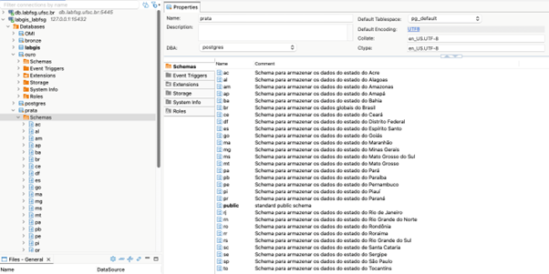{#fig-estrutura-de-armazenamento-fonte-labFSG}

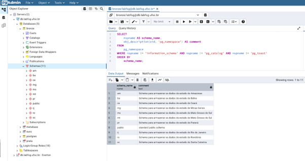{#fig-estrutura-de-armazenamento-fonte-SETIC}

### Documentação do fluxo operacional e modelagem de dados

Esta atividade concentrou-se na documentação do processo operacional e na modelagem da estrutura de dados espaciais da ETAPA 2. Neste trimestre foi formalizada a necessidade de documentar integralmente o processo de preparação e organização dos dados cartográficos e de converter essa documentação em uma instrução de trabalho representativa do processo de extração. Ao longo das reuniões técnicas, a equipe passou a validar a planilha de levantamento de camadas e dicionário de dados, discutir a modelagem de dados para camadas e variáveis geográficas, revisar a normalização de nomenclaturas e amadurecer a descrição do fluxo operacional.

Esse trabalho evoluiu para a consolidação de uma versão inicial do fluxo operacional, para a revisão contínua do dicionário de dados e para o aprofundamento da modelagem lógica do banco espacial com foco nas camadas **Bronze** e **Prata**. A necessidade de alinhar atributos das camadas de dados, validar a estrutura inicial proposta, gerar um DER para visualização dos relacionamentos e complementar a estrutura lógica das camadas em função das variáveis geográficas a serem produzidas foram os grandes desafios enfrentados nesta frente de atuação da equipe da ETAPA 2.

Em termos de produto, essa frente subsidia diretamente a geração da documentação do fluxo operacional, a consolidação do dicionário de dados e a construção da base conceitual necessária para a persistência estruturada dos dados cartográficos e das variáveis geográficas no banco espacial. Conforme exemplificados na @fig-modelo-preliminar-do-banco-de-dados.

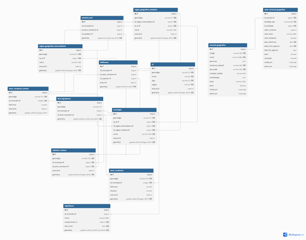{#fig-modelo-preliminar-do-banco-de-dados}

fonte: [https://dbdiagram.io/d/Cartografia-e-Variaveis-Geograficas-r2-6994bdb4bd82f5fce2fa48c5](https://quarto.org/)

### Produção cartográfica

Esta atividade correspondeu à produção efetiva da base cartográfica, inicialmente em formato GeoPackage e, progressivamente, com persistência e organização parcial em PostGIS. Neste trimestre, ocorreu o reprocessamento dos dados das capitais prioritárias, sua organização como dados cartográficos brutos iniciais e a preparação da primeira entrega cartográfica. Nos ciclos seguintes, a equipe deu continuidade à produção das bases cartográficas das capitais dos lotes 1 e 2, com geração dos dados brutos Bronze, revisão dos arquivos GeoPackage, padronização de nomenclatura e preparação dos dados da POC de Florianópolis para entrega à equipe de Estimação.

O primeiro lote de entrega contou com seis municípios e, posteriormente, o reprocessamento e a regeneração dos dados das capitais dos lotes seguintes, o que demonstra que a produção cartográfica evoluiu de um conjunto inicial de capitais prioritárias para uma escala ampliada, orientada pelos lotes operacionais definidos no planejamento da etapa. O resultado prático desse esforço foi a consolidação de arquivos GeoPackage versionados, organizados em padrão comum, contendo camadas cartográficas básicas e complementares.

Neste trimestre, a equipe estruturou e documentou em maior detalhe o pipeline de extração de dados brutos cartográficos, concebido para gerar, a partir do código IBGE do município, um GeoPackage municipal padronizado em SIRGAS 2000 (EPSG:4674), reunindo as principais camadas espaciais necessárias à formação da base territorial. O pipeline foi organizado em cinco estágios sequenciais.

-   No primeiro, são extraídas as camadas oficiais do IBGE, abrangendo unidades federativas, grandes regiões, regiões geográficas intermediárias e imediatas, municípios, distritos, subdistritos, bairros, setores censitários e faces de logradouro, formando o núcleo cartográfico institucional da base.\
-   No segundo estágio, são obtidas as linhas viárias do OpenStreetMap (OMS), por meio da Overpass API, com reconstrução e filtragem das geometrias viárias para composição das camadas de linhas gerais e logradouros veiculares.\
-   No terceiro estágio, realiza-se a identificação dos setores urbanos, a partir da classificação censitária do IBGE, gerando tanto a camada de setores urbanos quanto a geometria dissolvida da área urbana contínua do município.\
-   No quarto estágio, são gerados os subsetores urbanos, por operações geométricas entre os setores urbanos e o buffer da malha viária, resultando em representações vinculadas aos setores censitários e também em uma malha urbana contínua.\
-   Por fim, no quinto estágio, ocorre a extração das edificações a partir da base Google Open Buildings, com recorte pela área urbana e geração de pontos representativos com atributos básicos como área estimada e nível de confiança da detecção.

Esse pipeline foi relevante porque estabeleceu uma rotina reprodutível, escalável e tecnicamente consistente para montagem da base cartográfica bruta municipal, integrando fontes oficiais, colaborativas e derivadas de imagens, com padronização de nomenclatura, coerência espacial entre camadas e preparação objetiva dos insumos para as etapas posteriores de qualificação, modelagem e derivação de variáveis geográficas. Maiores detalhes deste pipeline podem ser verificados no *Anexo Pipeline de Geoprocessamento da Base Cartográfica da Camada Bronze*.

A lista dos municípios priorizados neste trimestre para produção dos dados cartográficos foram: Florianópolis, Fortaleza, Campo Grande, Porto Velho, Belo Horizonte, Rio de Janeiro, Curitiba, Salvador, Manaus, Cuiabá e Cajuri. Conforme exemplificados nas figuras -@fig-arquivos-geopackage-produzidos, 
-@fig-arquivos-geopackage-organizados, -@fig-ex-conteudo-arquivo-gpkg-camada-bronze e -@fig-ex-conteudo-arquivo-gpkg-camada-prata.

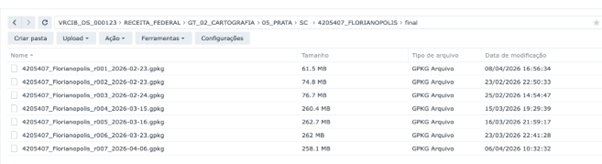{#fig-arquivos-geopackage-produzidos}

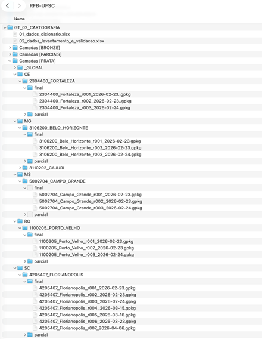{#fig-arquivos-geopackage-organizados}

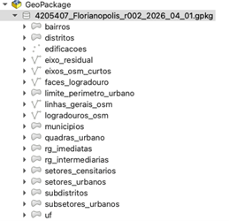{#fig-ex-conteudo-arquivo-gpkg-camada-bronze}

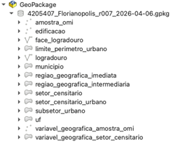{#fig-ex-conteudo-arquivo-gpkg-camada-prata}

Além da extração, organização, validação e padronização das camadas vetoriais, as atividades de produção cartográfica também abrangeram o estudo e a geração experimental de produtos temáticos derivados de imagens de sensoriamento remoto, com o objetivo de avaliar sua aplicabilidade como variáveis geográficas relevantes para o processo de avaliação em massa. Essa frente foi desenvolvida especialmente no contexto da POC de Florianópolis, como forma de verificar o potencial analítico de índices espectrais obtidos a partir de imagens Sentinel-2 processadas no Google Earth Engine.

Nesse âmbito, a equipe estruturou e testou scripts independentes para geração de camadas raster temáticas referentes aos índices NDVI, BCI, NDBI, RNDSI e UI, todos calculados sobre a área de Florianópolis a partir da coleção Sentinel-2 Surface Reflectance (COPERNICUS/S2_SR). Esses índices foram selecionados por sua capacidade de representar componentes territoriais potencialmente explicativos para a modelagem, tais como cobertura vegetal, grau de urbanização, presença de áreas construídas e solo exposto. O processamento considerou filtragem por área de interesse, recorte temporal anual, controle de cobertura de nuvens, aplicação de máscara com base na banda SCL e geração de composições medianas para posterior cálculo dos índices temáticos.

Como resultado, foram produzidas camadas raster de apoio para visualização e análise, bem como especificados produtos exportáveis em Google Drive, com resoluções espaciais de 10 metros para o NDVI e 20 metros para os índices BCI, NDBI, RNDSI e UI. Ainda que esses scripts tenham sido organizados como blocos independentes e não como uma esteira totalmente integrada ao fluxo principal, seu desenvolvimento foi relevante porque demonstrou a viabilidade de incorporar produtos de imagem ao processo cartográfico da etapa, ampliando o conjunto de fontes e evidências espaciais disponíveis para derivação de variáveis geográficas.

Do ponto de vista metodológico, essa atividade reforça que a produção cartográfica da ETAPA 2 não se restringiu à preparação de bases vetoriais convencionais, mas também passou a considerar o uso de dados raster e índices espectrais como insumos complementares para caracterização territorial. Assim, além das bases em GeoPackage e da persistência progressiva em PostGIS, a equipe também avaliou produtos derivados de imagens como suporte à identificação de padrões urbanos, ambientais e morfológicos que podem, futuramente, ser incorporados ao conjunto de variáveis geográficas do projeto.

A seguir temos a exemplificação de parte um script no padrão do Google Earth Engine que permite a produção de índices espaciais a partir de imagens de satélites, os quais também fizeram parte dos estudos da equipe para geração de base cartográfica. O script completo pode ser visto no *Anexo Processamento de Índices Espaciais a partir de Imagens de Satélites*.

```         

//SCRIPTS 01: NDVI (resolução espacial \= 10m)  
//NDVI: Índice de vegetação NDVI \= (NIR \- RED)/(NIR \+ RED)  
// COLEÇÃO: Sentinel-2 MSI: MultiSpectral Instrument \- Level: 2C (BOA)

// Definindo a Área de Estudo: MunicÍpio de Florianópolis   
var aoi \= table.geometry();  
// Adicionando a localização ao mapa  
Map.addLayer(aoi);

// \===============================  
// 2\. Máscara de nuvens  
// \===============================  
function maskS2clouds(image) {  
  var scl \= image.select('SCL');  
    
  var mask \= scl.neq(3)  
    .and(scl.neq(8))  
    .and(scl.neq(9))  
    .and(scl.neq(10))  
    .and(scl.neq(11));  
      
  return image.updateMask(mask);  
}

// \===============================  
// 3\. Carregar Sentinel-2  
// \===============================  
var collection \= ee.ImageCollection('COPERNICUS/S2\_SR')  
  .filterBounds(aoi)  
  .filterDate('2023-01-01', '2023-12-31')  
  .filter(ee.Filter.lt('CLOUDY\_PIXEL\_PERCENTAGE', 20))  
  .map(maskS2clouds);  
var numero \= collection.size();  
print("Número de Imagens: ", numero);

// Calcula a Mediana e cada banda e cada pixel  
// Nome das bandas B1\_median, B2\_median, etc.  
var  area \= collection.reduce(ee.Reducer.median());  
// Recortando a área de estudo  
var median \= area.clip(aoi);  
// Visualizando a Imagem T  
var vis\_param \= {bands: \['B8\_median', 'B4\_median', 'B3\_median'\], gamma: 1.6};  
Map.centerObject(aoi,10);  
Map.addLayer(median, vis\_param, 'Sentinel-2B 05/2023');  
// Calculando NDVI  
var NIR \= median.select("B8\_median");  
var RED \= median.select("B4\_median");  
var NDVI \= NIR.subtract(RED).divide(NIR.add(RED));  
// Visualizando NDVI  
var paleta \= \[ 'FFFFFF', 'CE7E45', 'DF923D', 'F1B555', 'FCD163', '99B718',  
               '74A901', '66A000', '529400', '3E8601', '207401', '056201',  
               '004C00', '023B01', '012E01', '011D01', '011301'\];  
Map.centerObject(aoi,10);  
Map.addLayer(NDVI, {min: 0, max: 1, palette: paleta}, 'NDVI');  
// \===============================  
// 9\. Exportação (opcional)  
// \===============================  
Export.image.toDrive({  
      image: NDVI,  
      description: 'NDVI\_Sentinel2\_BOA\_Floripa\_POC',  
      scale: 10,  
      region: aoi,  
      maxPixels: 1e13  
});
```

O saldo objetivo da produção cartográfica no trimestre demonstra a consolidação inicial da capacidade produtiva da ETAPA 2. Ao todo, foram gerados 11 municípios na camada Bronze, cada um contendo 16 camadas cartográficas, e estruturados 11 municípios na camada Prata, com 14 camadas por município, ainda que em diferentes estágios de maturidade. Florianópolis se destacou como o município mais completo do período, servindo como principal referência para testes, validações, integração com o OMI e entrega à Estimação. Esses resultados mostram que a produção cartográfica já alcançou escala inicial concreta e deixou de estar restrita a experimentação pontual.

### Geração de variáveis geográficas

A sexta frente abrangeu a produção, classificação, revisão e ampliação das variáveis geográficas. Em um primeiro momento, o trabalho concentrou-se na análise das variáveis registradas nas planilhas de controle, identificando sua correlação com a ETAPA 2, suas fontes primárias e sua representação cartográfica. Com base nisso, a equipe passou a classificar as variáveis segundo a viabilidade de obtenção de suas fontes, distinguindo itens de geração fácil, em análise e difícil. O *Anexo Registro e controle das variáveis geográficas* ilustra o resultado desta atividade de classificação e controle das variáveis geográficas.

Em seguida, foi realizada uma primeira rodada de processamento das variáveis consideradas mais fáceis, acompanhada do refinamento metodológico das variáveis mais complexas e da revisão de sua camada de referência espacial. Ao longo do trimestre, o conjunto de variáveis consideradas incluiu, entre outras, distância à massa d’água, distância ao litoral, percentual de impermeabilização, quantidade de lotes, tamanho do lote médio e variáveis municipais como FPM, FUNDEB, renda per capita, IDH e categoria turística. Em abril, a equipe da ETAPA 2 definiu a separação explícita entre variáveis vinculadas à amostra do OMI, ao setor censitário e ao município, além da disponibilização de das variáveis geradas na versão da camada Prata.

Esse conjunto de atividades foi essencial para demonstrar a viabilidade técnica da estrutura de variáveis geográficas da etapa, ainda que parte delas permanecesse dependente de complementação de fontes, refinamento metodológico ou liberação de insumos externos. As tabelas a seguir resumem as variáveis geográficas produzidas e agregadas por setor censitário, município e amostra do OMI.

| NM_CAMPO_BD | DESC_CAMPO | TIPO_BD | PK | UNIQUE | NOT_NULL | ORIGINAL? |
|:----------|:----------|:----------|:----------|:----------|:----------|:----------|
| setor_area_km2 | Área em quilômetros quadrados | numeric | FALSE | FALSE | FALSE | FALSE |
| cd_aglom | Código do Aglomerado | varchar(12) | FALSE | FALSE | FALSE | TRUE |
| cd_bairro | Código do Bairro | varchar(10) | FALSE | FALSE | FALSE | TRUE |
| cd_concurb | Código da Concentração Urbana | varchar(7) | FALSE | FALSE | FALSE | TRUE |
| cd_dist | Código do Distrito | varchar(9) | FALSE | FALSE | FALSE | TRUE |
| cd_fcu | Código da Favela ou Comunidade Urbana | varchar(11) | FALSE | FALSE | FALSE | TRUE |
| cd_mun | Código do Município | varchar(7) | FALSE | FALSE | FALSE | TRUE |
| cd_nu | Código do Núcleo Urbano | varchar(10) | FALSE | FALSE | FALSE | TRUE |
| cd_regiao | Código das Grandes Regiões (Regiões Geográficas) | varchar(1) | FALSE | FALSE | FALSE | TRUE |
| cd_rgi | Código da Região Geográfica Imediata | varchar(6) | FALSE | FALSE | FALSE | TRUE |
| cd_rgint | Código da Região Geográfica Intermediária | varchar(4) | FALSE | FALSE | FALSE | TRUE |
| cd_setor | Geocódigo de Setor Censitário | varchar(15) | FALSE | FALSE | FALSE | TRUE |
| cd_situacao | Situação detalhada do Setor Censitário | varchar(1) | FALSE | FALSE | FALSE | TRUE |
| cd_subdist | Código do Subdistrito | varchar(11) | FALSE | FALSE | FALSE | TRUE |
| cd_tipo | Código do Tipo do Setor Censitário | varchar(1) | FALSE | FALSE | FALSE | TRUE |
| cd_uf | Código da Unidade da Federação conforme definição do IBGE | varchar(2) | FALSE | FALSE | FALSE | TRUE |
| ano_dens_demo | Ano do censo que calculou densidade demográfica do setor censitário | integer | FALSE | FALSE | FALSE | TRUE |
| dens_demo_hab_km2 | Densidade demográfica do setor censitário de habitante por km² | numeric | FALSE | FALSE | FALSE | FALSE |
| dens_equip_educ | Densidade de equipamentos de educação | numeric | FALSE | FALSE | FALSE | FALSE |
| dens_equip_saud | Densidade de equipamentos de saúde | numeric | FALSE | FALSE | FALSE | FALSE |
| dist_centro | Distância ao centro municipal | numeric | FALSE | FALSE | FALSE | FALSE |
| dist_litoral | Menor distância do setor censitário até a linha do litoral | numeric | FALSE | FALSE | FALSE | FALSE |
| dist_mun_polo | Distância ao município polo | numeric | FALSE | FALSE | FALSE | FALSE |
| id | Identificador primário | bigint | TRUE | TRUE | TRUE | FALSE |
| lote_medio_m2 | Tamanho médio de lotes por setor | numeric | FALSE | FALSE | FALSE | FALSE |
| qtd_equip_educ | Quantidade de equipamentos de educação no setor censitário | integer | FALSE | FALSE | FALSE | FALSE |
| qtd_equip_saud | Quantidade de equipamentos de saúde no setor censitário | integer | FALSE | FALSE | FALSE | FALSE |
| nm_aglom | Nome do Aglomerado | varchar(254) | FALSE | FALSE | FALSE | TRUE |
| nm_bairro | Nome do Bairro | varchar(254) | FALSE | FALSE | FALSE | TRUE |
| nm_concurb | Nome da Concentração Urbana | varchar(254) | FALSE | FALSE | FALSE | TRUE |
| nm_dist | Nome do Distrito | varchar(50) | FALSE | FALSE | FALSE | TRUE |
| nm_fcu | Nome da Favela ou Comunidade Urbana | varchar(254) | FALSE | FALSE | FALSE | TRUE |
| nm_mun | Nome do Município | varchar(50) | FALSE | FALSE | FALSE | TRUE |
| nm_nu | Nome do Núcleo Urbano | varchar(254) | FALSE | FALSE | FALSE | TRUE |
| nm_regiao | Nome da Grande Região Geográfica do IBGE | varchar(15) | FALSE | FALSE | FALSE | TRUE |
| nm_rgi | Nome da Região Geográfica Imediata | varchar(254) | FALSE | FALSE | FALSE | TRUE |
| nm_rgint | Nome da Região Geográfica Intermediária | varchar(254) | FALSE | FALSE | FALSE | TRUE |
| nm_subdist | Nome do Subdistrito | varchar(50) | FALSE | FALSE | FALSE | TRUE |
| nm_uf | Nome da Unidade da Federação | varchar(20) | FALSE | FALSE | FALSE | TRUE |
| qtd_domic | Quantidade de domicílios por setor | integer | FALSE | FALSE | FALSE | FALSE |
| geometria | Geometria primitiva da camada | geometry(multipolygon, 4674) | FALSE | FALSE | TRUE | TRUE |
| situacao | Situação do Setor Censitário | varchar(6) | FALSE | FALSE | FALSE | TRUE |
| qtd_lote | Quantidade de lote | integer | FALSE | FALSE | FALSE | FALSE |
| total_pess | Total de pessoas | integer | FALSE | FALSE | FALSE | FALSE |
| n_resp_c_rend | Número de responsáveis com rendimento | integer | FALSE | FALSE | FALSE | FALSE |
| ren_chef_domic | Renda média do chefe do domicílio | numeric | FALSE | FALSE | FALSE | FALSE |
| var_ren_media | Variância da renda média | numeric | FALSE | FALSE | FALSE | FALSE |
| renda_med_pct | Renda média do familiar responsável pelo domicílio (por setor) | numeric | FALSE | FALSE | FALSE | FALSE |
| possui_sobreposicao_inundacao | Determinar se há áreas de inundação no setor | Boolean | FALSE | FALSE | FALSE | FALSE |
| renda_krigada_media | Valor da renda média processada por krigagem | numeric | FALSE | FALSE | FALSE | FALSE |
| renda_krigada_mediana | Valor da renda mediana processada por krigagem | numeric | FALSE | FALSE | FALSE | FALSE |
| renda_krigada_moda | Valor da moda da renda processada por krigagem | numeric | FALSE | FALSE | FALSE | FALSE |

: Tabela das variáveis geográficas agregadas por setor censitário {#tbl-var-geo-agregadas-por-SC}

| NM_CAMPO_BD | DESC_CAMPO | TIPO_BD | PK | UNIQUE | NOT_NULL | ORIGINAL? |
|:----------|:----------|:----------|:----------|:----------|:----------|:----------|
| cd_concurb | Código da Concentração Urbana | varchar(7) | FALSE | FALSE | FALSE | TRUE |
| cd_mun | Código do Município | varchar(7) | FALSE | FALSE | FALSE | TRUE |
| cd_regiao | Código das Grandes Regiões (Regiões Geográficas) | varchar(1) | FALSE | FALSE | TRUE | TRUE |
| cd_rgi | Código da Região Geográfica Imediata | varchar(6) | FALSE | FALSE | FALSE | TRUE |
| cd_rgint | Código da Região Geográfica Intermediária | varchar(4) | FALSE | FALSE | FALSE | TRUE |
| cd_uf | Código da Unidade da Federação conforme definição do IBGE | varchar(2) | FALSE | FALSE | TRUE | TRUE |
| sigla_regiao | Sigla da Grande Região Geográfica | varchar(2) | FALSE | FALSE | TRUE | TRUE |
| sigla_uf | Sigla da Unidade da Federação | varchar(2) | FALSE | FALSE | TRUE | TRUE |
| mun_area_km2 | Área em quilômetros quadrados | numeric | FALSE | FALSE | TRUE | FALSE |
| nm_concurb | Nome da Concentração Urbana | varchar | FALSE | FALSE | FALSE | TRUE |
| nm_mun | Nome do Município | varchar(50) | FALSE | FALSE | FALSE | TRUE |
| nm_regiao | Nome da Grande Região Geográfica do IBGE | varchar(15) | FALSE | FALSE | TRUE | TRUE |
| nm_rgi | Nome da Região Geográfica Imediata | varchar(254) | FALSE | FALSE | FALSE | TRUE |
| nm_rgint | Nome da Região Geográfica Intermediária | varchar(254) | FALSE | FALSE | FALSE | TRUE |
| nm_uf | Nome da Unidade da Federação | varchar(20) | FALSE | FALSE | TRUE | TRUE |
| pib_percap | PIB per capita do município | numeric | FALSE | FALSE | FALSE | FALSE |
| ren_percap_media | Renda per capita média em reais | numeric | FALSE | FALSE | FALSE | FALSE |
| ren_percap_mediana | Renda per capita mediana em reais | numeric | FALSE | FALSE | FALSE | FALSE |
| idh_ipea_2010 | Índice de desenvolvimento humano de 2010 | numeric | FALSE | FALSE | FALSE |  |
| ifdm_2023 | Índice de desenvolvimento IFDM de 2023 | numeric | FALSE | FALSE | FALSE |  |
| nm_regiao_tur | Nome da região turística | text | FALSE | FALSE | FALSE | FALSE |
| categ_tur | Categoria do Município quanto ao turismo | text | FALSE | FALSE | FALSE | FALSE |
| fpm_2025 | Fundo de participação por município | numeric | FALSE | FALSE | FALSE | FALSE |
| fundeb_coun_vaat_2025 | Valor total anual por aluno | numeric | FALSE | FALSE | FALSE | FALSE |
| fundeb_fpe_2025 | Fundo de participação dos estados | numeric | FALSE | FALSE | FALSE | FALSE |
| fundeb_fpm_2025 | Parte do FPM que é direcionada ao FUNDEB | numeric | FALSE | FALSE | FALSE | FALSE |
| fundeb_fti_2025 | Fundo de compensação de perdas tributárias | numeric | FALSE | FALSE | FALSE | FALSE |
| fundeb_icms_2025 | Imposto sobre circulação de mercadorias e serviços | numeric | FALSE | FALSE | FALSE | FALSE |
| fundeb_ipi_exp_2025 | IPI sobre exportações | numeric | FALSE | FALSE | FALSE | FALSE |
| fundeb_ipva_2025 | Imposto sobre propriedade de veículo | numeric | FALSE | FALSE | FALSE | FALSE |
| fundeb_itcmd_2025 | Imposto sobre heranças e doações | numeric | FALSE | FALSE | FALSE | FALSE |
| fundeb_itr_2025 | Imposto sobre propriedade territorial rural | numeric | FALSE | FALSE | FALSE | FALSE |
| fundeb_coun_vaar_2025 | Valor anual por aluno do fundo | numeric | FALSE | FALSE | FALSE | FALSE |
| fundeb_coun_vaaf_2025 | Valor anual por aluno do fundo | numeric | FALSE | FALSE | FALSE | FALSE |

: Tabela das variáveis geográficas agregadas por município {#tbl-var-geo-agregadas-por-municipio}

| NM_CAMPO_BD | DSC_CAMPO | TIPO_BD | NOT_NULL | ORIGINAL? | UNIQUE | PK |
|:----------|:----------|:----------|:----------|:----------|:----------|:----------|
| amenidades | Características adicionais do imóvel. | text | FALSE | TRUE | FALSE | FALSE |
| area_anun | Área do imóvel informada no anúncio. | numeric(12,2) | FALSE | TRUE | FALSE | FALSE |
| area_total | Área total do imóvel. | numeric(12,2) | FALSE | TRUE | FALSE | FALSE |
| anun_nm_bairro | Nome do bairro (tratado/normalizado) | text | TRUE | TRUE | FALSE | FALSE |
| anun_cep_end | Código de Endereçamento Postal. | text | TRUE | TRUE | FALSE | FALSE |
| nm_mun | Município do imóvel. | varchar | FALSE | TRUE | FALSE | FALSE |
| imob_comp_end | Complemento do endereço. | text | FALSE | TRUE | FALSE | FALSE |
| anunt_contat | Informações de contato. | text | FALSE | TRUE | FALSE | FALSE |
| anun_data | Data de publicação original. | date | FALSE | TRUE | FALSE | FALSE |
| dt_raspagem | Data/hora da coleta do dado. | date | FALSE | TRUE | FALSE | FALSE |
| dt_tabela | Data de referência do lote. | date | FALSE | TRUE | FALSE | FALSE |
| dsc_anun | Descrição textual completa do anúncio. | text | FALSE | TRUE | FALSE | FALSE |
| sigla_uf | Unidade Federativa. | char(2) | FALSE | TRUE | FALSE | FALSE |
| nm_imob | Nome das imobiliárias de origem do anúncio. | varchar | FALSE | TRUE | FALSE | FALSE |
| id_imob | Identificador único do registro nesta tabela. | integer | TRUE | TRUE | TRUE | TRUE |
| id_anunt | Identifica por da imobiliária ou anunciante. | varchar | FALSE | TRUE | FALSE | FALSE |
| id_fonte | Identificador do anúncio no portal original (ex: Viva Real). | varchar | TRUE | TRUE | FALSE | FALSE |
| val_iptu | Valor do IPTU. | numeric(18,2) | FALSE | TRUE | FALSE | FALSE |
| anun_url | URL do anúncio. | text | FALSE | TRUE | FALSE | FALSE |
| anun_nm_log | Nome da rua/logradouro. | text | TRUE | TRUE | FALSE | FALSE |
| qtd_andares | Número de pavimentos. | numeric | FALSE | TRUE | FALSE | FALSE |
| qtd_banheiros | Quantidade de banheiros. | numeric | FALSE | TRUE | FALSE | FALSE |
| qtd_quartos | Quantidade de quartos. | numeric | FALSE | TRUE | FALSE | FALSE |
| qtd_suites | Quantidade de suítes. | numeric | FALSE | TRUE | FALSE | FALSE |
| qtd_vg_garagem | Quantidade de vagas de garagem. | numeric | FALSE | TRUE | FALSE | FALSE |
| anun_num_end | Número do endereço informado. | text | FALSE | TRUE | FALSE | FALSE |
| periodo_aluguel | Periodicidade da cobrança. | varchar | FALSE | TRUE | FALSE | FALSE |
| subtip_imov | Sub-classificação do tipo de imóvel. | text | FALSE | TRUE | FALSE | FALSE |
| tx_condom | Valor do condomínio. | numeric(18,2) | FALSE | TRUE | FALSE | FALSE |
| tip_anun | Status de anúncio (Novo/Usado). | varchar | FALSE | TRUE | FALSE | FALSE |
| tip_imov | Categoria do imóvel (Casa, Apartamento, Terreno, etc). | varchar | TRUE | TRUE | FALSE | FALSE |
| tip_negocio | Natureza da transação (Venda/Aluguel). | varchar | FALSE | TRUE | FALSE | FALSE |
| tip_propriedade | Classificação da unidade. | varchar | FALSE | TRUE | FALSE | FALSE |
| tip_uso | Uso do imóvel (Residencial/Comercial). | varchar | FALSE | TRUE | FALSE | FALSE |
| anun_tit | Título do anúncio conforme coletado. | text | FALSE | TRUE | FALSE | FALSE |
| anunt_url | URL do anunciante. | text | FALSE | TRUE | FALSE | FALSE |
| anun_val | Valor total do anúncio. | numeric(18,2) | FALSE | TRUE | FALSE | FALSE |
| anun_val_aluguel | Valor específico para aluguel. | numeric(18,2) | FALSE | TRUE | FALSE | FALSE |
| anun_val_venda | Valor específico para venda. | numeric(18,2) | FALSE | TRUE | FALSE | FALSE |
| arcgis_precisao | Nível de precisão do ArcGIS (4=Exato). | smallint | FALSE | FALSE | FALSE | FALSE |
| cnefe_cd_unico_end | Código único do endereço | integer | FALSE | TRUE | TRUE | TRUE |
| cnefe_nv_geo_coord | Nível de geocodificação | smallint | FALSE | TRUE | FALSE | FALSE |
| ca_bas | Coeficiente de aproveitamento básico | numeric | FALSE | TRUE | FALSE | FALSE |
| ca_max | Coeficiente de aproveitamento máximo | numeric | FALSE | TRUE | FALSE | FALSE |
| cd_zon | Código do zoneamento. | varchar | FALSE | TRUE | FALSE | FALSE |
| to_max | Taxa de ocupação máxima | numeric | FALSE | TRUE | FALSE | FALSE |
| estado_constru | Código de status da obra | smallint | FALSE | FALSE | FALSE | FALSE |
| id_imovel | Identificador do imóvel vindo da tabela base do Datalake. | integer | TRUE | FALSE | TRUE | TRUE |
| cd_outlier | Código de outlier detectado. | smallint | FALSE | FALSE | FALSE | FALSE |
| observacoes | Notas manuais. | text | FALSE | FALSE | FALSE | FALSE |
| outliers_tip | Campos que geraram o alerta de outlier. | text\[\] | FALSE | FALSE | FALSE | FALSE |
| atualizado_em | Timestamp da última alteração. | timestamp | FALSE | FALSE | FALSE | FALSE |
| atualizado_por | Usuário da última alteração. | text | FALSE | FALSE | FALSE | FALSE |
| verif | Status de verificação automática. | boolean | FALSE | FALSE | FALSE | FALSE |
| verif_georref | Revisão manual de geocodificação. | boolean | FALSE | FALSE | FALSE | FALSE |
| verif_outlier | Revisão manual de outliers. | boolean | FALSE | FALSE | FALSE | FALSE |
| processo_geo | Processo de geocodificação utilizado. | varchar | FALSE | FALSE | FALSE | FALSE |

: Tabela das variáveis geográficas agregadas por amostra do OMI {#tbl-var-geo-agregadas-por-amostra-do-OMI}

### POC Florianópolis

A sétima frente concentrou-se na execução da **POC de Florianópolis**, que funcionou como principal ambiente demonstrador e de validação da lógica da ETAPA 2. Em março, a POC foi assumida como prioridade operacional, com foco na preparação das variáveis geográficas e da amostra do OMI em modelo de banco de dados PostGIS.

As atividades envolveram o georreferenciamento dos registros alfanuméricos do Observatório para geração da camada **amostra_omi**, o download de camadas específicas de Florianópolis, o processamento do conjunto de variáveis para a área da POC e o relacionamento espacial entre os dados do OMI e as variáveis geográficas dentro do banco de dados espacial.

Em termos de produto, a POC resultou na produção de base cartográfica e de um conjunto de variáveis geográficas para Florianópolis, com geração de arquivos em formato GeoPackage e modelagem parcial já carregada no banco espacial PostGIS. As classes processadas e em modelagem de banco de dados espacial obtidas com a POC foram: **uf, municipio, setor_censitario, setor_censitario_urbano, subsetor_urbano, logradouro, face_logradouro, edificacao, amostra_omi** e classes de variáveis geográficas em nível de município (**variavel_geografica_municipio**), setor censitário (**variavel_geografica_setor_censitario**) e amostra (**variavel_geografica_amostra_omi**).

A equipe ainda registrou a necessidade de produzir nova revisão da POC de Florianópolis, com entrega interna e posterior encaminhamento à equipe de Estimação, evidenciando o papel da POC como artefato vivo de teste, ajuste, validação e refinamento metodológico da ETAPA 2.

A POC de Florianópolis representou a principal entrega integrada e demonstradora da ETAPA 2 no trimestre. Além de funcionar como ambiente de teste e refinamento metodológico, ela se consolidou como caso efetivo de produção territorial e integração com a etapa de Estimação. Como resultado, foram disponibilizadas à equipe da ETAPA 3 as 14 camadas da base Prata de Florianópolis, juntamente com as 60 variáveis geográficas geradas para o município, evidenciando que a POC ultrapassou a condição de experimento interno e passou a operar como referência concreta de produto territorial da etapa.

### Organização das bases

A organização das bases foi estruturada segundo o princípio de separação por camadas, versionamento e rastreabilidade. Na Bronze, permanecem os dados brutos cartográficos e secundários; na Prata, os dados organizados, padronizados, integrados e saneados; na Ouro, a entrega final homologada.

O manual do *Fluxo de Geração da Base Cartográfica e das Variáveis Geográficas*, que foi criado neste trimestre e ainda está em desenvolvimento, deixa claro que toda entrada, transformação e saída deve possuir identificação de origem, data e responsável, e que as camadas devem manter convenção de nomenclatura consistente e histórico de versões.

Conforme apresentado no item Padronização, a codificação dos arquivos GeoPackage seguiu nomenclatura que permite rastreabilidade e auditabilidade. A possibilidade de armazenamento dos arquivos GeoPackage na estrutura do Synology é a garantia de auditabilidade, rastreabilidade e segurança dos arquivos dentro do LabFSG.

As Figuras -@fig-ex-org-arquivos-camada-prata-1 e -@fig-ex-org-arquivos-camada-prata-2 exemplificam a estrutura de armazenamento de arquivos geopackage na qual é possível verificar a localização do arquivo, sua data, o responsável pela criação ou modificação e outros detalhes que identificam o arquivo.

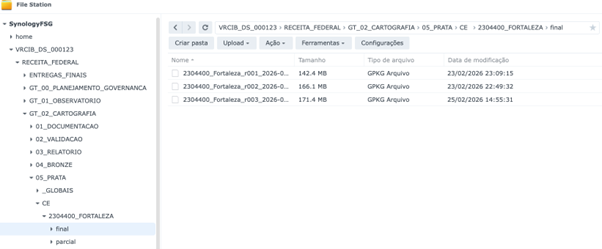{#fig-ex-org-arquivos-camada-prata-1}

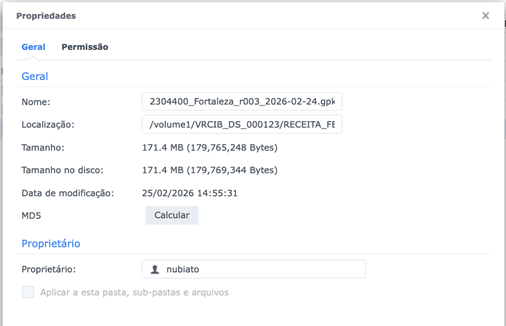{#fig-ex-org-arquivos-camada-prata-2}

A organização das bases foi definida com ênfase em versionamento, rastreabilidade e separação entre áreas de trabalho e entregas congeladas. Para a camada Bronze, foi definido um padrão de armazenamento por UF e município, com nome de arquivo padronizado contendo geocódigo, nome do município, número de revisão e data. Para a camada Prata, foi estabelecida separação entre pasta parcial, destinada a rascunhos e edições, e pasta final, destinada a revisões congeladas e imutáveis. Conforme exemplificados nas figuras -@fig-ilustracao-da-organizacao, -@fig-ilustracao-da-organizacao-da-camada-bronze, -@fig-ilustracao-da-organizacao-da-camada-prata, -@fig-ilustracao-da-organizacao-da-camada-prata e -@fig-ilustracao-da-organizacao-da-camada-ouro.

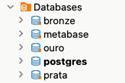{#fig-ilustracao-da-organizacao}

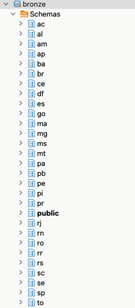{#fig-ilustracao-da-organizacao-da-camada-bronze}

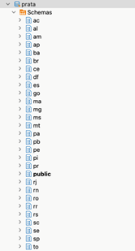{#fig-ilustracao-da-organizacao-da-camada-prata}

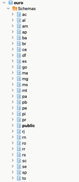{#fig-ilustracao-da-organizacao-da-camada-ouro}

A organização dos dados da ETAPA 2 passou a ser estruturada também no banco espacial PostgreSQL/PostGIS, com adoção de três bancos principais — **bronze**, **prata** e **ouro** — que representam, respectivamente, as camadas de dados brutos, dados tratados/qualificados e dados consolidados para publicação. Em cada banco foi adotado um modelo de organização territorial, com um esquema geral e um esquema para cada unidade da federação, de modo que os dados são organizados prioritariamente por território e não por tema. Nesse modelo, camadas da Cartografia, do OMI e Estimação coexistem dentro do mesmo esquema territorial, sendo diferenciadas por convenção de nomenclatura.

Para garantir governança adequada, foram previstos grupos de acesso por função — administração, edição e visualização —, mas com controle fino por camada (tabela), uma vez que o PostgreSQL não restringe permissões por prefixo de nome. Complementarmente, as camadas passaram a contar com um mecanismo de controle de ingestão e linhagem, por meio da tabela **public.log_ingestao_dados**, destinada a registrar cada evento de carga com informações como arquivo-fonte, operador, schema e tabela de destino, quantidade de registros, revisão da entrega, data de produção e status do processamento. Esse controle reforça a rastreabilidade do fluxo, a auditabilidade das cargas e a capacidade de reprocessamento e comparação entre revisões. E cada camada passou a ter atributos para também permitir rastreabilidade e auditabilidade para cada registro de dados.

A ingestão de dados geográficos foi definida como um procedimento automatizado de carga de arquivos GeoPackage para o banco PostgreSQL/PostGIS, aplicável à mesma lógica operacional das camadas Bronze e Prata. O processo pode ser executado via QGIS ou via scripts Python em terminal, mediante configuração prévia das credenciais de acesso, definição do schema de destino e indicação do arquivo-fonte a ser processado.

Como regra de negócio, o procedimento distingue dois cenários: criação inicial, quando o esquema ainda não possui tabelas e a carga ocorre por inserção completa, e atualização/apêndice, quando as camadas já existem e novas revisões precisam ser incorporadas. Para preservar a integridade do ambiente, os scripts possuem trava de segurança para evitar sobrescrita indevida, extraem automaticamente metadados a partir do nome do arquivo — como revisão e data de produção —, padronizam nomes de camadas e colunas em minúsculo e forçam a geometria para tipos Multi. O processo também gera dois níveis de rastreabilidade: feedback em tempo real no console do QGIS ou terminal, com volumetria por camada importada, e registro histórico na tabela public.log_ingestao_dados, com status de processamento, SRID de origem, quantidade de feições e observações técnicas em caso de erro. Além disso, após a carga, cada tabela pode receber mecanismo de auditoria para registrar alterações futuras. Essa sistemática reforça a padronização, a rastreabilidade e a auditabilidade do fluxo de ingestão, tanto para a entrada dos dados brutos na Bronze quanto para a evolução dos dados tratados e revisados na Prata.

| Campo | Tipo | Descrição |
|:-----------------------|:-----------------------|:-----------------------|
| id | serial | Chave primária única para cada evento de carga. |
| data_hora_ingestao | timestamp | Momento exato em que o script processou a carga. |
| operador | varchar | O usuário do banco (ou sistema) que executa o processo. |
| arquivo_fonte | varchar | O nome físico do arquivo (ex: 5002704_Campo_Grande_r002.gpkg). |
| formato_extensao | varchar | Tipo do arquivo (GeoPackage, Shapefile, CSV, etc). |
| srid_origem | integer | O EPSG original do arquivo (Padrão: 4674 - SIRGAS 2000). |
| schema_destino | varchar | O schema para onde o dado foi enviado (ex: ms, sc). |
| tabela_destino | varchar | A tabela específica que recebeu os dados (ex: edificacao). |
| registros_camada | integer | Total de feições lidas do arquivo original. |
| status_processamento | varchar | Resultado da carga: CONCLUIDO, FALHA ou ERRO_SQL. |
| id_revisao_entrega | integer | O número da revisão extraída do nome do arquivo (ex: 2). |
| data_producao | date | A data de geração do dado, conforme metadado do arquivo. |
| observacao_tecnica | text | Logs de erro detalhados ou notas sobre a qualidade do dado. |

: Tabela Organização da ingestão de dados no banco de dados Postgresql {#tblorg-ingestao-dados-no-Postgresql}

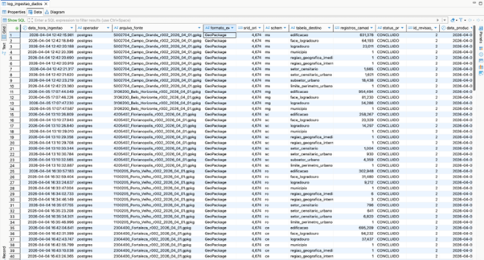{#fig-exemplificacao-do-conteudo-da-tabela}

Além do controle de ingestão e linhagem, a sistemática adotada também estabelece um controle de auditoria sobre as tabelas carregadas, tanto por meio de colunas de controle incorporadas às próprias tabelas quanto por meio de uma tabela específica de auditoria alimentada por trigger. Em cada tabela de dados cartográficos são adicionados campos de controle como data de carga, arquivo de origem, responsável pela carga e versão do modelo, permitindo identificar quando e por quem a carga foi realizada, a partir de qual arquivo e sob qual versão estrutural. Complementarmente, a tabela **public.log_auditoria** registra as alterações ocorridas nas tabelas cartográficas, armazenando informações como schema, nome da tabela, identificador do registro, tipo de operação executada, valores anteriores e novos em formato JSONB, usuário do banco e data do evento. Com isso, o ambiente passa a suportar não apenas a rastreabilidade da ingestão inicial, mas também a auditoria das alterações posteriores, fortalecendo a governança, a integridade histórica e a capacidade de inspeção sobre a evolução dos dados ao longo do fluxo operacional. Conforme exemplificados nas figuras (@fig-organizacao-da-auditoria), (@fig-exemplificacao-de-registro-de-auditoria-1) e na (@fig-exemplificacao-de-registro-de-auditoria-2).

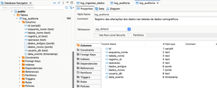{#fig-organizacao-da-auditoria}

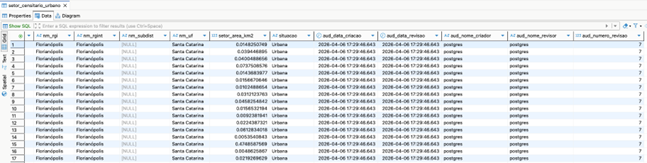{#fig-exemplificacao-de-registro-de-auditoria-1}

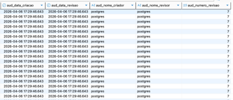{#fig-exemplificacao-de-registro-de-auditoria-2}

O Script Python de ingestão e organização de dados é ilustrado pelo código apresentado a seguir e a versão completa para terminal Python e QGIS é apresentada no Anexo Ingestão de dados no banco de dados espacial.

```         
import psycopg2
import os
import re
import subprocess
import sys

\# \--- CONFIGURAÇÕES DE CONEXÃO \---

\# Descomente o bloco que deseja usar

\# Opção: BANCO LOCAL

host, port, db\_name, user, password, schema\_destino \= "localhost", "5432", 
"bronze", "postgres", "postgres", "mg"

\# \--- CONFIGURAÇÃO DE ARQUIVO \---

\#O ARQUIVO DEVE ESTAR NOMEADO NO PADRÃO ACORDADO\!

home \= os.path.expanduser("\~")

\# Exemplo: 5002704\_Campo\_Grande\_r002\_2026\_04\_01.gpkg, 5103403\_Cuiaba\_r001\_2026\_04\_01.gpkg, 2927408\_Salvador\_r001\_2026\_04\_01.gpkg, 1302603\_Manaus\_r001\_2026\_04\_01.gpkg

\# 4106902\_Curitiba\_r001\_2026\_04\_01.gpkg, 3304557\_Rio\_de\_Janeiro\_r001\_2026\_04\_01.gpkg

nome\_arquivo \= "3106200\_Belo\_Horizonte\_r002\_2026\_04\_01.gpkg"

caminho\_gpkg \= os.path.join(home, "Downloads", nome\_arquivo)

\# String de conexão para o OGR2OGR

conn\_string\_ogr \= f"PG:host={host} port={port} dbname={db\_name} user={user} 
password={password}"

\# \--- EXTRAÇÃO DE METADADOS \---

\#Definição data do arquivo de dados

\# 1\. Data de Produção (ex: 2026\_04\_01 \-\> 2026-04-01)

match\_rev \= re.search(r'r(\\d{3})', nome\_arquivo)

\#Definição da revisão do arquivo

\# 2\. Revisão (ex: r001 \-\> 1\)

revisao\_num \= int(match\_rev.group(1)) if match\_rev else 0

match\_data \= re.search(r'(\\d{4})\_(\\d{2})\_(\\d{2})', nome\_arquivo)

data\_prod \= f"{match\_data.group(1)}\-{match\_data.group(2)}\-{match\_data.group(3)}" if match\_data else None

\# \--- MAPEAMENTO \---

mapeamento\_camadas \= {

   'edificacoes': 'edificacao',

   'faces\_logradouro': 'face\_logradouro',

   'logradouros\_osm': 'logradouro',

   'municipios': 'municipio',

   'rg\_imediatas': 'regiao\_geografica\_imediata',

   'rg\_intermediarias': 'regiao\_geografica\_intermediaria',

   'setores\_censitarios': 'setor\_censitario',

   'setores\_urbanos': 'setor\_censitario\_urbano',

   'subsetores\_urbanos': 'subsetor\_urbano',

   'limite\_perimetro\_urbano': 'limite\_perimetro\_urbano'

}

def validar\_infraestrutura(conn):

   cur \= conn.cursor()

   cur.execute("SELECT EXISTS(SELECT 1 FROM information\_schema.tables WHERE 
   table\_schema='public' AND table\_name='log\_ingestao\_dados')")

   existe\_log \= cur.fetchone()\[0\]

   cur.close()

   if not existe\_log:

       print("❌ ERRO: A tabela 'public.log\_ingestao\_dados' não foi e
       encontrada.")

       return False

   return True

def registrar\_log(conn, tabela, qtd\_registros, status, obs\=""):

   try:

       cur \= conn.cursor()

       sql \= """

           INSERT INTO public.log\_ingestao\_dados

           (arquivo\_fonte, formato\_extensao, srid\_origem, schema\_destino,
           tabela\_destino,

            registros\_camada, status\_processamento, id\_revisao\_entrega, 
            data\_producao, observacao\_tecnica)

           VALUES (%s, %s, %s, %s, %s, %s, %s, %s, %s, %s)

       """

       cur.execute(sql, (nome\_arquivo, 'GeoPackage', 4674, schema\_destino, 
       tabela, qtd\_registros, status, revisao\_num, data\_prod, obs))

       conn.commit()

       cur.close()

   except Exception as e:

       print(f"❌ Falha ao registrar log para {tabela}: {e}")


def executar\_pos\_carga(conn, v\_tabela):

   try:

       cur \= conn.cursor()

      

       \# 1\. Criação das colunas de controle (sem valor default fixo no DDL)

       cur.execute(f'ALTER TABLE "{schema\_destino}"."{v\_tabela}" ADD COLUMN IF
       NOT EXISTS data\_carga timestamp DEFAULT now();')

       cur.execute(f'ALTER TABLE "{schema\_destino}"."{v\_tabela}" ADD COLUMN IF
       NOT EXISTS arquivo\_origem varchar(255);')

       cur.execute(f'ALTER TABLE "{schema\_destino}"."{v\_tabela}" ADD COLUMN IF
       NOT EXISTS responsavel\_carga varchar(100) DEFAULT current\_user;')

       cur.execute(f'ALTER TABLE "{schema\_destino}"."{v\_tabela}" ADD COLUMN IF
       NOT EXISTS versao\_modelo int;')

      

       \# 2\. Atualização dos valores para a carga atual

       \# O filtro 'WHERE arquivo\_origem IS NULL' garante que estamos marcando 
       apenas os registros recém-importados

       sql\_update \= f"""

           UPDATE "{schema\_destino}"."{v\_tabela}"

           SET

               data\_carga \= now(),

               arquivo\_origem \= %s,

               responsavel\_carga \= current\_user,

               versao\_modelo \= %s

           WHERE arquivo\_origem IS NULL;

       """

       cur.execute(sql\_update, (nome\_arquivo, revisao\_num))

      

       \# 3\. Validação de PK (Primary Key)

       \# O ogr2ogr às vezes importa sem definir a PK no banco, aqui garantimos 
       que a coluna 'id' seja a chave

       cur.execute(f"""

           SELECT count(\*)

           FROM information\_schema.table\_constraints

           WHERE table\_schema \= %s

             AND table\_name \= %s

             AND constraint\_type \= 'PRIMARY KEY'

       """, (schema\_destino, v\_tabela))

      

       if cur.fetchone()\[0\] \== 0:

           cur.execute(f'ALTER TABLE "{schema\_destino}"."{v\_tabela}" ADD 
           PRIMARY KEY (id);')

      

       \# 4\. Índice Espacial

       \#cur.execute(f'CREATE INDEX IF NOT EXISTS idx\_{v\_tabela}\_geom ON 
       "{schema\_destino}"."{v\_tabela}" USING GIST (geom);')

       \# \--- 4\. ADEQUAÇÃO: Índice Espacial Inteligente \---

       \# Verifica se já existe QUALQUER índice GIST na coluna 'geom' desta tabela

       check\_index\_sql \= """

           SELECT count(\*)

           FROM pg\_index i

           JOIN pg\_class c ON c.oid \= i.indrelid

           JOIN pg\_class t ON t.oid \= i.indexrelid

           JOIN pg\_attribute a ON a.attrelid \= c.oid AND a.attnum \= ANY(i.indkey)

           JOIN pg\_namespace n ON n.oid \= c.relnamespace

           JOIN pg\_am am ON am.oid \= t.relam

           WHERE n.nspname \= %s      \-- Schema

             AND c.relname \= %s      \-- Tabela

             AND a.attname \= 'geom'  \-- Coluna

             AND am.amname \= 'gist'; \-- Tipo de índice

       """

       cur.execute(check\_index\_sql, (schema\_destino, v\_tabela))

       existe\_gist \= cur.fetchone()\[0\] \> 0

       if not existe\_gist:

           \# Só cria se não houver nenhum índice espacial na coluna

           cur.execute(f'CREATE INDEX IF NOT EXISTS "idx\_{v\_tabela}\_geom" ON
           "{schema\_destino}"."{v\_tabela}" USING GIST (geom);')

       \# 5\. Trigger de Auditoria

       cur.execute(f'DROP TRIGGER IF EXISTS trg\_audit\_bronze ON 
       "{schema\_destino}"."{v\_tabela}";')

       cur.execute(f'CREATE TRIGGER trg\_audit\_bronze AFTER UPDATE OR DELETE ON
       "{schema\_destino}"."{v\_tabela}" FOR EACH ROW EXECUTE FUNCTION public.fn\_audit\_log();')

      

       conn.commit()

       cur.close()

       return True

      

   except Exception as e:

       conn.rollback()

       print(f"❌ Erro estrutural ou de atualização em {v\_tabela}: {e}")

       return False

def contar\_registros\_gpkg(camada):

   """Usa ogrinfo para contar registros sem carregar o QGIS"""

   try:

       cmd \= \['ogrinfo', '-so', caminho\_gpkg, camada\]

       result \= subprocess.run(cmd, capture\_output\=True, text\=True)

       for line in result.stdout.split('\\n'):

           if "Feature Count:" in line:

               return int(line.split(':')\[\-1\].strip())

   except:

       return 0

   return 0

def iniciar\_processo():

   try:

       db\_conn \= psycopg2.connect(dbname\=db\_name, user\=user, 
       password\=password, host\=host, port\=port)

   except Exception as e:

       print(f"❌ Erro de conexão: {e}"); return

   if not validar\_infraestrutura(db\_conn):

       db\_conn.close(); return

   print(f"🚀 Iniciando ingestão do arquivo: {nome\_arquivo}\\n")

   for origem, destino in mapeamento\_camadas.items():

       \# Verificação de segurança por tabela

       cur \= db\_conn.cursor()

       cur.execute("SELECT EXISTS(SELECT 1 FROM information\_schema.tables WHERE
       table\_schema=%s AND table\_name=%s)", (schema\_destino, destino))

       if cur.fetchone()\[0\]:

           print(f"⚠️  Pulando {destino}: Tabela já existe no schema.")

           cur.close()

           continue

       cur.close()

       qtd\_feicoes \= contar\_registros\_gpkg(origem)

      

       \# Comando OGR2OGR (Substitui o QgsVectorLayerExporter)

       cmd \= \[

           'ogr2ogr',

           '-f', 'PostgreSQL',

           conn\_string\_ogr \+ f" active\_schema={schema\_destino}", \# Espaço
           importante aqui

           caminho\_gpkg,

           origem,

           '-nln', destino,

           '-nlt', 'PROMOTE\_TO\_MULTI',

           '-lco', 'GEOMETRY\_NAME=geom',

           '-lco', 'FID=id',

           '-lco', 'PRECISION=NO',

           '-overwrite',

           '--config', 'PG\_USE\_COPY', 'YES',

           '--quiet'

       \]

       try:

           subprocess.run(cmd, check\=True)

           sucesso\_sql \= executar\_pos\_carga(db\_conn, destino)

          

           if sucesso\_sql:

               registrar\_log(db\_conn, destino, qtd\_feicoes, 'CONCLUIDO')

               print(f"✅ {destino}: ingestão realizada com sucesso 
               ({qtd\_feicoes} registros).")

           else:

               registrar\_log(db\_conn, destino, qtd\_feicoes, 'ERRO\_SQL')

              

       except subprocess.CalledProcessError as e:

           registrar\_log(db\_conn, destino, 0, 'FALHA', str(e))

           print(f"❌ Erro ao importar {origem} via ogr2ogr.")

   db\_conn.close()

   print("\\n\--- Ingestão e Log Finalizados \---")

if \_\_name\_\_ \== "\_\_main\_\_":

   iniciar\_processo()
   
```

Como parte da organização das bases foi gerada uma modelagem de banco de dados espacial preliminar da camada Ouro, a partir do dicionário de dados desenvolvido, a fim de gerar a primeira visão geral da estrutura dos dados espaciais. O código do modelo de entidade e relacionamento (MER) disponível é a primeira versão gerada neste trimestre a qual será refeita a partir do dicionário de dados final produzido neste trimestre, mas serve como exemplificação geral da padronização do banco de dados espacial (*Anexo Modelo de Entidade e Relacionamento da camada Ouro*).

A estrutura de organização implantada no trimestre constituiu uma entrega em si mesma, ao estabelecer as bases institucionais de governança da informação espacial da ETAPA 2. O ambiente passou a suportar controle de versões, rastreabilidade de ingestão, auditoria de alterações, persistência territorial em banco espacial e recuperação estruturada dos dados produzidos. O dicionário de dados registrou 37 camadas distribuídas entre Bronze e Prata, reforçando que a organização dos dados não ficou restrita aos arquivos de trabalho, mas passou a compor uma arquitetura de dados geoespaciais com vocação de continuidade, reuso e escalabilidade.

### Validação geométrica e topológica

A validação geométrica e topológica foi formalmente incorporada ao fluxo desde a consistência inicial da camada Bronze até a qualificação da Prata e será transferida para a camada Ouro nas próximas atividades. O procedimento estabelece validação de integridade geométrica, verificação de geometrias inválidas e posterior validação de completude, coerência, integridade e qualidade espacial da base Prata antes da geração das variáveis. Isso significa que a validação geométrica e topológica não ficou restrita à entrada dos dados, mas integra também a fase de qualificação intermediária.

Essa dimensão aparece refletida na implantação de critérios de validação cartográfica e em protocolos de tratamento e validação de dados geoespaciais, com ênfase na precisão estatística requerida pelas etapas seguintes.

A validação geométrica e topológica ocorreu em paralelo à organização e ao preparo das entregas das camadas de referência da base cartográfica e das camadas de representação das variáveis geográficas. O procedimento operacional exige geometrias válidas, coerência espacial e rotinas de verificação pós-padronização.

Nas atividades práticas, isso apareceu na validação de logradouros, subsetores, geocodificação de amostras do OMI e discussão sobre divergências entre dados geocodificados pela API do ArcGIS e pela informação presente no CNEFE. A equipe concluiu que, diante dessas divergências, o processamento deveria ocorrer prioritariamente no nível de setor censitário, e não de subsetor, para preservar a consistência espacial na integração das variáveis, bem como na amostra do OMI como sendo a informação de menor granularidade das variáveis geográficas.

## Resultados

Os resultados alcançados no trimestre evidenciam que a **ETAPA 2 – Bases Cartográficas Territoriais** ultrapassou a fase de simples planejamento conceitual e passou a operar com uma base metodológica, tecnológica e produtiva efetivamente implantada. Ao final do período, a etapa já contava com governança estruturada, plano de gerenciamento revisado, fluxos operacionais formalizados, rotina de acompanhamento por sprints, plataforma de gestão implantada, arquitetura tecnológica definida e mecanismos de controle de qualidade, rastreabilidade e auditoria incorporados ao processo. Esse conjunto de elementos não representa apenas uma melhoria organizacional, mas a criação das condições concretas para que a produção territorial ocorra de forma controlada, escalável e compatível com o rigor exigido pelo projeto.

Do ponto de vista técnico, o trimestre produziu resultados materiais que demonstram a efetiva operacionalização da etapa. Entre eles, destacam-se a consolidação do fluxo operacional da ETAPA 2 (*Anexo Fluxo operacional detalhado da ETAPA 2)*, a formalização da lógica de organização da base em camadas **Bronze, Prata e Ouro**, a definição do modelo preliminar de armazenamento territorial em banco espacial (*Anexo Modelo de Entidade e Relacionamento da camada Ouro*), a construção do dicionário de dados (*Anexo Dicionário e modelagem de dados espaciais)* e a evolução da modelagem lógica para persistência das classes cartográficas e das variáveis geográficas. Esses resultados são particularmente relevantes porque transformaram uma proposta inicial de fluxo em uma estrutura operacional concreta, apta a sustentar tanto a ingestão e qualificação dos dados quanto sua futura integração com as etapas de estimação.

Também houve resultados diretamente associados à produção dos dados territoriais. A equipe realizou a geração e o reprocessamento das bases cartográficas das capitais priorizadas, com entrega do primeiro lote em formato GeoPackage, evolução da carga em PostGIS e organização dos insumos em ambiente estruturado para processamento e rastreabilidade. Paralelamente, avançou-se na definição e geração das variáveis geográficas em diferentes escalas territoriais, com classificação das variáveis por viabilidade de obtenção, definição de camadas de referência e amadurecimento metodológico para variáveis mais complexas. Ainda que parte desse conjunto tenha permanecido dependente de fontes externas ou de maior refinamento técnico, o trabalho realizado foi suficiente para demonstrar a capacidade de a etapa sair de um fluxo manual, centrado apenas em arquivos, para uma lógica apoiada em estrutura de dados controlada, versionamento, banco espacial e trilha de auditoria.

Nesse mesmo movimento, a POC de Florianópolis desempenhou papel central como ambiente demonstrador da etapa. Sua produção, revisão e reentrega permitiram testar, em um caso concreto, a integração entre base cartográfica, variáveis geográficas, amostra do OMI e estrutura de banco espacial. O valor desse resultado não está apenas na existência de um protótipo operacional, mas no fato de que a POC serviu como laboratório real para validar decisões metodológicas, revisar a modelagem de dados, ajustar o fluxo operacional e antecipar desafios de integração que impactam diretamente a escalabilidade da etapa para os demais municípios e lotes.

O resultado final do trimestre pode ser compreendido como a implantação efetiva dos fundamentos técnicos e operacionais da ETAPA 2, combinando organização institucional, padronização metodológica, infraestrutura de dados, produção cartográfica, geração de variáveis, documentação de processos e integração progressiva com os insumos da modelagem. Trata-se de um avanço relevante porque consolida a etapa como uma frente produtiva real do projeto, e não apenas como um conjunto de diretrizes ou intenções de trabalho.

### Base territorial estruturada

Ao final do trimestre, pode-se afirmar que a ETAPA 2 já dispõe de uma base territorial em estruturação avançada, sustentada por fluxos formais, padrões de nomenclatura, critérios de entrada e qualificação, ambiente de armazenamento organizado, dicionário de dados em consolidação, modelagem lógica em desenvolvimento e entregas parciais efetivamente produzidas por município. Ainda que o estado final previsto para a etapa — correspondente à consolidação plena da camada Ouro, com publicação e catalogação institucional — não tenha sido integralmente alcançado no período, os elementos estruturantes necessários à sua formação já foram implantados de maneira consistente.

A relevância desse resultado está no fato de que a base territorial deixou de ser um objetivo abstrato e passou a existir como ativo operacional concreto, materializado em arquivos GeoPackage versionados, dados carregados ou preparados para carga em PostGIS, camadas cartográficas já processadas, convenções de persistência por território, estrutura preliminar de auditoria e rastreabilidade e regras formais de avanço entre Bronze, Prata e Ouro. Esses componentes demonstram que a etapa alcançou um nível de maturidade suficiente para sustentar produção territorial real, com potencial de reaproveitamento, reprocessamento e integração entre diferentes frentes do projeto.

No estágio atual, a camada Bronze encontra-se suficientemente definida e, em grande parte, já produzida para os lotes priorizados e planejados, reunindo a base bruta cartográfica e alfanumérica, acompanhada de controles de ingestão, origem, revisão e volumetria. A camada Prata, por sua vez, encontra-se em processo de construção, validação e normalização, concentrando os esforços de padronização, qualificação temática e geométrica, consolidação do dicionário de dados e preparação para persistência estruturada no banco espacial. Já a camada Ouro, embora ainda não consolidada integralmente, está metodologicamente definida e passou a funcionar como referência para o desenho das entregas finais, da publicação e da integração com a modelagem.

Outro aspecto que reforça a robustez dessa base territorial é a incorporação de uma lógica de governança dos dados espaciais, que vai além da simples produção cartográfica. A existência de estrutura territorial em esquemas por UF, controle de ingestão e linhagem, colunas de controle nas tabelas, mecanismos de auditoria por gatilhos, regras de padronização e checkpoints de qualidade evidencia que a base territorial vem sendo constituída sob critérios institucionais de confiabilidade, rastreabilidade e custódia. Isso aumenta substancialmente sua relevância para o projeto, porque garante que os dados produzidos não sejam apenas utilizáveis no curto prazo, mas também sustentáveis e auditáveis ao longo da evolução do trabalho.

Dessa forma, a base territorial ao final do trimestre pode ser caracterizada como uma **in**fraestrutura de dados geoespaciais em consolidação, já suficientemente madura para suportar a continuidade da produção cartográfica, a expansão da geração de variáveis geográficas e a integração progressiva com os processos de estimação. Embora ainda não integralmente concluída, ela representa um avanço substantivo do projeto, pois estabelece os alicerces técnicos, metodológicos e operacionais sobre os quais a etapa poderá evoluir para uma base territorial plenamente validada, publicada e apta ao uso. Conforme exemplificados nas figuras (@fig-exemplicacao-camada-bronze), (@fig-exemplicacao-camada-prata) e (@fig-exemplicacao-de-dados-postgis-camada-bronze).

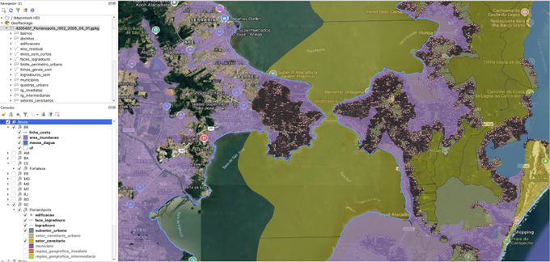{#fig-exemplicacao-camada-bronze}

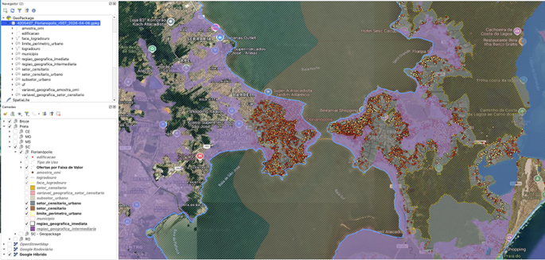{#fig-exemplicacao-camada-prata}

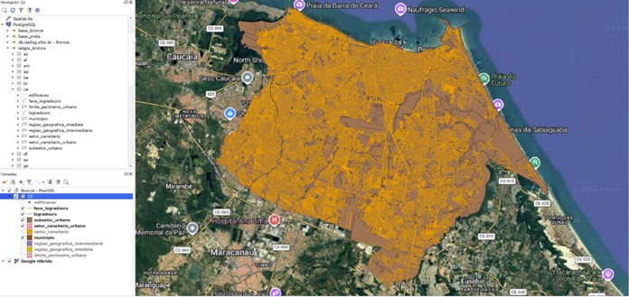{#fig-exemplicacao-de-dados-postgis-camada-bronze}

### Qualidade de dados espaciais e Consistência topológica

A qualidade da base cartográfica foi tratada como requisito estruturante da ETAPA 2, uma vez que a confiabilidade das variáveis geográficas e dos produtos derivados depende diretamente da consistência geométrica, topológica, temática e estrutural das camadas de origem. Nesse contexto, a qualidade não foi compreendida como uma verificação isolada ao final do processo, mas como um controle contínuo, incorporado ao fluxo operacional desde a ingestão dos dados até a consolidação das versões tratadas e qualificadas.

No plano de gerenciamento e nos procedimentos operacionais da etapa, os controles de qualidade estão associados a princípios de reprodutibilidade, auditabilidade, rastreabilidade, padronização normativa e compatibilidade tecnológica, assegurando que a base cartográfica produzida possa ser reutilizada, inspecionada e evoluída de forma controlada ao longo do projeto. Essa orientação foi materializada na definição de checkpoints formais entre as camadas Bronze, Prata e Ouro, de modo que o avanço entre estágios depende do atendimento a critérios mínimos de integridade e consistência.

Na prática, os procedimentos de validação contemplaram a verificação de aspectos como: leitura correta dos arquivos, compatibilidade do sistema de referência espacial, aderência ao escopo territorial do município, presença dos atributos mínimos previstos no dicionário de dados, consistência da modelagem das classes, validade geométrica das feições e coerência entre camadas relacionadas. No campo da consistência topológica, isso implicou observar, conforme a natureza da camada, a ocorrência de sobreposições indevidas, lacunas, fragmentações residuais, duplicidades, desconexões, geometrias inválidas e incoerências espaciais entre feições que deveriam manter relação de adjacência, continuidade ou contenção.

Esse controle foi particularmente relevante em camadas como setores censitários, setores urbanos, logradouros, faces de logradouro, subsetores e edificações, nas quais a qualidade geométrica influencia diretamente a geração de produtos derivados e a associação correta das variáveis geográficas às entidades territoriais. Os registros operacionais mostram que a equipe realizou verificações específicas sobre logradouros, quadras, geocodificação de amostra do OMI, subsetores e normalização de classes e atributos, demonstrando que os problemas de consistência foram tratados como parte do próprio processo produtivo e não apenas como correção posterior.

A passagem da camada Bronze para a Prata foi condicionada justamente a esse processo de conferência e saneamento. O dado bruto só é considerado apto ao tratamento analítico após passar por verificações de integridade, estrutura e validade geométrica; em seguida, a camada Prata é submetida a uma qualificação técnica adicional, voltada à coerência temática, à aderência ao dicionário de dados e à sua aptidão para suportar a geração das variáveis geográficas. Esse mecanismo fortalece o aceite técnico das entregas parciais e reduz o risco de propagação de erros para as etapas seguintes.

Além disso, a qualidade da base cartográfica foi reforçada pela própria estrutura de governança de dados adotada no ambiente PostGIS, com controle de ingestão, registro de linhagem, padronização de nomenclaturas e mecanismos de auditoria. Esses elementos ampliam a capacidade de rastrear a origem dos dados, identificar revisões e inspecionar alterações, contribuindo para uma abordagem de qualidade orientada não apenas à geometria, mas também à custódia e governança da informação espacial.

Em síntese, a consistência topológica e a qualidade da base cartográfica foram tratadas como critérios permanentes de aceite e confiabilidade, fundamentais para assegurar que a ETAPA 2 produza uma base territorial tecnicamente sólida, compatível com os requisitos da modelagem de avaliação em massa e adequada ao uso institucional pretendido.

## Desafios

Os desafios apresentados a seguir decorrem de uma etapa que já se encontra operacionalizada e com resultados concretos produzidos. Por essa razão, as preocupações atuais não se concentram mais na simples viabilização inicial da ETAPA 2, mas na consolidação de sua maturidade, na estabilização metodológica, na integração entre frentes do projeto e na ampliação da sua capacidade de produção territorial em escala. Em outras palavras, os desafios são proporcionais ao avanço obtido: quanto mais a etapa produz, mais se tornam visíveis os requisitos de infraestrutura, governança, integração e escalabilidade necessários para sustentar sua evolução.

Os desafios observados na ETAPA 2 ao longo do trimestre demonstram que a evolução da base cartográfica territorial não depende apenas da execução técnica das atividades previstas, mas da convergência entre **disponibilidade de insumos, maturidade metodológica, capacidade tecnológica, governança de dados e integração entre frentes do projeto**. Trata-se, portanto, de uma etapa que combina elevada intensidade operacional com múltiplas dependências institucionais e técnicas, o que exige tratamento contínuo dos riscos para que os produtos possam evoluir de provas de conceito e entregas parciais para uma base territorial escalável, estável e reutilizável.

O primeiro desafio permanece sendo a dependência entre etapas do projeto. A ETAPA 2 ocupa posição intermediária e estratégica na cadeia de valor do trabalho: depende de definições, alinhamentos e produtos de etapas anteriores, e ao mesmo tempo condiciona diretamente a capacidade da ETAPA 3 de produzir modelos robustos de estimação. Dessa forma, atrasos, indefinições ou incompletudes nas etapas anteriores impactam a seleção de insumos, a priorização das camadas e a organização do cronograma da equipe da ETAPA 2; por outro lado, qualquer insuficiência na ETAPA 2 repercute de forma imediata na qualidade, na abrangência e na confiabilidade dos insumos que alimentarão a modelagem avaliativa.

O segundo desafio refere-se à **d**isponibilidade, qualidade e heterogeneidade das bases de dados externas. A ETAPA 2 depende da combinação de dados oriundos de múltiplas fontes — abertas, institucionais, censitárias, cadastrais, colaborativas e derivadas de imagens — que nem sempre apresentam o mesmo nível de atualização, cobertura, precisão geométrica, compatibilidade semântica ou aderência territorial. A coexistência de bases incompletas, desatualizadas ou estruturalmente distintas aumenta o esforço de validação, padronização e reconciliação entre camadas, além de elevar o risco de inconsistências topológicas, retrabalho e fragmentação metodológica entre municípios e lotes.

O terceiro desafio está associado à integração com os dados do Observatório do Mercado Imobiliário (OMI). A etapa territorial avançou no desenho metodológico e na preparação do banco espacial para receber a amostra de mercado, mas ainda depende da disponibilização, geocodificação, padronização e integração consistente desses insumos para consolidar parte relevante das variáveis geográficas vinculadas à amostra. Isso significa que a evolução plena da etapa não depende apenas da produção cartográfica em si, mas também da estabilidade do fluxo de recebimento dos dados do OMI e da definição clara dos protocolos de cruzamento entre amostras, entidades territoriais e atributos espaciais.

O quarto desafio diz respeito ao risco de retrabalho decorrente de validações tardias ou de definições metodológicas ainda em amadurecimento. A ETAPA 2 exige checkpoints formais de qualidade entre Bronze, Prata e Ouro, mas o próprio processo mostrou que parte das definições precisou ser revista ao longo da execução, seja em relação à camada territorial de referência das variáveis, seja em relação à nomenclatura das classes, à modelagem lógica ou à necessidade de determinadas camadas intermediárias. Esse cenário é compatível com o estágio de construção da etapa, mas amplia o risco de retrabalho e reforça a necessidade de consolidar critérios de aceitação, padrões de dados e mecanismos de validação cada vez mais precoces no fluxo.

O quinto desafio relaciona-se à maturação incremental da modelagem dos produtos territoriais. As primeiras entregas foram produzidas com modelagem parcial e em regime evolutivo, o que é natural em uma fase inicial de implantação, mas evidencia que parte da robustez final da ETAPA 2 ainda depende de consolidação adicional. A definição das classes prioritárias, a estabilização do dicionário de dados, a persistência das entidades territoriais no banco espacial e a separação clara entre camadas de origem, camadas derivadas e tabelas analíticas ainda exigem refinamento contínuo para que a base territorial alcance um estado plenamente estável.

Um sexto desafio, que ganha especial relevância, é a infraestrutura tecnológica necessária para a sustentação e expansão da ETAPA 2. A evolução do fluxo para uma arquitetura orientada a banco espacial, controle de ingestão, auditoria, processamento por lotes e futura integração com publicação demanda ambiente computacional estável, capacidade de armazenamento adequada, mecanismos confiáveis de backup, desempenho suficiente para operações geoespaciais intensivas e governança sobre credenciais, permissões e rotinas automatizadas. Em outras palavras, a etapa já não pode ser entendida apenas como uma produção de arquivos vetoriais; ela passa a depender de uma infraestrutura de dados geoespaciais capaz de suportar carga, persistência, validação, rastreabilidade e integração entre equipes. A limitação ou instabilidade desse ambiente compromete diretamente a escalabilidade do processo.

Associado a isso, o sétimo desafio é a escalabilidade operacional da ETAPA 2. Até o momento, a equipe demonstrou capacidade de estruturar o fluxo, produzir entregas parciais e validar uma POC territorial, mas a ampliação do processo para múltiplos municípios, lotes sucessivos e maior volume de variáveis exige transição de um modelo predominantemente artesanal ou semi automatizado para um modelo mais industrializado. Isso implica automatizar rotinas de ingestão, validar em lote, reduzir dependência de verificações manuais, padronizar regras de nomenclatura e persistência, e garantir que as decisões metodológicas tomadas em um município possam ser reproduzidas de forma consistente em outros contextos. A escalabilidade, portanto, não é apenas uma questão de volume, mas de capacidade de repetição confiável com baixo acúmulo de exceções.

Um oitavo desafio, ainda mais sensível para a etapa, é a incerteza em torno da geração e da futura escalabilidade das variáveis geográficas. Embora a equipe tenha avançado na classificação das variáveis, no teste de fontes, na definição das escalas territoriais e na produção inicial de parte do conjunto, permanece a preocupação de que nem todas as variáveis tenham metodologia plenamente estabilizada, fonte acessível ou regra de agregação consolidada para reprodução em escala. Esse ponto é crítico porque a relevância final da ETAPA 2 não será medida apenas pela existência da base cartográfica, mas pela sua capacidade de entregar um conjunto de variáveis geográficas confiável, comparável entre municípios e efetivamente útil para a modelagem de avaliação em massa. Assim, a incerteza metodológica ou operacional sobre determinadas variáveis representa um desafio não apenas técnico, mas também de produto.

Há ainda um nono desafio relacionado à governança e custódia dos dados espaciais. A implantação de esquemas territoriais por UF, controle de ingestão, log de auditoria, colunas de rastreabilidade e grupos de acesso por função representa um avanço relevante; contudo, essa mesma arquitetura exige disciplina permanente na aplicação de nomenclaturas, permissões, ownership, procedimentos de carga e controle de revisões. À medida que a base cresce e passa a ser consumida por diferentes frentes do projeto, a governança deixa de ser suporte e passa a ser condição essencial para evitar perda de integridade, ambiguidades sobre a versão válida dos dados e fragilidade na reconstituição histórica das entregas.

Por fim, um décimo desafio reside na transformação da etapa em produto institucional sustentável. A ETAPA 2 já avançou significativamente como processo técnico e operacional, mas sua consolidação final requer que os produtos gerados deixem de depender excessivamente do conhecimento tácito da equipe que os construiu e passem a estar integralmente documentados, auditáveis, reproduzíveis e aptos à manutenção em ciclos futuros. Isso significa que o desafio não é apenas concluir entregas, mas garantir que a base territorial resultante possa ser compreendida, mantida, expandida e reutilizada institucionalmente, com previsibilidade de operação e clareza metodológica.

Os desafios da ETAPA 2 não se limitam à disponibilidade de dados ou à execução cartográfica. Eles abrangem a articulação entre etapas, a qualidade e heterogeneidade das fontes, a integração com o OMI, a consolidação da modelagem, a robustez da infraestrutura tecnológica, a capacidade de escalar a produção e, sobretudo, a incerteza ainda existente sobre a geração plena e escalável das variáveis geográficas. Tornar visíveis esses desafios é fundamental porque eles definem, em grande medida, as condições necessárias para que a ETAPA 2 evolua de um estágio de estruturação avançada para um patamar de produção territorial madura, estável e institucionalmente apropriável.

## Escalabilidade

A escalabilidade da ETAPA 2 precisa ser tratada como tema estratégico do projeto. O fluxo metodológico já foi bem desenhado, com camadas Bronze–Prata–Ouro, controle de ingestão, versionamento, banco espacial, trilha de auditoria e checkpoints de qualidade, o que mostra que a etapa caminha na direção correta. No entanto, o principal ponto de atenção do momento é transformar essa arquitetura em capacidade real de execução em escala, isto é, produzir base territorial e variáveis geográficas para múltiplos municípios e lotes com previsibilidade, desempenho, rastreabilidade e baixo retrabalho. Esse desafio é recorrente nos alinhamentos técnicos e suficientemente relevante para mobilizar apoio especializado, inclusive com participação da equipe da Google, o que evidencia seu caráter crítico para a maturidade da etapa.

A discussão sobre escalabilidade ganha ainda mais relevância quando confrontada com os resultados já alcançados no trimestre. A geração de 11 municípios na Bronze, a estruturação de 11 municípios na Prata, a consolidação de 37 camadas registradas no dicionário e a produção de 60 variáveis geográficas demonstram que a ETAPA 2 já possui capacidade inicial comprovada de execução. O desafio agora é transformar essa capacidade inicial em rotina estável e expansível, preservando desempenho, rastreabilidade, auditabilidade e consistência metodológica à medida que o número de municípios, revisões e variáveis cresce. Nesse contexto, a escalabilidade da base cartográfica mostra sinais mais claros de avanço, enquanto a escalabilidade plena da geração das variáveis geográficas permanece como um dos principais pontos de atenção da etapa.

O risco central não está apenas em processar mais dados, mas em garantir que esse crescimento ocorra com infraestrutura tecnológica adequada, automação suficiente, controle de versões, rastreabilidade de origem e auditabilidade das transformações realizadas. Em um fluxo que tende a crescer em volume, revisões e integrações, mecanismos como log de ingestão, auditoria por gatilhos, colunas de controle, schemas territoriais e padronização de nomenclatura deixam de ser apenas boas práticas e passam a ser condições indispensáveis para preservar governança e confiabilidade. Sem isso, a expansão do processo aumentaria a chance de perda de controle sobre os dados, inconsistências entre entregas e dificuldade de reconstituir a origem e a validade de cada resultado.

Há ainda um ponto de atenção adicional: a escalabilidade da geração das variáveis geográficas continua sendo uma das maiores incertezas da ETAPA 2. A base cartográfica já apresenta trajetória mais clara de padronização e expansão, mas parte das variáveis ainda depende de consolidação metodológica, estabilidade das fontes, integração com o OMI e amadurecimento das rotinas de processamento. Assim, o sucesso da etapa em escala não será medido apenas pela produção da base territorial, mas pela capacidade de transformar essa base em um conjunto de variáveis geográficas consistente, comparável entre municípios e efetivamente utilizável pela modelagem de avaliação em massa.

Dessa forma, o tema da escalabilidade deve ser visto como transversal à etapa e articulado a quatro eixos principais: infraestrutura tecnológica, automação do fluxo, governança/rastreabilidade e maturidade das variáveis geográficas. O avanço efetivo nesses quatro eixos será o que permitirá que a ETAPA 2 evolua de um processo tecnicamente bem concebido e já parcialmente operacional para uma linha de produção territorial em escala, com desempenho previsível, controle institucional e capacidade de expansão para novos municípios e novos ciclos de entrega.

Em síntese, a ETAPA 2 já apresenta uma base conceitual e operacional favorável à escalabilidade, mas a transformação dessa arquitetura em capacidade real de execução em larga escala dependerá da consolidação do ambiente tecnológico, da redução de etapas manuais, do fortalecimento dos mecanismos de rastreabilidade e auditabilidade e, sobretudo, da estabilização metodológica e operacional do processo de geração das variáveis geográficas. É justamente nessa convergência entre produção em escala e governança da informação espacial que se encontra um dos desafios mais relevantes e também mais estratégicos da etapa.

## Conclusões

Ao final do primeiro trimestre de 2026, pode-se reafirmar que a ETAPA 2 – Bases Cartográficas Territoriais deixou de se situar apenas no campo do planejamento metodológico e passou a operar com resultados concretos, mensuráveis e tecnicamente estruturados. O período foi marcado pela consolidação da governança da etapa, pela formalização do fluxo operacional, pela implantação da organização Bronze–Prata–Ouro, pela estruturação inicial do ambiente PostgreSQL/PostGIS e pela definição de mecanismos de padronização, rastreabilidade, ingestão e auditoria dos dados espaciais. Esses avanços criaram as condições institucionais e tecnológicas necessárias para transformar o processo territorial em uma frente efetiva de produção de dados para o projeto.

No plano produtivo, os resultados alcançados demonstram avanço material da execução. Foram gerados 11 municípios na camada Bronze, com 16 camadas cartográficas por município, e 11 municípios na camada Prata, com 14 camadas por município, ainda que em níveis distintos de maturidade, sendo Florianópolis o caso mais completo e consolidado do período.

O dicionário de dados passou a registrar 37 camadas distribuídas entre Bronze e Prata, reforçando a organização lógica e documental da base territorial. No campo analítico, foram identificadas 76 variáveis geográficas e geradas 60 variáveis até o momento, o que demonstra avanço substancial do produto geográfico da etapa. Também pode ser destacado como resultado concreto do trimestre a entrega à equipe da ETAPA 3 do pacote territorial de Florianópolis, contendo as 14 camadas da base Prata e as 60 variáveis geográficas geradas. Essa entrega possui relevância estratégica porque representa o principal caso de integração entre a produção cartográfica, a modelagem de dados, a derivação de variáveis e a utilização efetiva dos produtos da ETAPA 2 como insumo para as etapas subsequentes do projeto. A POC de Florianópolis, nesse sentido, cumpriu papel de validação metodológica, teste operacional e demonstração da viabilidade prática da arquitetura territorial construída ao longo do trimestre. Dessa forma, a síntese do período indica que a ETAPA 2 alcançou um patamar de estruturação avançada com produção efetiva, apoiado em fluxo formal, base territorial em formação, banco espacial em consolidação, dicionário de dados em evolução e geração concreta de variáveis geográficas. Ao mesmo tempo, os resultados já tornam mais visíveis os desafios dos ciclos seguintes, especialmente aqueles relacionados à consolidação da camada Prata, à futura constituição da camada Ouro, à robustez da infraestrutura tecnológica, à rastreabilidade e auditabilidade em escala e, sobretudo, à estabilização metodológica e operacional da geração das variáveis geográficas como produto escalável.

Pode-se afirmar que o trimestre foi decisivo para estabelecer os fundamentos técnicos, operacionais e produtivos da ETAPA 2, convertendo planejamento, documentação, modelagem e infraestrutura em entregas territoriais concretas. O desafio dos próximos ciclos deixa de ser o de iniciar a estruturação e passa a ser o de consolidar, ampliar e escalar com segurança a base territorial e o conjunto de variáveis geográficas, de forma compatível com as necessidades institucionais da Receita Federal e com as exigências analíticas do processo de Avaliação em Massa Imóveis Urbanos.
