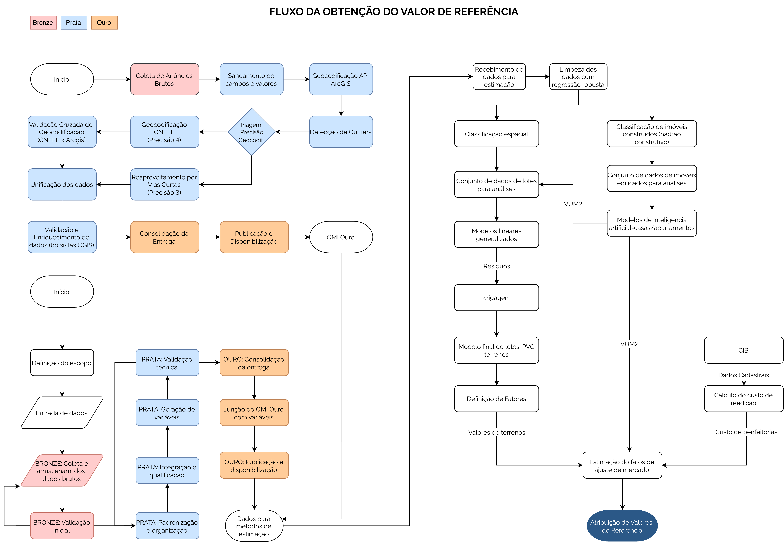
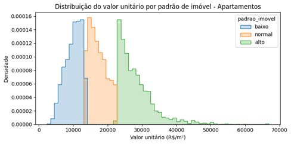
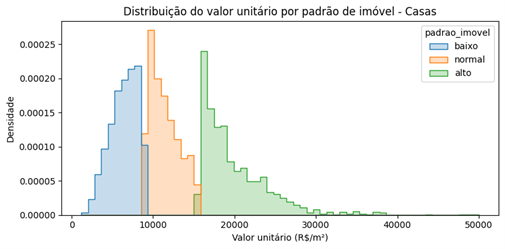
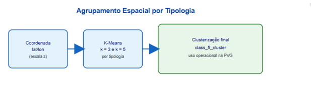
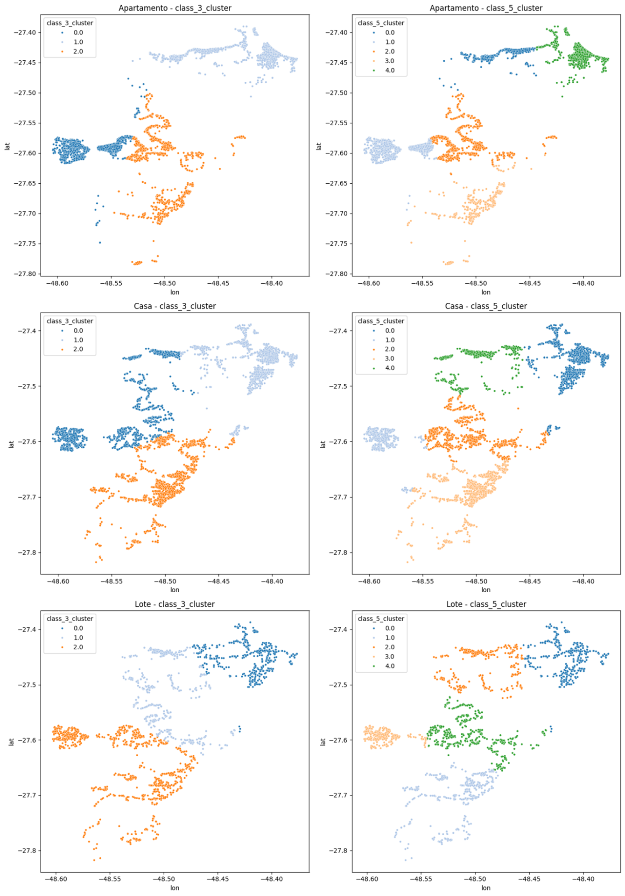

---
editor:
  markdown:
    wrap: 72
execute:
  enabled: false
  eval: false
---

# Materiais, Métodos e Resultados da Etapa 3 - Modelagem e Planta de Valores Genéricos (PVG) {#sec-est}

## Introdução

A Etapa 3 do projeto corresponde ao desenvolvimento da modelagem estatística e espacial voltada à construção da Planta de Valores Genéricos (PVG) e à estimativa dos Valores de Referência dos imóveis urbanos no contexto da Prova de Conceito (PoC) de Florianópolis/SC. Esta etapa representa o núcleo analítico do projeto, pois integra as bases estruturadas nas etapas anteriores — observatório do mercado imobiliário, variáveis geoespaciais e bases cartográficas territoriais — para geração de modelos capazes de representar o comportamento do mercado imobiliário de forma consistente, auditável e escalável.

A modelagem foi estruturada com base em princípios de avaliação em massa, buscando equilibrar desempenho estatístico, coerência econômica e interpretabilidade dos resultados. Nesse contexto, a abordagem adotada combina métodos estatísticos clássicos, técnicas geoestatísticas e procedimentos de segmentação espacial, permitindo representar simultaneamente os fatores locacionais, construtivos e territoriais que influenciam a formação dos valores imobiliários.

O fluxo metodológico desenvolvido foi organizado de forma incremental e controlada, iniciando pela limpeza e qualificação das bases oriundas do Observatório do Mercado Imobiliário, seguida da definição e tratamento das variáveis explicativas, classificação dos imóveis segundo padrão construtivo e segmentação espacial dos mercados. Posteriormente, foram ajustados modelos específicos para imóveis edificados e para lotes urbanos, permitindo a geração de superfícies de valor e de variáveis derivadas utilizadas na composição da PVG.

Para os imóveis edificados, a modelagem buscou estimar os valores unitários do metro quadrado construído (VUM2), considerando atributos físicos, econômicos e locacionais dos imóveis. Já para os lotes urbanos, foram desenvolvidos modelos específicos capazes de representar o comportamento do valor da terra urbana, incorporando variáveis territoriais, renda, acessibilidade, infraestrutura urbana e influência espacial. Essa estratégia permitiu estruturar uma abordagem aderente ao método evolutivo de avaliação, possibilitando posteriormente a composição dos valores finais dos imóveis.

Além do desenvolvimento dos modelos, esta etapa teve papel fundamental na validação metodológica da PoC, permitindo avaliar o comportamento das variáveis, testar estratégias de segmentação territorial, verificar a aderência dos resultados ao mercado imobiliário real e identificar limitações associadas à qualidade dos dados e à heterogeneidade espacial do município. Os resultados obtidos constituem uma base importante para o refinamento dos modelos e para a preparação da expansão da metodologia para outros municípios e contextos territoriais.

Por fim, a Etapa 3 também contribuiu para consolidar diretrizes de escalabilidade da modelagem, evidenciando a necessidade de combinar automação, controle técnico e interpretação especializada. A metodologia desenvolvida foi concebida para ser replicável, mantendo rastreabilidade, padronização e capacidade de adaptação às diferentes realidades territoriais que serão encontradas ao longo da futura expansão nacional do projeto.

A etapa 3- Modelagem e Planta de Valores Genéricos (PVG) apresenta os procedimentos e resultados obtidos para a POC Florianópolis/SC. No
apendice 1 encontra-se o fluxo de modelagem utilizado. Todos
os passos constantes do fluxo de modelagem são descritos na sequência.
Os resultados podem ser vistos na @sec-resultados-modelagem. Nas seções
[-@sec-desafios-modelagem] e [-@sec-escalabilidade] são descritos os
principais desafios encontrados e considerações sobre a escalabilidade
da solução adotada para o restante do projeto.

## Fluxo de Modelagem {#sec-fluxo-modelagem}

O fluxo de modelagem pode ser visto no apêndice 1. 
Basicamente, o fluxo mostra que parte do conjunto de dados (dados de
imóveis edificados) foi utilizada para prever valores de metro quadrado
construído (VUM2), gerando uma variável para a localização que
posteriomente foi utilizada na modelagem de valores unitários de lotes,
assim como na definição do fator de ajuste de mercado.

Para a estimação de valores de metro quadrado construído, foi necessária
a classificação dos imóveis edificados (casas e apartamentos) segundo
seu padrão construtivo. Este procedimento encontra-se detalhado na
@sec-classif-pc.

Além disso, os dados foram classificados segundo a sua localização
geoespacial, conforme pode ser visto na @sec-classif-geo, visando a
identificação de submercados imobiliários[^1].

[^1]: Apesar da classificação geoespacial efetuada, verificou-se que, em
    Florianópolis/SC, os modelos responderam bem à subdivisão dos
    mercados em distritos, portanto esta segmentação geospacial dos
    mercados foi adotada. Optou-se por manter aqui o estudo da divisão
    geoespacial do mercado para fins de eventual necessidade em outros
    municípios.

```{mermaid}
%%| fig-width: 4
%%| label: fig-fluxo-modelagem
%%| fig-cap: "Fluxograma da estimação do Valor de Referência."
%%| eval: false
flowchart TB
    A("RECEBIMENTO DOS DADOS DAS ETAPAS 1 E 2") --> B("LIMPEZA DOS DADOS COM REGRESSÃO ROBUSTA")
    B --> C(["CLASSIFICAÇÃO DE IMÓVEIS CONSTRUÍDOS (PADRÃO CONSTRUTIVO)"])
    B --> D(["CLASSIFICAÇÃO ESPACIAL"])
    C --> E("CONJUNTO DE DADOS DE IMÓVEIS EDIFICADOS PARA ANÁLISES")
    E --> F("MODELOS DE INTELIGÊNCIA ARTIFICIAL")
    F --VUM2 --> G("CONJUNTO DE DADOS DE LOTES PARA ANÁLISES")
    D --> G
    G --> H("MODELOS LINEARES GENERALIZADOS")
    H --Resíduos --> I("KRIGAGEM")
    I --> J("MODELO FINAL DE LOTES")
    K["CIB"] --Dados Cadastrais --> L["CÁLCULO DO CUSTO DE REEDIÇÃO"]
    J --Valores de Terrenos --> M
    L --Custo de Benfeitorias --> M["ESTIMAÇÃO DO FATOR DE AJUSTE DE MERCADO"]
    M --> N["ATRIBUIÇÃO DE VALORES DE REFERÊNCIA"]
    F --VUM2--> M
  
    style A stroke:#2962FF, fill:#2962FF,color:#FFFFFF
    style B stroke:#2962FF, fill:#FFD600,color:#FFFFFF
    style F stroke:#2962FF, fill:#FFD600,color:#FFFFFF
    style E stroke:#2962FF, fill:#2962FF,color:#FFFFFF
    style G stroke:#2962FF, fill:#2962FF,color:#FFFFFF
    style H stroke:#2962FF, fill:#FFD600,color:#FFFFFF
    style J stroke:#2962FF, fill:#FFD600,color:#FFFFFF
    style M stroke:#2962FF, fill:#FFD600,color:#FFFFFF
```

```{r}
#| eval: true

```

## Limpeza dos dados

Os dados oriundos do observatório do mercado imobiliário foram limpos
com o auxílio de regressão robusta. Na regressão linear ordinária o
quadrado dos resíduos, $r_i$, são minimizados:

$$\hat\beta_{\text{OLS}} = \min r_i^2 = \arg\min\limits_{\beta} (\mathbb y - \mathbb X\beta)^2$$ {#eq-OLS}

Já a regressão robusta pode ser ajustada de diversas maneiras, com a
aplicação de uma função, $\rho$, dos resíduos diferentes da função
quadrática, como ilustrado na @eq-RLS. O mais natural seria utilizar o
absoluto dos resíduos, em lugar do seu quadrado. Porém, a função
absoluto, $abs(t)$, não possui propriedades desejáveis (não é uma função
derivável em $t = 0$, o que dificulta o processo de minimização). Por
isso é mais comum a utilização de uma função como o *M-Estimador* de
Huber [@Huber1964], da @eq-HLoss.

$$\hat\beta_{\text{RLS}} =  \arg\min\limits_{\beta} \rho(\mathbb y - \mathbb X\beta)$$ {#eq-RLS}

Deve-se notar que a função de Huber equivale aproximadamente a um
processo de *Winsorização* os resíduos, ou seja, a partir de um
determinado valor de $k$ (em geral igual a 1,5) os resíduos são
alterados de forma que para $|r_i| > k$ a função de minimização equivale
a tomar o valor absoluto dos resíduos e para resíduos em que
$r_i \leq k$ são tomados os resíduos quadráticos.

$$
\rho_{Huber}(t) = \begin{cases}
\frac{1}{2} t^2 & |t| \leq k\\
k|t| - \frac{1}{2} k^2& |t| >k
\end{cases}
$$ {#eq-HLoss}

Diversas outras funções foram propostas para a @eq-RLS, como a função
*biweight* de Tukey. No entanto, este método de estimação padece do
problema de não ser robusto a *outliers* nas variáveis explicativas,
porém apenas a *outliers* presentes na variável dependente (no caso,
imóveis de valores muito mais altos ou mais baixos do que os que seria
previstos pelos modelos).

Para dar conta dos *outliers* presentes nas variáveis explicativas,
@Rousseeuw_least_1984 propôs dois estimadores: o estimador **LMS**
(*Least Median of Squares*), que minimiza **a mediana** dos resíduos
quadráticos, e o estimador LTS (*Least Trimmed Squares*, ou Mínimos
Quadrados Aparados), que minimiza o quadrado dos resíduos, porém apenas
para os "bons" pontos da amostra:

$$
\beta_{LTS} = \underset{\beta}{\arg \min} \sum_{i=1}^h (y_i - X\beta)^2_{i:n}
$$ {#eq-LTS}

Resumidamente, o estimador LTS da @eq-LTS utiliza aproximadamente apenas
$h$ pontos da amostra (em geral, $h \approx 0,5\cdot n$) para um ajuste
mais estável, e calcula os resíduos de cada ponto da amostra em relação
à esta reta de regressão robusta. Após o cálculo dos resíduos os pontos
são classificados como "bons" (pontos cujos resíduos padronizados são
menores que 2,5 em módulo) ou "ruins" (em que $|r_i| > 2,5$). Por
questões computacionais, a princípio o estimador LMS foi adotado em
detrimento do estimador LTS. No entanto, com o desenvolvimento da
capacidade de processamento dos computadores, o método LTS tornou-se
mais popular e, por isso, foi o escolhido para a limpeza de dados neste
projeto.

## Definição de variáveis {#sec-variaveis-modelagem}

Para os imóveis edificados, foram utilizadas as seguintes variáveis:

-   `dist_litoral`: variável numérica quantitativa que mede a distância
    do imóvel ao litoral, em metros;
-   `renda_pct_krigada`: variável numérica quantitativa que mede a renda
    per capita do censo 2022 (IBGE), krigada, em Reais;
-   `tipo_imovel`: variável qualitativa (dicotômica em grupo) que
    designa a tipologia do imóvel (Apartamento, Cobertura, Flat, Casa ou
    Casa de Condomínio);
-   `area`: variável numérica quantitativa que mede a área privativa do
    imóvel, em $m^2$;
-   `num_banheiros`: variável numérica quantitativa que representa o
    número de banheiros do imóvel;
-   `num_vagas_garagem`: variável numérica quantitativa que representa o
    número de vagas de garagem do imóvel;
-   `num_suites`: variável numérica quantitativa que representa o número
    de suítes do imóvel;
-   `PC`: variável qualitativa (dicotômica em grupo) que designa o
    padrão construtivo do imóvel (Baixo, Médio ou Alto);
-   `Tipologia`: variável qualitativa (dicotômica) que divide a amostra
    em Apartamentos (Apartamentos, Coberturas e Flats) ou Casas (Casas e
    Casas de Condomínio).

Já para os lotes, foram utilizadas:

-   `area`: variável numérica quantitativa que mede a área do lote, em
    $m^2$;
-   `Dist`: variável numérica quantitativa que representa a média
    harmônica das distâncias ao centro da cidade e da distância ao
    litoral;
-   `VUM2`: variável numérica quantitativa que representa o valor
    unitário do metro quadrado construído na localidade do lote;
-   `renda_pct_krigada`: variável numérica quantitativa que mede a renda
    per capita do censo 2022 (IBGE), krigada, em Reais;
-   `ca_max`: variável numérica quantitativa que representa o
    coeficiente de aproveitamento máximo do lote;
-   `dens_equip_saud`: variável numérica quantitativa que representa a
    densidade de equipamentos de saúde no entorno do imóvel;
-   `tipo_uso`: variável qualitativa (dicotômica) que designa se o
    imóvel tem um potencial de uso residencial ou comercial.

### Classificação de imóveis construídos (padrão construtivo) {#sec-classif-pc}

Para a classificação de imóveis construídos, adotou-se como variável
principal o **valor unitário** (R\$/m²), calculado pela razão entre
preço anunciado e área privativa. Essa escolha foi feita por
representar, de forma sintética, o posicionamento econômico do imóvel e
refletir diferenças construtivas observáveis no mercado.

A aplicação foi realizada separadamente para os conjuntos de
**apartamentos** e **casas**, preservando a heterogeneidade entre
tipologias. Em seguida, a variável foi padronizada e submetida a
agrupamento não supervisionado (**K-Means**, com `k = 3`), com ordenação
dos grupos pela média de valor unitário e rotulagem final em três
classes técnicas:

-   baixo padrão;
-   padrão normal;
-   alto padrão.

No contexto deste relatório, o K-Means foi utilizado para organizar
observações em grupos com maior semelhança interna e maior distinção
externa. O algoritmo opera de forma iterativa, alternando duas etapas:
(i) alocação de cada observação ao centróide mais próximo; (ii)
recálculo dos centróides como média dos elementos de cada grupo. O
processo é repetido até estabilização, minimizando a soma dos quadrados
das distâncias intragrupo. Como resultado, obtém-se uma tipologia
objetiva de padrão construtivo, sem impor limiares arbitrários de preço.


{#fig-padrao-construtivo
width="85%"}

Os histogramas a seguir apresentam a distribuição do valor unitário
(R\$/m²) por classe de padrão construtivo gerada pelo K-Means,
separadamente para apartamentos e casas. As distribuições confirmam a
separação entre os grupos: em ambas as tipologias, as curvas dos padrões
baixo, normal e alto apresentam picos em faixas distintas de valor, com
sobreposição controlada nas fronteiras. Essa separação valida que o
algoritmo capturou com consistência a segmentação econômica dos imóveis
sem necessidade de limiares definidos manualmente.

Para os **apartamentos** (@fig-hist-padrao-aptos), o padrão baixo
concentra-se predominantemente na faixa de R\$ 5.000 a R\$ 15.000/m², o
padrão normal entre R\$ 10.000 e R\$ 20.000/m², e o padrão alto
apresenta distribuição mais dispersa, com valores a partir de R\$
20.000/m² e cauda longa até R\$ 70.000/m², refletindo a heterogeneidade
do segmento de alto padrão em Florianópolis.



{#fig-hist-padrao-aptos
width="90%"}

Para as **casas** (@fig-hist-padrao-casas), o padrão baixo concentra-se
até R\$ 10.000/m², o padrão normal entre R\$ 8.000 e R\$ 15.000/m², e o
padrão alto acima de R\$ 15.000/m². Em comparação com os apartamentos,
as casas apresentam faixas de valor unitário mais comprimidas e menor
dispersão no padrão alto, o que evidencia diferenças estruturais entre
as duas tipologias.



{#fig-hist-padrao-casas
width="90%"}

### Classificação espacial {#sec-classif-geo}

Na classificação espacial, as variáveis utilizadas foram as coordenadas
geográficas dos registros (**latitude** e **longitude**) para **cada
tipologia de imóvel**: apartamentos, casas e lotes. Utilizando as
coordenadas (escala z), foi aplicado agrupamento não supervisionado
(**K-Means**) por tipologia.

Foram geradas e comparadas as classificações `class_3_cluster` e
`class_5_cluster` em cada conjunto tipológico, com inspeção visual da
distribuição espacial e da separação entre grupos. Para uso operacional
no fluxo da PVG, foi consolidada a classificação final
**`class_5_cluster`**, por apresentar melhor equilíbrio entre
detalhamento territorial e estabilidade do tamanho dos grupos.

No agrupamento espacial, o K-Means separa zonas com comportamento
locacional semelhante a partir da proximidade entre coordenadas
padronizadas. Embora não substitua uma regionalização administrativa
formal, essa estratégia melhora a representação da heterogeneidade
espacial em cada tipologia e cria estratos técnicos úteis para os
modelos de valor.



{#fig-agrupamento width="85%"}



{#fig-clusterizacao-tipologias
width="95%"}

## Construção dos modelos

Nesta seção são reportados os modelos ajustados para os imóveis
edificados e para os lotes urbanos da cidade de Florianópolis/SC.

### Modelo de imóveis edificados {#sec-modelo-edificados}

Uma vez realizada a limpeza e classificação dos dados segundo o padrão
construtivo, foi ajustado um modelo de regressão linear múltipla sobre
os dados de imóveis edificados (casas e apartamentos). De posse deste
modelo, foram obtidos fatores de homogeneização a partir dos
coeficientes estimados para as diversas variáveis explicativas. Então,
com estes fatores assim ajustados, os dados da amostra de imóveis
edificados foram homogeneizados, para fins de criação de uma superfície
de valores de metro quadrado construído. As estatísticas do modelo de
regressão de imóveis edificados podem ser vistas na @tbl-EdifModel.

```{r}
#| label: tbl-EdifModel
#| tbl-cap: "Modelo de imóveis edificados. Coeficientes exponenciados."
#| echo: false
library(broom)
library(kableExtra)
load("../POC-FLN/model/Edif_OLS.rda")
tab <- FinalFit |>
  tidy(conf.int = TRUE, conf.level = .80, exponentiate = TRUE)

tab[which(tab$term == "(Intercept)"), "term"] <- "Intercepto"

tab |>
  kable(digits = 2, format.args = list(decimal.mark = ",", big.mark = "."),
        col.names = c("Termo", "Coef.", "Erro-padrão", "Estat. t", "p-valor", 
                      "IC_inf", "IC_sup"),
        booktabs = TRUE) |>
 # kable_styling() |>
  footnote(alphabet = c(
    paste("Erro-padrão dos resíduos: ", brf(sigma(FinalFit)), "em ", 
          df.residual(FinalFit), "graus de liberdade"),
    paste("R2: ", brf(R2(FinalFit))),
    paste("R2aj: ", brf(adjR2(FinalFit))),
    paste("AIC: ", brf(AIC(FinalFit)))
  ))
```

Como é possível notar na @tbl-EdifModel, foram utilizadas como variáveis
explicativas do logarítmo natural dos preços unitários as variáveis
citadas na @sec-variaveis-modelagem. É possível notar na @tbl-EdifModel,
ainda, que as variáveis explicativas `area`, `num_banheiros`,
`num_vagas_garagem`, `num_suites` e `PC` foram consideradas com efeitos
diferentes segundo a `Tipologia`.

Este modelo foi utilizado para a geração de uma superfície de valores
(ver @sec-resultados-modelagem).

### Modelo de Lotes

Com a variável `VUM2` criada a partir do modelo de lotes edificados, foi
ajustado um modelo linear generalizado, com família gamma e função de
ligação `log`. As estatísticas desse modelo podem ser vistas na
@tbl-LotesGLM.

```{r}
#| label: tbl-LotesGLM
#| tbl-cap: "Modelo linear generalizado de lotes urbanos. Coeficientes exponenciados."
#| echo: false
library(broom)
library(kableExtra)
library(DescTools)
load("../POC-FLN/model/Lotes_GLM.rda")
tab <- GammaR2 |>
  tidy(conf.int = TRUE, conf.level = .80, exponentiate = TRUE)

tab[which(tab$term == "(Intercept)"), "term"] <- "Intercepto"

tab |>
  kable(digits = 2, format.args = list(decimal.mark = ",", big.mark = "."),
        col.names = c("Termo", "Est.", "Erro-padrão", "Est. t", "p-valor", 
                      "IC_inf", "IC_sup")) |>
  footnote(alphabet = c(
    paste("Erro-padrão dos resíduos: ", brf(sigma(GammaR2)), "em ", 
          df.residual(GammaR2), "graus de liberdade"),
    paste("Pseudo-R2 (NagelKerke):", 
          brf(PseudoR2(GammaR2, which = "Nagelkerk"))),
    paste("AIC:", brf(AIC(GammaR2)))
            )
  )
```

No modelo da @tbl-LotesGLM, para a explicação dos valores unitários dos
lotes foram utilizadas como variáveis explicativas `area`, `Dist`,
`VUM2`, `renda_pct_krigada`, `ca_max`, `dens_equip_saud` e `tipo_uso`,
descritas na @sec-variaveis-modelagem.

Os resíduos do modelo da @tbl-LotesGLM foram krigados, conforme
procedimento descrito na @sec-atividades-modelagem, para posterior
reutilização no modelo de regressão final para os lotes.

## Atividades Desenvolvidas {#sec-atividades-modelagem}

### Seleção de variáveis

A seleção de variáveis foi realizada de acordo com o princípio da
parcimônia (navalha de Ockham). Não foi utilizado nenhum método
automático de seleção: ela foi feita através da inclusão e exclusão
manual de variáveis, testando com cada combinação os modelos, até que um
modelo ótimo fosse obtido, apenas com aquelas variáveis consideradas
importantes, evitando assim o fenômeno do *overfitting*.

Os algoritmos de seleção automática de variáveis, infelizmente, não são
garantia de escolha do melhor modelo. Segundo @Matloff2017:

> There is no panacea! Choosing a subset of predictors on the basis of
> cross-validation, AIC and so on is not foolproof by any means. Due to
> the Principle of Frequent Occurence of Rare Events, some subsets may
> look very good yet actually be artifacts.

### Testes de modelos

O modelo utilizado para a confecção da supercíes de valores de metro
quadrado construído é um modelo preditivo que, por este motivo, não
demanda uma verificação pormenorizada das hipóteses da inferência
clássica.

Para o modelo de lotes, contudo, seria desejável que as hipóteses da
inferência clássica (linearidade, normalidade e homoscedasticidade)
fossem todas verificadas. No entanto, nem sempre é fácil conseguir um
modelo com estas características. A não-verificação das hipóteses da
inferência clássica, contudo, não invalidam a propriedade de
consistência do estimador de mínimos quadrados [@Matloff2017, p. 81]. Ou
seja, quando o tamanho da amostra $n$ tende a infinito, o valor
estimado, $\hat\beta$, tende a $\beta$, independentemente de verificação
das hipóteses de homoscedasticidade e normalidade.

## Resultados {#sec-resultados-modelagem}

### Modelo Final

Foi elaborado um modelo preliminar para os lotes de Florianópolis,
apresentado na @tbl-LotesGLM. Deste modelos foram extraídos resíduos
para verificação da dependência espacial, que se mostrou presente, como
de praxe. Os resíduos do modelo da @tbl-LotesGLM foram então krigados.

Com os resíduos krigados obtidos do modelo preliminar de lotes
(@tbl-LotesGLM), foi ajustada uma variável explicativa de localização
(`layer`) para o ajuste do modelo final (modelo de regressão linear
ordinária) de lotes, da @tbl-LotesModel:

```{r}
#| label: tbl-LotesModel
#| tbl-cap: "Modelo de lotes urbanos."

load("../POC-FLN/model/LotesFinalFit.rda")
tab <- FinalFit |>
  tidy(conf.int = T, conf.level = .80, exponentiate = F) 

tab[which(tab$term == "(Intercept)"), "term"] <- "Intercepto"

tab |>
  kable(digits = 2, format.args = list(decimal.mark = ",", big.mark = "."),
        col.names = c("Termo", "Est.", "Erro-padrão", "Est. t", "p-valor", 
                      "IC_inf", "IC_sup"))  |>
  footnote(alphabet = c(
    paste("Erro-padrão dos resíduos: ", brf(sigma(FinalFit)), "em ", 
          df.residual(FinalFit), "graus de liberdade"),
    paste("R2: ", brf(R2(FinalFit))),
    paste("R2aj: ", brf(adjR2(FinalFit)))
        )
  )
```

Como é possível notar na @tbl-LotesModel, o modelo final tem poder de
explicar em torno de 82% dos preços unitários de mercado, um resultado
que pode ser considerado notável, se consideramos a falta de diversas
variáveis acerca das características físicas dos lotes (frente, forma,
pedologia e outras).

Os gráficos da @fig-ResidualsFinais mostram que não há presença de
*outliers* ou pontos influenciantes no modelo. A normalidade dos
resíduos, no entanto, hipótese da inferência clássica, não foi
verificada, como fica claro quando se analisa o gráfico Q-Q.

A falta da verificação da hipótese da normalidade dos resíduos, no
entanto, não invalida o modelo de regressão linear. Conforme
@Matloff2017 [p. 80-81], $\hat beta$ é um estimador não-viesado e
consistente mesmo na ausência de normalidade e/ou homoscedasticidade.

O modelo da @tbl-LotesModel, portanto, pode ser considerado viável para
a predição de valores unitários de terrenos visando a aplicação do
método evolutivo para toda a cidade. Porém, os testes estatísticas e os
intervalos de confiança dos coeficientes apresentados na @tbl-LotesModel
não são válidos, pela ausência da normalidade. A @tbl-LotesModel2
apresenta, então, as estatísticas do modelo computadas com erros
robustos (matriz HC3). Nota-se que não houve grandes modificações nos
resultados dos testes e dos intervalos de confiança dos coeficientes em
relação ao apresentados na @tbl-LotesModel.

```{r}
#| label: fig-ResiduosFinais
#| fig-cap: "Resíduos do modelo final de lotes."
par(mfrow = c(2,2))
plot(FinalFit)
```

```{r}
#| label: tbl-LotesModel2
#| tbl-cap: "Modelo de lotes urbanos. Erros robustos."

library(lmtest)
library(sandwich)

tab <- 
  coeftest(FinalFit, vcov = vcovHC(FinalFit, type = "HC3")) |>
  tidy(conf.int = T, conf.level = .80, exponentiate = T) 

tab[which(tab$term == "(Intercept)"), "term"] <- "Intercepto"

tab |>
  kable(digits = 2, format.args = list(decimal.mark = ",", big.mark = "."),
        col.names = c("Termo", "Est.", "Erro-padrão", "Est. t", "p-valor", 
                      "IC_inf", "IC_sup"))  |>
  footnote(alphabet = c(
    paste("Erro-padrão dos resíduos: ", brf(sigma(FinalFit)), "em ", 
          df.residual(FinalFit), "graus de liberdade"),
    paste("R2: ", brf(R2(FinalFit))),
    paste("R2aj: ", brf(adjR2(FinalFit)))
        )
  )
```

### *Outputs* de valor

#### Superfície de valores de metro quadrado construído

```{r}
#| label: fig-superficieVU
#| fig-cap: "Mapa de Valores de metro quadrado construído (R$/m2)."
library(terra)
library(tidyterra)
Raster <- rast("../POC-FLN/IDW/4205407_Florianopolis_v001.tif")
# plot(Raster, col = terrain.colors(100))
# ggplot() +
#   geom_spatraster(data = Raster) +
#   scale_color_viridis_b()

mapa_ko <-
  tm_basemap(c(Satelite = "Esri.WorldImagery")) +
  tm_shape(Raster) +
  tm_raster(palette = col, title = "Superfície de Valores Unitários") +
  tm_layout("Amostra de Imóveis Edificados",
            legend.outside=TRUE,
            attr.color = "orange",
            inner.margins = c(0.1,0.1,0.1,0.1) # bottom, left, top, right
  ) + 
  tm_compass() +
  tm_scalebar() +
  tm_check_fix() 
mapa_ko
```

#### Planta de Valores Genéricos

Com o modelo da @tbl-LotesModel é possível elaborar uma planta de
valores genéricos (PVG) para a cidade de Florianópolis. Esta PVG deve
ter uma escala condizente com a magnitude do projeto. Se por um lado não
é viável tecnicamente a elaboração de PVG's por face de quadras no
contexto deste projeto, por outro lado a escala de trabalho não pode ser
pequena a ponto de não permitir a aplicação uma tributação com um mínimo
de equidade.

Uma vez definida a escala, a PVG deverá ser gerada a partir da
superfície de valores unitários de lotes mostrada na
@fig-SuperficieVULotes.

### Outros modelos

Nesta seção são apresentados os resultados de outros modelos
estatísticos elaborados para a POC Florianópolis. São estudos de modelos
de aprendizado de máquina. Tais modelos não foram utilizados para os
resultados finais da POC, por dois motivos: primeiro, os modelos foram
ajustados em paralelo ao andamento previsto para a POC; segundo, existe
a dificuldade de interpretabilidade dos modelos de aprendizado de
máquina. Como ilustrado na @fig-fluxo-modelagem, os modelos de
aprendizado de máquina devem ser utilizados ao longo do projeto, porém
os seus resultados deverão ser utilizados como um caminho para a
estimação linear dos valores finais, mantendo assim a
interpretabilidade.

#### Estimação de valores unitários (VU) de lotes em Florianópolis (SC)

#### Objetivo

Estimar valores absolutos e unitários de lotes em Florianópolis a partir
de anúncios raspados no Viva Real em 01/11/2025, e gerar superfície de
valores unitários estimados.

#### Bases de dados utilizadas

`4205407_Florianopolis_r007_2026-04-06 — variavel_geografica_amostra_omi.gpkg`

#### Preparação dos dados

##### Seleção de observações

A partir do campo `arcgis_precisao`foram filtradas as observações com
valores iguais a 3 ou 4. Em `tipo_negocio` foram filtradas "venda" ou
"venda/aluguel". Em `tipo_imov` filtraram-se `Apartamento`, `Casa`,
`Casa de Condomínio`, `Cobertura` e `Flat`. Em `situacao`, foram
filtradas as classificadas em "Urbana".

##### Geração de *dummies* de tipos de uso

Foram geradas variáveis *dummy* para os tipos de uso constantes na base
de dados: `d\_apartamento`, `d\_casa`, `d\_casa\_cond`, `d\_cobertura` e
`d\_flat`.

##### Imputação de valores

Às observações com valores nulos (0) ou ausentes (NA), foram imputados
valores, a partir da média dos k vizinhos mais próximos - KNN (k = 8),
para as seguintes variáveis:

-   `val_iptu`: remoção prévia de valores superiores a R\$ 120 mil,
    considerados *outliers* após inspeção visual (valores
    discrepantemente altos sem padrão espacial discernível). Foram
    realizadas 8 remoções. Apenas os valores `NA` foram imputados, pois
    valores nulos de IPTU podem corresponder à realidade no caso de
    imóveis isentos;

-   `ca_max`: corresponde ao Coeficiente de Aproveitamento máximo na
    localização do lote. Além dos valores ausentes, foram imputados os
    valores nulos, pois não se considera realista valores nulos para
    imóveis edificados;

-   `to_max`: corresponde à Taxa de Ocupação máxima na localização do
    lote. Foram imputados valores ausentes e nulos, pelas mesmas razões
    do `ca_max`;

-   `renda_med_pct`: corresponde à renda média per capita do setor
    censitário. Dada a inexistência de valores nulos, apenas os valores
    ausentes foram imputados;

-   `classe\_declividade`: corresponde à classe de declividade da
    localização do lote, variando de 1 = plano a 5 = montanhoso. Após
    conversão do campo para a classe *integer*, imputaram-se apenas os
    valores ausentes, dada a inexistência de valores nulos;

-   `var_ren_media`: corresponde à variância da renda média no setor
    censitário. Foram imputados apenas os valores ausentes, dada a
    inexistência de valores nulos.

##### Remoção de observações com valores NA ou artificialmente baixos para Área total

Todas as observações cuja variável `Area_total` exibisse valores
ausentes ou menores ou iguais a 10 foram removidas. Além disso, foram
removidas todas as observações com valores ausentes nas variáveis
`qtd_vg_garagem`, `qtd_suites`, `area_total`.

##### Taxa condominial como variável *dummy*

A muitos imóveis nâo incide taxa condominial. Por essa razão, foram
criadas colunas para valores `NA` de `taxa_condominial` (como variável
dummy) e imputados valores 0 para `NAs` nas colunas originais.

##### Tranformação logarítmica

De modo a reduzir a assimetria da distribuição das variáveis, tanto a
dependente como as independentes, com exceção das *dummies*, foram
logaritmizadas. Antes, os valores nulos foram transformados segundo as
respectivas distribuições das variáveis e valores mínimos, conforme
rotina a seguir:

-   `area_anun`, `area_total` $<= 10 \rightarrow$ removidos;

-   `qtd_lote`, `val_iptu`, `dens_demo_hab_km2` $= 0 \rightarrow 0,1$;

-   `dens_equip\_educ`, `dens_equip_saud`, `dist_area_inund`
    $= 0 \rightarrow 0,01$;

-   `qtd_vg_garagem`, `qtd_suites`, $= 0 \rightarrow 0,1$;

-   `dist_litoral`, `total_pess`, $= 0 \rightarrow 1,0$;

-   `lote_medio_m2` $= 0 \rightarrow 10,0$

##### Detecção de outliers por regressão robusta com M-estimadores

A regressão robusta é uma técnica de regressão desenvolvida para reduzir
a influência de outliers ou de violações pressupostos da regressão
linear convencional. Ao contrário do método dos Mínimo Quadrados
Ordinários (MQO), a regressão robusta penaliza menos os erros extremos,
diminuindo o impacto de pontos fora do padrão. Assim, essas observações
recebem pesos (w) menores (Raza *et al.,* 2024).

Antes da regressão robusta, performou-se uma regressão linear simples
exploratória (`OLS_exploratoria`) para verificação de eventuais
variáveis não significativas e de multicolinearidade. As variáveis
empregadas, logaritmizadas, foram definidas como:

-   *Variável dependente*: valor de venda anunciado
    (`log_anun_val_venda`);

-   *Variáveis independentes*: área privativa (`log_area_anun`); n° de
    vagas de garagem (`log_qtd_vg_garagem`); n° de suítes
    (`log_qtd_suites`); n° de banheiros (`log_qtd_banheiros` ); taxa de
    condomínio (`log_tx_condom`); valor de IPTU (`log_val_iptu`); área
    total do lote (`log_area_total`); coeficiente de aproveitamento
    máximo (`log_ca_max`); taxa de ocupação máxima (`log_to_max`);
    densidade demográfica em hab/km² (`log_dens_demo_hab_km2`);
    densidade de equipamentos educacionais (`log_dens_equip_educ`);
    densidade de equipamentos de saúde (`log_dens_equip_saud`);
    distância ao Centro de Florianópolis (`log_dist_centro`); distância
    ao litoral (`log_dist_litoral`); área média do lote em m²
    (log_lote_medio_m2); quantidade de domicílios (`log_qtd_domic`)
    total de pessoas residentes (`log_total_pess`); variação da renda
    média (`log_var_ren_media`); renda média per capita
    (log_renda_med_pct); classe de declividade
    (`log_classe_declividade`); distância a áreas inundáveis
    (`log_dist_area_inund`); quantidade de lotes (`log_qtd_lotes`), tipo
    de imóvel - dummy (`d_casa`, `d_casa_cond`, `d_cobertura`, `d_flat`)
    e dummy de taxa de condomínio (`tx_cond_na`).

Os resultados demonstram a não significância de `log\_dens\_equip\_educ`
(p = 0.6544) e `log\_dist\_centro` (p = 0.2430), removidas.

Em seguida foi executado o modelo robusto (modelo_robusto_Lotes), com a
mesma especificação da OLS_exploratoria, exceto as varáveis removidas na
etapa anterior.

Após a extração dos pesos *w* e de sua distribuição foram consideradas
outliers as 5% observações com menores pesos, o que corresponde a *w* \<
0.6137, as quais foram então excluídas.

##### Variável Padrão construtivo (PC)

Foi criada uma variável `Padrão Construtivo` (PC), com clusterização a
partir de `anun\_val\_venda` e `renda\_med\_pct`. Foram definidas 3
classes (k = 3): baixo padrão, médio padrão e alto padrão.

Um método para a previsão espacial de clusters é a *kigagem indicativa*,
a qual revela a probabilidade de uma variável pertencer a uma
determinada classe no espaço, gerando uma classificação final a partir
do maior valor de probabilidade para aquele ponto. Faz sentido porque
tanto valor como renda exibem forte componente espacial. Portanto, PC
também exibe alta correlação espacial.

No entanto, a krigagem indicativa revelou-se extremamente onerosa
computacionalmente. Adota-se, portanto, o k-NN espacial, mais leve
computacionalmente e conceitualmente próximo à krigagem indicativa (Miao
*et al.*, 2025). Este método Compara com os k-vizinhos mais próximos e
verifica a que clusters (PC) eles pertencem, adotando-se uma abordagem
probabilística (% de vizinhos em cada classe). O número de vizinhos foi
definido como k = 8.

#### Modelo OLS

O primeiro modelo produzido foi uma regressão linear simples (OLS) com a
mesma especificação da regressão robusta, através da função `lm` (nativa
do R). O modelo OLS exibiu os seguintes resultados:

-   Desvio padrão residual = 0.2917 em 45375 graus de liberdade;
-   R²-ajustado = 0.8249;
-   Estatística F = 8225 em 26 e 45375 graus de liberdade;
-   $p < 2.2e-16$.

Os quatro gráficos diagnósticos gerados (*Residuals vs Fitted*, *Q-Q
Residuals*, *Scale-Location*, *Residuals vs Leverage*) revelam pequena
não linearidade residual, resíduos não normalmente distribuídos,
heterocedasticidade moderada e ausência de outliers ou observações muito
influentes. A não linearidade e não normalidade podem dever-se à
dependência e heterogeneidade espacial. Assim, foi efetuada uma análise
espacial exploratória, mediante análise de autocorrelação espacial de
Moran, com os seguintes resultados:

-   I de Moran: 0.4696;

-   I de Moran esperado sem autocorrelação espacial: -2.202352e-05;

-   teste t: 254.24;

-   $p < 2.2e-16$

Valores que confirmam forte autocorrelação espacial nos resíduos.

Nesse sentido, um modelo combinado hierárquico - MH + *machine
learning* - ML nos resíduos (doravante MHML) é capaz de mitigar a
autocorrelação espacial. O MH absorve parte da heterogeneidade espacial,
enquanto o ML nos resíduos captura não linearidades, efeitos locais
(equivalente ao GWR) e a microestrutura local (Liu; Kounadi;
Zurita-Milla, 2022).

#### Modelo Hierárquico (MH)

Seguidamente, foi aplicado um modelo hierárquico (MH), com a mesma
especificação do OLS, incluindo setores censitários como níveis
hierarquicamente aninhados nos distritos: `(1 | cd_dist/cd_setor)` . A
função adotada é `lmer` (pacote `lme4`).

O MH resultou nos seguintes valores de variância para os níveis
hierárquicos:

-   var. cd_setor = 0.02187 (21.52%)
-   var. cd_dist = 0.02069 (20.36%)
-   var. residual = 0.05906 (58.11%)

O que implica em alta variância espacial (\~42%), justificando o modelo
hierárquico. Observa-se que setor é o nível dominante, mas distrito é
quase tão importante.

Em termos de ajuste da regressão, foram obtidos:

-   R² marginal (efeitos fixos) = 0.782
-   R² condicional (efeitos fixos + aleatórios) = 0.873

#### Modelo Combinado - MHML

O modelo hierárquico captura a estrutura global e os efeitos espaciais
de cada nível, enquanto o modelo baseado em *machine learning* (ML)
captura não linearidades e interações restantes. Vários estudos sugerem
que, dentre os modelos ML, os baseados em Boost exibem desempenho
superior aos baseados em Random Forests (RF) (Hjort et al., 2022; Liu
*et al.*, 2024; Ho; Tang; Wong, 2021). Essa abordagem híbrida é
conhecida como *stacking residual* ou *two-stage modeling*, em que um
modelo estatístico principal é complementado por um algoritmo de machine
learning aplicado aos erros sistemáticos não explicados inicialmente.

Estudos comparativos mostram que o XGBoost e o LightGBM apresentam
desempenho muito semelhante (Chango-Sailema et al., 2026, sendo que em
alguns casos o LightGBM supera (Indah et. al., 2025). Em vista dessas
vantagens, optou-se pelo LightGBM, que possui melhor custo-benefício,
performance comparável ao XGBoost e é mais leve.

##### Estratégia de estimação

A base de dados foi inicialmente dividida em:

-   70% para treino;

-   30% para teste

No conjunto de treino, realizou-se nova subdivisão:

-   80% treino interno;

-   20% validação.

O subconjunto de validação foi utilizado durante o treinamento do
LightGBM, com mecanismo de *early stopping*, prevenindo sobreajuste.

##### Primeira etapa: modelo hierárquico (MH)

Inicialmente foi ajustado o modelo hierárquico linear com a mesma
especificação anterior.

##### Modelagem dos resíduos

Após a estimação do MH, foram calculados os resíduos, os quais
representam parcela do valor dos imóveis não capturada pelo modelo
hierárquico, incluindo relações não lineares, interações complexas entre
variáveis, heterogeneidades locais e padrões difíceis de representar em
regressão linear. Sobre esses resíduos foi treinado o algoritmo
LightGBM.

##### Parâmetros do LightGBM

O modelo foi ajustado com parâmetros conservadores, priorizando
generalização:

-   learning rate = 0.03;
-   n° leaves = 20;
-   feature fraction = 0.7;
-   bagging fraction = 0.7;
-   bagging frequency = 5;
-   n° rounds = 200.

Foi adotado critério de parada antecipada após 20 iterações sem melhora
na validação.

##### Predição final

A previsão final resulta da soma entre: previsão estrutural do Modelo
Hierárquico + correção residual aprendida pelo LightGBM. Como o modelo
foi estimado em escala logarítmica, aplicou-se retransfomação
exponencial com *Smearing Correction*, corrigindo o viés da volta à
escala monetária.

##### Resultados comparativos

| Modelo | R²     | RMSE    | MAE     | MAPE   |
|--------|--------|---------|---------|--------|
| OLS    | 0.8263 | 803.118 | 460.729 | 24.00% |
| MH     | 0.8555 | 734.440 | 389.775 | 19.48% |
| MHML   | 0.8884 | 633.703 | 351.822 | 18.44% |

*Valores monetários em R\$.*

O modelo combinado (MHML) apresentou o melhor desempenho em todos os
indicadores. Em relação ao OLS houve aumento substancial do poder
explicativo, redução expressiva do erro absoluto médio e redução do erro
percentual médio. Em relação ao modelo hierárquico isolado (MH) o
LightGBM conseguiu capturar padrões residuais relevantes, houve ganho
adicional de precisão e manteve-se a interpretação estrutural do MH,
adicionando flexibilidade preditiva.

Apesar do ganho de desempenho, persistem erros relevantes no MHML:

-   MAE ≈ R\$ 352 mil;

-   MAPE ≈ 18,4%

Isso indica que, embora robusto, o mercado imobiliário ainda contém
elevada heterogeneidade não totalmente observável.

##### Modelo final operacional

Após a validação comparativa, o MHML foi reestimado utilizando 100% da
base de dados, gerando a variável final `Valor_previsto_MHML_todos`.
Essa variável corresponde ao valor estimado de mercado dos imóveis
segundo o modelo combinado final.

#### Geração de superfície contínua de valores unitários (IDW)

Com o objetivo de incorporar ao modelo de previsão de valores para lotes
uma variável espacial representativa da dinâmica do mercado residencial,
foi gerada uma superfície contínua de valores unitários (VU em R\$/m²) a
partir dos imóveis observados, utilizando o método de interpolação
*Inverse Distance Weighting* (IDW). Essa superfície foi posteriormente
exportada em formato raster (GeoTIFF) para uso como variável explicativa
espacial no modelo de lotes.

A área de interpolação foi contruída com zona de influência de 1000 m em
torno dos pontos amostrais. Posteriormente, foi gerada grade regular com
resolução espacial de 100 m, sendo que cada célula da grade corresponde
ao local onde o valor unitário foi estimado.

Adotaram-se os seguintes parâmetros para a interpolação IDW:

-   Potência (idp) = 2;

-   Máximo de vizinhos (nmax) = 50;

-   Distância máxima (maxdist) = 3000 m.

Assim, cada célula foi estimada com base em até 50 imóveis localizados
num raio máximo de 3 km.

## Desafios {#sec-desafios-modelagem}

A modelagem de valores de lotes é desafiadora, especialmente por conta
da falta de um cadastro urbano completo, que impossibilita a extração
das características físicas dos lotes, o que certamente melhoraria a
estimação. Durante o projeto, variáveis cartográficas alternativas devem
ser buscadas para complementar o poder de explicação dos modelos de
lotes urbanos.

### Importância das variáveis

As variáveis mais importantes para a estimação de valores unitários de
lotes podem ser extraídas da análise da @tbl-correlacoes: a variável
mais importante para explicar os valores unitários dos lotes foi a
variável `area`, seguida da variável de localização (`layer`) e da
variável `VUM2`.

```{r}
#| label: tbl-correlacoes
#| tbl-cap: "Correlações"
olsrr::ols_correlations(FinalFit) |>
  kable(digits = 2, format.args = list(decimal.mark = ",", big.mark = "."))
```

### Aderência ao mercado

A aderência ao mercado do modelo de lotes urbanos pode ser verificada
subjetivamente através da análise da superfície krigada de valores
unitários homogeneizados para um lote residencial padrão com 450 $m^2$
de área.

```{r}
#| label: fig-SuperficieVULotes
#| fig-cap: "Superfície de valores unitários para um lote padrão residencial de 450m2."
# knitr::include_graphics("../POC-FLN/KO/4205407_Florianopolis_Lotes_v001.tif")
Raster <- rast("../POC-FLN/KO/4205407_Florianopolis_Lotes_v001.tif")
# plot(Raster, col = terrain.colors(100))
# ggplot() +
#   geom_spatraster(data = Raster) +
#   scale_color_viridis_b()

mapa_ko <-
  tm_basemap(c(Satelite = "Esri.WorldImagery")) +
  tm_shape(Raster) +
  tm_raster(palette = col, title = "Superfície de Valores Unitários") +
  tm_layout("Amostra de Lotes",
            legend.outside=TRUE,
            attr.color = "orange",
            inner.margins = c(0.1,0.1,0.1,0.1) # bottom, left, top, right
  ) + 
  tm_compass() +
  tm_scalebar() +
  tm_check_fix() 
mapa_ko
```

## Escalabilidade {#sec-escalabilidade}

A escalabilidade do processo de modelagem deve se dar de forma natural
ao longo do projeto. Em termos de estimação, a automatização completa é
um tanto temerária: não se pode prescindir de efetuar um controle de
qualidade através de uma análise crítica dos modelos, verificando a
coerência dos resultados obtidos. A definição de um fluxograma de
estimação, no entanto, como mostrado na @fig-fluxo-modelagem, permite a
divisão das tarefas entre os membros da equipe de estimação, o que
deverá tornar o processo de estimação mais eficiente, ainda que demande
um controle de qualidade rigoroso.

Considera-se importante para a escalabilidade a utilização dos modelos
paramétricos, melhorados, com o auxílio da krigagem, da variável de
localização baseada nos resíduos de um modelo preliminar, pois isto
permitirá, em tempo futuro, uma metanálise dos resultados obtidos em
cada capital. Isto pode vir a permitir, após a confecção dos modelos em
um número suficiente de capitais, extrapolar o conhecimento obtido para
outras capitais de maneira científica, evitando-se a eventual
necessidade de adoção de procedimentos duvidosos, como a adoção de
fatores de homogeneização determinísticos.

### Replicação em outros municípios

A replicação em outros municípios se dará com as devidas adaptações
eventualmente necessárias para refletir a realidade dos mercados
imobiliários locais.

Como argumentado acima, a eventual extrapolação do conhecimento obtido
em uma cidade para outra deverá ocorrer em tempo futuro, apenas após o
acúmulo de estudos suficientes para a elaboração de uma metanálise que
permita que essa extrapolação seja feita com segurança.

A definição de um controle de qualidade, objetivo do processo de
estimação também deverá ocorrer naturalmente ao longo do projeto, com a
definição de métricas adequadas para os modelos.

## Conclusões

A Etapa 3 permitiu consolidar a estrutura metodológica de modelagem estatística e espacial voltada à construção da Planta de Valores Genéricos (PVG) e à estimação dos Valores de Referência no contexto da Prova de Conceito (PoC) de Florianópolis/SC. Os resultados obtidos demonstraram a viabilidade técnica da abordagem adotada, evidenciando que a integração entre dados de mercado, variáveis geoespaciais e técnicas de modelagem estatística possibilita representar de forma consistente o comportamento do mercado imobiliário urbano.

A etapa permitiu estruturar um fluxo de modelagem integrado, contemplando desde a limpeza robusta das bases de dados até a geração de modelos preditivos para imóveis edificados e lotes urbanos. A utilização de técnicas de regressão robusta, classificação de padrão construtivo por agrupamento não supervisionado, segmentação espacial e modelagem geoestatística contribuiu para aumentar a consistência analítica dos resultados e reduzir os impactos de ruídos e outliers presentes nas bases de mercado.

Os modelos desenvolvidos apresentaram desempenho estatístico relevante, especialmente considerando a complexidade e heterogeneidade do mercado imobiliário urbano. O modelo de imóveis edificados alcançou elevado poder explicativo, permitindo a geração de superfícies de valores unitários do metro quadrado construído, enquanto o modelo de lotes urbanos demonstrou capacidade consistente de representar os valores da terra urbana mesmo diante da ausência de diversas variáveis físicas tradicionalmente utilizadas em avaliações imobiliárias.

Outro resultado importante desta etapa foi a consolidação de uma estratégia de modelagem interpretável e auditável, alinhada às necessidades institucionais da Receita Federal do Brasil. Diferentemente de abordagens exclusivamente baseadas em modelos de “caixa preta”, a metodologia adotada buscou preservar a capacidade de interpretação econômica das variáveis, a rastreabilidade das decisões metodológicas e a transparência do processo de formação dos valores estimados. Essa característica é fundamental para garantir legitimidade técnica, auditabilidade e futura internalização institucional da solução.

A etapa também permitiu identificar limitações metodológicas relevantes, especialmente relacionadas à qualidade das variáveis disponíveis, à heterogeneidade espacial dos mercados e às dificuldades associadas à modelagem de lotes vagos e áreas de expansão urbana. Esses achados possuem caráter estratégico, pois orientam os próximos refinamentos metodológicos e evidenciam os pontos críticos que deverão ser tratados antes da expansão da metodologia em escala nacional.

Por fim, os resultados alcançados demonstram que a modelagem desenvolvida na PoC constitui uma base sólida para evolução do projeto, tanto na ampliação territorial quanto na preparação para integração com os ambientes operacionais da RFB. A combinação entre modelagem estatística, inteligência geoespacial e controle metodológico estabelecida nesta etapa representa um avanço significativo na construção de uma arquitetura nacional de avaliação em massa capaz de produzir valores de referência de forma padronizada, escalável e tecnicamente consistente.


#### x. Referências

CHANGO-SAILEMA, W. G.; VELAZTEGUÍ-IZURIETA, H.; PAZUÑA-NARANJO, W. P.
*et al.* XGBoost vs. LightGBM: An XAI Approach to National Vehicle Fleet
Analysis\_. Computation\_, v. 14, n. 4, 81, 2026.

HJORT, A.; PENSAR, J.; SCHEEL, I.; SOMMERVOLL, D. House price prediction
with gradient boosted trees under different loss functions. *Journal of
Property Research*, v. 39, n. 4, p. 338-364, 2022.

HO, W. K. O.; TANG, B.; WONG, S. W.. Predicting property prices with
machine learning algorithms. *Journal of Property Research*, v. 38, n.
1, p. 48-70, 2021.

INDAH, Y. M.; ARISTAWIDYA, R.; FITRIANTO, A.; ERFIANI, E.; JUMANSYAH, L.
M. R. D.. Comparison of Random Forest, XGBoost and LightGBM Methods on
the Human Development Index Classification. *Jambura Journal of
Mathematics*, v. 7, n. 1, p. 14-18, 2025.

LIU, Xiang; CHEN, Xiaohong; ORFORD, Scott; TIAN, Mingshu; ZOU, Guojian.
Does better accessibility always mean higher house prices? *Environment
and Planning B: Urban Analytics and City Science*, v. 51, n. 9, p.
2179-2195, 2024.

LIU, X.; KOUNADI, O.; ZURITA-MILLA, R.. Incorporating spatial
autocorrelation in machine learning models using spatial lag and
eigenvector spatial filtering features. *ISPRS International Journal of
Geo-Information*, v. 11, n. 4, 2022.

MIAO, Y.; LI, H.; XUE, L.; SHEN, C.; WANG, F. Application of a
semi-variogram-based KNN algorithm in the spatial prediction of soil
heavy metals. *Environmental Pollution*, v. 390, p. 127436, 2026.

RAZA, A.; TALIB, M.; NOOR-UL-AMIN, M.; GUNAIME, N.; BOUKHRIS, I.; NABI,
M. Enhancing performance in the presence of outliers with redescending
M-estimators. *Scientific Reports*, v. 14, 13529, 2024. Disponível em:
<https://doi.org/10.1038/s41598-024-64239-6>. Acesso em: 16 abr 2026.

TARASOV, S.; DESSOULAVY-SLIWINSKI, B. Algorithm-Driven Hedonic Real
Estate Pricing – An Explainable AI Approach. *Real Estate Management and
Valuation*, v. 33, n. 1, 2025.
