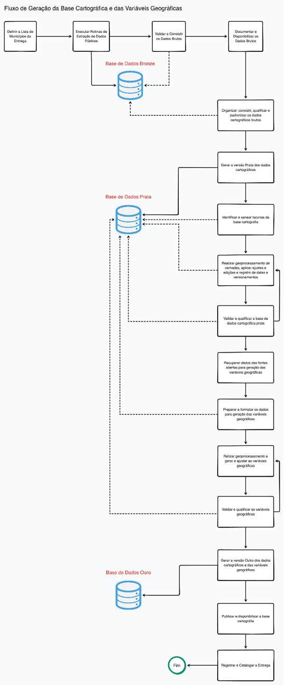

# Estruturação da base territorial {#sec-estr-base}

## Fluxo detalhado da Etapa 2

{height=700}

## Dicionário e modelagem de dados

\blandscape

### uf: Camada de identificação das unidades da federação

| NM_CAMPO_BD | DESC_CAMPO | TIPO_BD | PK | UNIQUE | NOT_NULL | ORIGINAL? |
|-----------|-----------|-----------|-----------|-----------|-----------|-----------|
| cd_uf | Código da Unidade da Federação conforme definição do IBGE | varchar(2) | TRUE | TRUE | TRUE | TRUE |
| cd_regiao | Código das Grandes Regiões (Regiões Geográficas) | varchar(1) | FALSE | FALSE | FALSE | TRUE |
| geometria | Geometria primitiva da camada | public.geometry(MultiPolygon, 4674) | FALSE | FALSE | TRUE | FALSE |
| nm_regiao | Nome da Grande Região Geográfica do IBGE | varchar(15) | FALSE | FALSE | FALSE | TRUE |
| nm_uf | Nome da Unidade da Federação | varchar(20) | FALSE | FALSE | FALSE | TRUE |
| sigla_regiao | Sigla da Grande Região Geográfica | varchar(2) | FALSE | FALSE | FALSE | TRUE |
| sigla_uf | Sigla da Unidade da Federação | varchar(2) | FALSE | FALSE | FALSE | TRUE |
| uf_area_km2 | Área em quilômetros quadrados | numeric | FALSE | FALSE | FALSE | TRUE |

### municipio: Camada de identificação dos municípios

| NM_CAMPO_BD | DESC_CAMPO | TIPO_BD | PK | UNIQUE | NOT_NULL | ORIGINAL? |
|-----------|-----------|-----------|-----------|-----------|-----------|-----------|
| cd_mun | Código do Município | varchar(7) | TRUE | TRUE | TRUE | TRUE |
| mun_area_km2 | Área em quilômetros quadrados | numeric | FALSE | FALSE | TRUE | FALSE |
| cd_concurb | Código da Concentração Urbana | varchar(7) | FALSE | FALSE | FALSE | TRUE |
| cd_regiao | Código das Grandes Regiões (Regiões Geográficas) | varchar(1) | FALSE | FALSE | TRUE | TRUE |
| cd_rgi | Código da Região Geográfica Imediata | varchar(6) | FALSE | FALSE | FALSE | TRUE |
| cd_rgint | Código da Região Geográfica Intermediária | varchar(4) | FALSE | FALSE | FALSE | TRUE |
| cd_uf | Código da Unidade da Federação conforme definição do IBGE | varchar(2) | FALSE | FALSE | TRUE | TRUE |
| geometria | Geometria primitiva da camada | public.geometry(MultiPolygon, 4674) | FALSE | FALSE | TRUE | TRUE |
| nm_concurb | Nome da Concentração Urbana | varchar(254) | FALSE | FALSE | FALSE | TRUE |
| nm_mun | Nome do Município | varchar(350) | FALSE | FALSE | TRUE | TRUE |
| nm_regiao | Nome da Grande Região Geográfica do IBGE | varchar(15) | FALSE | FALSE | TRUE | TRUE |
| nm_rgi | Nome da Região Geográfica Imediata | varchar(254) | FALSE | FALSE | FALSE | TRUE |
| nm_rgint | Nome da Região Geográfica Intermediária | varchar(254) | FALSE | FALSE | FALSE | TRUE |
| nm_uf | Nome da Unidade da Federação | varchar(20) | FALSE | FALSE | TRUE | TRUE |
| sigla_regiao | Sigla da Grande Região Geográfica | varchar(2) | FALSE | FALSE | TRUE | TRUE |
| sigla_uf | Sigla da Unidade da Federação | varchar(2) | FALSE | FALSE | TRUE | TRUE |
| aud_data_criacao | Data/hora da inserção original | timestamp | FALSE | FALSE | TRUE | FALSE |
| aud_data_revisao | Data/hora da última alteração | timestamp | FALSE | FALSE | TRUE | FALSE |
| aud_nome_criador | Nome do operador que realizou a carga | varchar(150) | FALSE | FALSE | TRUE | FALSE |
| aud_nome_revisor | Nome do técnico que editou/validou o dado | varchar(150) | FALSE | FALSE | TRUE | FALSE |
| aud_numero_revisao | Contador de edições e revisões do registro (incrementado sempre que houver alteração do dado). | int | FALSE | FALSE | TRUE | FALSE |

### setor_censitario: Camada de identificação dos setores censitários

| NM_CAMPO_BD | DESC_CAMPO | TIPO_BD | PK | UNIQUE | NOT_NULL | ORIGINAL? |
|-----------|-----------|-----------|-----------|-----------|-----------|-----------|
| cd_setor | Geocódigo de Setor Censitário | varchar(15) | TRUE | TRUE | TRUE | TRUE |
| cd_aglom | Código do Aglomerado | varchar(12) | FALSE | FALSE | FALSE | TRUE |
| cd_bairro | Código do Bairro | varchar(10) | FALSE | FALSE | FALSE | TRUE |
| cd_concurb | Código da Concentração Urbana | varchar(7) | FALSE | FALSE | FALSE | TRUE |
| cd_dist | Código do Distrito | varchar(9) | FALSE | FALSE | FALSE | TRUE |
| cd_fcu | Código da Favela ou Comunidade Urbana | varchar(11) | FALSE | FALSE | FALSE | TRUE |
| cd_mun | Código do Município | varchar(7) | FALSE | FALSE | FALSE | TRUE |
| cd_nu | Código do Núcleo Urbano | varchar(10) | FALSE | FALSE | FALSE | TRUE |
| cd_regiao | Código das Grandes Regiões (Regiões Geográficas) | varchar(1) | FALSE | FALSE | FALSE | TRUE |
| cd_rgi | Código da Região Geográfica Imediata | varchar(6) | FALSE | FALSE | FALSE | TRUE |
| cd_rgint | Código da Região Geográfica Intermediária | varchar(4) | FALSE | FALSE | FALSE | TRUE |
| cd_sit | Código da Situação do Setor Censitário | varchar(1) | FALSE | FALSE | FALSE | TRUE |
| cd_subdist | Código do Subdistrito | varchar(11) | FALSE | FALSE | FALSE | TRUE |
| cd_tipo | Código do Tipo do Setor Censitário | varchar(1) | FALSE | FALSE | FALSE | TRUE |
| cd_uf | Código da Unidade da Federação conforme definição do IBGE | varchar(2) | FALSE | FALSE | FALSE | TRUE |
| geometria | Geometria primitiva da camada | public.geometry(Polygon, 4674) | FALSE | FALSE | FALSE | TRUE |
| nm_aglom | Nome do Aglomerado | varchar(254) | FALSE | FALSE | FALSE | TRUE |
| nm_bairro | Nome do Bairro | varchar(254) | FALSE | FALSE | FALSE | TRUE |
| nm_concurb | Nome da Concentração Urbana | varchar(254) | FALSE | FALSE | FALSE | TRUE |
| nm_dist | Nome do Distrito | varchar(50) | FALSE | FALSE | FALSE | TRUE |
| nm_fcu | Nome da Favela ou Comunidade Urbana | varchar(254) | FALSE | FALSE | FALSE | TRUE |
| nm_mun | Nome do Município | varchar(50) | FALSE | FALSE | FALSE | TRUE |
| nm_nu | Nome do Núcleo Urbano | varchar(254) | FALSE | FALSE | FALSE | TRUE |
| nm_regiao | Nome da Grande Região Geográfica do IBGE | varchar(15) | FALSE | FALSE | FALSE | TRUE |
| nm_rgi | Nome da Região Geográfica Imediata | varchar(254) | FALSE | FALSE | FALSE | TRUE |
| nm_rgint | Nome da Região Geográfica Intermediária | varchar(254) | FALSE | FALSE | FALSE | TRUE |
| nm_subdist | Nome do Subdistrito | varchar(50) | FALSE | FALSE | FALSE | TRUE |
| nm_uf | Nome da Unidade da Federação | varchar(20) | FALSE | FALSE | FALSE | TRUE |
| setor_area_km2 | Área em quilômetros quadrados | numeric | FALSE | FALSE | FALSE | TRUE |
| situacao | Situação do Setor Censitário | varchar(6) | FALSE | FALSE | FALSE | TRUE |
| aud_data_criacao | Data/hora da inserção original | timestamp | FALSE | FALSE | TRUE | FALSE |
| aud_data_revisao | Data/hora da última alteração | timestamp | FALSE | FALSE | TRUE | FALSE |
| aud_nome_criador | Nome do operador que realizou a carga | varchar(150) | FALSE | FALSE | TRUE | FALSE |
| aud_nome_revisor | Nome do técnico que editou/validou o dado | varchar(150) | FALSE | FALSE | TRUE | FALSE |
| aud_numero_revisao | Contador de edições e revisões do registro (incrementado sempre que houver alteração do dado). | int | FALSE | FALSE | TRUE | FALSE |

### setor_censitario_urbano: Camada de identificação dos setores censitários urbanos

| NM_CAMPO_BD | DESC_CAMPO | TIPO_BD | PK | UNIQUE | NOT_NULL | ORIGINAL? |
|-----------|-----------|-----------|-----------|-----------|-----------|-----------|
| cd_setor | Geocódigo de Setor Censitário | varchar(15) | TRUE | TRUE | TRUE | TRUE |
| cd_aglom | Código do Aglomerado | varchar(12) | FALSE | FALSE | FALSE | TRUE |
| cd_bairro | Código do Bairro | varchar(10) | FALSE | FALSE | FALSE | TRUE |
| cd_concurb | Código da Concentração Urbana | varchar(7) | FALSE | FALSE | FALSE | TRUE |
| cd_dist | Código do Distrito | varchar(9) | FALSE | FALSE | FALSE | TRUE |
| cd_fcu | Código da Favela ou Comunidade Urbana | varchar(11) | FALSE | FALSE | FALSE | TRUE |
| cd_mun | Código do Município | varchar(7) | FALSE | FALSE | FALSE | TRUE |
| cd_nu | Código do Núcleo Urbano | varchar(10) | FALSE | FALSE | FALSE | TRUE |
| cd_regiao | Código das Grandes Regiões (Regiões Geográficas) | varchar(1) | FALSE | FALSE | FALSE | TRUE |
| cd_rgi | Código da Região Geográfica Imediata | varchar(6) | FALSE | FALSE | FALSE | TRUE |
| cd_rgint | Código da Região Geográfica Intermediária | varchar(4) | FALSE | FALSE | FALSE | TRUE |
| cd_sit | Código da Situação do Setor Censitário | varchar(1) | FALSE | FALSE | FALSE | TRUE |
| cd_subdist | Código do Subdistrito | varchar(11) | FALSE | FALSE | FALSE | TRUE |
| cd_tipo | Código do Tipo do Setor Censitário | varchar(1) | FALSE | FALSE | FALSE | TRUE |
| cd_uf | Código da Unidade da Federação conforme definição do IBGE | varchar(2) | FALSE | FALSE | FALSE | TRUE |
| geometria | Geometria primitiva da camada | public.geometry(Polygon, 4674) | FALSE | FALSE | FALSE | TRUE |
| nm_aglom | Nome do Aglomerado | varchar(254) | FALSE | FALSE | FALSE | TRUE |
| nm_bairro | Nome do Bairro | varchar(254) | FALSE | FALSE | FALSE | TRUE |
| nm_concurb | Nome da Concentração Urbana | varchar(254) | FALSE | FALSE | FALSE | TRUE |
| nm_dist | Nome do Distrito | varchar(50) | FALSE | FALSE | FALSE | TRUE |
| nm_fcu | Nome da Favela ou Comunidade Urbana | varchar(254) | FALSE | FALSE | FALSE | TRUE |
| nm_mun | Nome do Município | varchar(50) | FALSE | FALSE | FALSE | TRUE |
| nm_nu | Nome do Núcleo Urbano | varchar(254) | FALSE | FALSE | FALSE | TRUE |
| nm_regiao | Nome da Grande Região Geográfica do IBGE | varchar(15) | FALSE | FALSE | FALSE | TRUE |
| nm_rgi | Nome da Região Geográfica Imediata | varchar(254) | FALSE | FALSE | FALSE | TRUE |
| nm_rgint | Nome da Região Geográfica Intermediária | varchar(254) | FALSE | FALSE | FALSE | TRUE |
| nm_subdist | Nome do Subdistrito | varchar(50) | FALSE | FALSE | FALSE | TRUE |
| nm_uf | Nome da Unidade da Federação | varchar(20) | FALSE | FALSE | FALSE | TRUE |
| setor_area_km2 | Área em quilômetros quadrados | numeric | FALSE | FALSE | FALSE | TRUE |
| situacao | Situação do Setor Censitário | varchar(6) | FALSE | FALSE | FALSE | TRUE |
| aud_data_criacao | Data/hora da inserção original | timestamp | FALSE | FALSE | TRUE | FALSE |
| aud_data_revisao | Data/hora da última alteração | timestamp | FALSE | FALSE | TRUE | FALSE |
| aud_nome_criador | Nome do operador que realizou a carga | varchar(150) | FALSE | FALSE | TRUE | FALSE |
| aud_nome_revisor | Nome do técnico que editou/validou o dado | varchar(150) | FALSE | FALSE | TRUE | FALSE |
| aud_numero_revisao | Contador de edições e revisões do registro (incrementado sempre que houver alteração do dado). | int | FALSE | FALSE | TRUE | FALSE |

### limite_perimetro_urbano: Camada de identificação dos perímetros urbanos

| NM_CAMPO_BD | DESC_CAMPO | TIPO_BD | PK | UNIQUE | NOT_NULL | ORIGINAL? |
|-----------|-----------|-----------|-----------|-----------|-----------|-----------|
| cd_concurb | Código da Concentração Urbana | varchar(7) | FALSE | FALSE | FALSE | TRUE |
| cd_mun | Código do Município | varchar(7) | FALSE | FALSE | FALSE | TRUE |
| cd_regiao | Código das Grandes Regiões (Regiões Geográficas) | varchar(1) | FALSE | FALSE | FALSE | TRUE |
| cd_rgi | Código da Região Geográfica Imediata | varchar(6) | FALSE | FALSE | FALSE | TRUE |
| cd_rgint | Código da Região Geográfica Intermediária | varchar(4) | FALSE | FALSE | FALSE | TRUE |
| cd_uf | Código da Unidade da Federação conforme definição do IBGE | varchar(2) | FALSE | FALSE | FALSE | TRUE |
| geometria | Geometria primitiva da camada | geometry(Polygon, 4674) | FALSE | FALSE | FALSE | TRUE |
| nm_concurb | Nome da Concentração Urbana | varchar(254) | FALSE | FALSE | FALSE | TRUE |
| nm_mun | Nome do Município | varchar(254) | FALSE | FALSE | FALSE | TRUE |
| nm_regiao | Nome da Grande Região Geográfica do IBGE | varchar(15) | FALSE | FALSE | FALSE | TRUE |
| nm_rgi | Nome da Região Geográfica Imediata | varchar(254) | FALSE | FALSE | FALSE | TRUE |
| nm_rgint | Nome da Região Geográfica Intermediária | varchar(254) | FALSE | FALSE | FALSE | TRUE |
| nm_uf | Nome da Unidade da Federação | varchar(20) | FALSE | FALSE | FALSE | TRUE |
| area_km2 | Área em quilômetros quadrados | numeric | FALSE | FALSE | FALSE | TRUE |

### logradouro: Camada de identificação dos logradouros

| NM_CAMPO_BD | DESC_CAMPO | TIPO_BD | PK | UNIQUE | NOT_NULL | ORIGINAL? |
|-----------|-----------|-----------|-----------|-----------|-----------|-----------|
| faixas_via | Quantidade de faixas de rolamento | smallint | FALSE | FALSE | FALSE | TRUE |
| geometria | Geometria primitiva da camada | geometry(MultiLinestring, 4674) | FALSE | FALSE | TRUE | TRUE |
| id | Identificador primário | bigint | TRUE | TRUE | TRUE | TRUE |
| id_osm | Identificador primário oriundo do OSM | bigint | FALSE | TRUE | FALSE | TRUE |
| mao_unica | Via de mão única | boolean | FALSE | FALSE | FALSE | TRUE |
| nm_log | Nome do logradouro | text | FALSE | FALSE | FALSE | TRUE |
| sup_via | Tipo de material construtivo da superfície viária | varchar | FALSE | FALSE | FALSE | TRUE |
| tip_log | Tipo do logradouro | varchar | FALSE | FALSE | FALSE | TRUE |
| veloc_max | Velocidade máxima da via | smallint | FALSE | FALSE | FALSE | TRUE |
| log_comp_m | Comprimento calculado em metros | numeric | FALSE | FALSE | FALSE | FALSE |

### face_logradouro: Camada de identificação das faces dos logradouros

| NM_CAMPO_BD | DESC_CAMPO | TIPO_BD | PK | UNIQUE | NOT_NULL | ORIGINAL? |
|-----------|-----------|-----------|-----------|-----------|-----------|-----------|
| id | Identificador primário | bigint | TRUE | TRUE | TRUE | FALSE |
| geometria | Geometria primitiva da camada | geometry(LineString, 4674) | FALSE | FALSE | TRUE | FALSE |
| tot_geral | Quantidade de imóveis da face de logradouro | integer | FALSE | FALSE | FALSE | FALSE |
| tot_res | Quantidade de imóveis residenciais da face de logradouro | integer | FALSE | FALSE | FALSE | FALSE |
| cd_face | Código da face de logradouro | varchar | FALSE | FALSE | FALSE | FALSE |
| cd_quadra | Código da quadra | varchar | FALSE | FALSE | FALSE | FALSE |
| nm_log | Nome do Logradouro | varchar | FALSE | FALSE | FALSE | FALSE |
| nm_tip_log | Nome do tipo de logradouro | varchar | FALSE | FALSE | FALSE | FALSE |
| nm_tit_log | Nome do título de logradouro | varchar | FALSE | FALSE | FALSE | FALSE |
| cd_setor | Geocódigo de Setor Censitário | varchar(15) | FALSE | FALSE | FALSE | FALSE |

### edificacao: Camada de identificação das edificações

| NM_CAMPO_BD | DESC_CAMPO | TIPO_BD | PK | UNIQUE | NOT_NULL | ORIGINAL? |
|-----------|-----------|-----------|-----------|-----------|-----------|-----------|
| confidence | Grau de acurácia da identificação da edificação | numeric(5,4) | FALSE | FALSE | TRUE | FALSE |
| edif_area_m2 | Área em metros quadrados da edificação | numeric | FALSE | FALSE | TRUE | FALSE |
| edif_lat | Latitude da coordenada de localização da edificação | numeric | FALSE | FALSE | TRUE | FALSE |
| edif_long | Longitude da coordenada de localização da edificação | numeric | FALSE | FALSE | TRUE | FALSE |
| geometria | Geometria primitiva da camada | geometry(Point, 4674) | FALSE | FALSE | TRUE | TRUE |
| id | Identificador primário | bigint | TRUE | TRUE | TRUE | TRUE |
| cd_mun | Código do Município | varchar(7) | FALSE | FALSE | TRUE | FALSE |

### regiao_geografica_imediata: Camada de identificação das regiões geográficas imediatas

| NM_CAMPO_BD | DESC_CAMPO | TIPO_BD | PK | UNIQUE | NOT_NULL | ORIGINAL? |
|-----------|-----------|-----------|-----------|-----------|-----------|-----------|
| rgi_area_km2 | Área em quilômetros quadrados | numeric | FALSE | FALSE | FALSE | FALSE |
| cd_regiao | Código das Grandes Regiões (Regiões Geográficas) | varchar(1) | FALSE | FALSE | FALSE | FALSE |
| cd_rgi | Código da Região Geográfica Imediata | varchar(6) | FALSE | FALSE | FALSE | FALSE |
| cd_rgint | Código da Região Geográfica Intermediária | varchar(4) | FALSE | FALSE | FALSE | FALSE |
| cd_uf | Código da Unidade da Federação conforme definição do IBGE | varchar(2) | FALSE | FALSE | FALSE | FALSE |
| id | Identificador primário | bigint | TRUE | TRUE | TRUE | FALSE |
| geometria | Geometria primitiva da camada | geometry(MultiPolygon, 4674) | FALSE | FALSE | FALSE | FALSE |
| nm_regiao | Nome da Grande Região Geográfica do IBGE | varchar(15) | FALSE | FALSE | FALSE | TRUE |
| nm_rgi | Nome da Região Geográfica Imediata | varchar(254) | FALSE | FALSE | FALSE | TRUE |
| nm_rgint | Nome da Região Geográfica Intermediária | varchar(254) | FALSE | FALSE | FALSE | TRUE |
| nm_uf | Nome da Unidade da Federação | varchar(20) | FALSE | FALSE | FALSE | TRUE |
| sigla_regiao | Sigla da Grande Região Geográfica | varchar(2) | FALSE | FALSE | FALSE | FALSE |
| sigla_uf | Sigla da Unidade da Federação | varchar(2) | FALSE | FALSE | FALSE | FALSE |

### regiao_geografica_intermediaria: Camada de identificação das regiões geográficas intermediárias

| NM_CAMPO_BD | DESC_CAMPO | TIPO_BD | PK | UNIQUE | NOT_NULL | ORIGINAL? |
|-----------|-----------|-----------|-----------|-----------|-----------|-----------|
| regint_area_km2 | Área em quilômetros quadrados | numeric | FALSE | FALSE | FALSE | FALSE |
| cd_regiao | Código das Grandes Regiões (Regiões Geográficas) | varchar(1) | FALSE | FALSE | FALSE | FALSE |
| cd_rgint | Código da Região Geográfica Intermediária | varchar(4) | FALSE | FALSE | FALSE | FALSE |
| cd_uf | Código da Unidade da Federação conforme definição do IBGE | varchar(2) | FALSE | FALSE | FALSE | FALSE |
| id | Identificador primário | bigint | TRUE | TRUE | TRUE | FALSE |
| geometria | Geometria primitiva da camada | geometry(MultiPolygon, 4674) | FALSE | FALSE | FALSE | FALSE |
| nm_regiao | Nome da Grande Região Geográfica do IBGE | varchar(15) | FALSE | FALSE | FALSE | TRUE |
| nm_rgint | Nome da Região Geográfica Intermediária | varchar(254) | FALSE | FALSE | FALSE | TRUE |
| nm_uf | Nome da Unidade da Federação | varchar(20) | FALSE | FALSE | FALSE | TRUE |
| sigla_regiao | Sigla da Grande Região Geográfica | varchar(2) | FALSE | FALSE | FALSE | FALSE |
| sigla_uf | Sigla da Unidade da Federação | varchar(2) | FALSE | FALSE | FALSE | FALSE |

### subsetor_urbano: Camada de identificação dos subsetores urbanos

| NM_CAMPO_BD | DESC_CAMPO | TIPO_BD | PK | UNIQUE | NOT_NULL | ORIGINAL? |
|-----------|-----------|-----------|-----------|-----------|-----------|-----------|
| id |  | bigint | TRUE | FALSE | FALSE | TRUE |
| geocodigo | Código derivado a partir do município | varchar(18) | FALSE | TRUE | TRUE | FALSE |
| id_setor_censitario | Identificação do setor censitário | bigint | FALSE | FALSE | TRUE | FALSE |
| geometry | Geometria primitiva da camada sendo múltiplos polígonos | geometry(MultiPolygon, 4674) | FALSE | FALSE | TRUE | FALSE |

### area_risco: Camada de identificação das áreas de risco

| NM_CAMPO_BD | DESC_CAMPO | TIPO_BD | PK | UNIQUE | NOT_NULL | ORIGINAL? |
|-----------|-----------|-----------|-----------|-----------|-----------|-----------|
| id |  | int | TRUE | FALSE | FALSE | TRUE |
| geometry | Geometria primitiva da camada sendo polígonos | geometry(MultiPolygon, 4674) | FALSE | FALSE | TRUE | TRUE |

### area_inundacao: Camada de identificação das áreas de inundação

| NM_CAMPO_BD | DESC_CAMPO | TIPO_BD | PK | UNIQUE | NOT_NULL | ORIGINAL? |
|-----------|-----------|-----------|-----------|-----------|-----------|-----------|
| id |  | int | TRUE | FALSE | FALSE | TRUE |
| geometry | Geometria primitiva da camada sendo polígonos | geometry(MultiPolygon, 4674) | FALSE | FALSE | TRUE | TRUE |

### linha_costa: Camada de identificação da linha de costa

| NM_CAMPO_BD | DESC_CAMPO | TIPO_BD | PK | UNIQUE | NOT_NULL | ORIGINAL? |
|-----------|-----------|-----------|-----------|-----------|-----------|-----------|
| id |  | int | TRUE | FALSE | FALSE | TRUE |
| geometry | Geometria primitiva da camada sendo linha | geometry(MultiLineString, 4674) | FALSE | FALSE | TRUE | TRUE |

### massa_agua: Camada de identificação das massas d’águas

| NM_CAMPO_BD | DESC_CAMPO | TIPO_BD | PK | UNIQUE | NOT_NULL | ORIGINAL? |
|-----------|-----------|-----------|-----------|-----------|-----------|-----------|
| fid | Identificador único sequencial | inteiro | FALSE | FALSE | FALSE | FALSE |
| gid | Identificador geográfico | real | FALSE | FALSE | FALSE | FALSE |
| esp_cd | Código da espécie de massa d'água | real | FALSE | FALSE | FALSE | FALSE |
| cod_snisb | Código SNISB | real | FALSE | FALSE | FALSE | FALSE |
| cod_sar | Código SAR | real | FALSE | FALSE | FALSE | FALSE |
| nmoriginal | Nome original da massa d'água | string | FALSE | FALSE | FALSE | FALSE |
| mnalternat | Nome alternativo | string | FALSE | FALSE | FALSE | FALSE |
| nmgenerico | Nome genérico (ex: Açude, Lagoa) | string | FALSE | FALSE | FALSE | FALSE |
| nmligacao | Nome de ligação | string | FALSE | FALSE | FALSE | FALSE |
| nmnespecifi | Nome não específico | string | FALSE | FALSE | FALSE | FALSE |
| detipomass | Tipo de massa d'água (Artificial, Natural) | string | FALSE | FALSE | FALSE | FALSE |
| dedominial | Domínio (Estadual, Federal) | string | FALSE | FALSE | FALSE | FALSE |
| dedominio | Descrição do domínio | string | FALSE | FALSE | FALSE | FALSE |
| defiscaliz | Órgão fiscalizador | string | FALSE | FALSE | FALSE | FALSE |
| nmemp | Nome do empreendimento | string | FALSE | FALSE | FALSE | FALSE |
| fonmemp | Fonte do nome do empreendimento | string | FALSE | FALSE | FALSE | FALSE |
| dtreserv | Data da reservação | string | FALSE | FALSE | FALSE | FALSE |
| fodtreserv | Fonte da data de reservação | string | FALSE | FALSE | FALSE | FALSE |
| nuvolunhm3 | Volume em hm³ | real | FALSE | FALSE | FALSE | FALSE |
| funovulume | Fonte do volume | string | FALSE | FALSE | FALSE | FALSE |
| nuperimkm | Perímetro em km | real | FALSE | FALSE | FALSE | FALSE |
| nuareakm2 | Área em km² | real | FALSE | FALSE | FALSE | FALSE |
| nuareaha | Área em hectares | real | FALSE | FALSE | FALSE | FALSE |
| nucompegeom | Complexidade geométrica | real | FALSE | FALSE | FALSE | FALSE |
| usopricn | Uso principal | string | FALSE | FALSE | FALSE | FALSE |
| fousoprinc | Fonte do uso principal | string | FALSE | FALSE | FALSE | FALSE |
| detipoapr | Tipo de aproveitamento | string | FALSE | FALSE | FALSE | FALSE |
| detipomda | Tipo de massa d'água (detalhe) | string | FALSE | FALSE | FALSE | FALSE |
| salinidade | Salinidade | string | FALSE | FALSE | FALSE | FALSE |
| regime | Regime hídrico | string | FALSE | FALSE | FALSE | FALSE |
| nmriocomp | Nome do rio componente | string | FALSE | FALSE | FALSE | FALSE |
| nmufe | Nome da UF | string | FALSE | FALSE | FALSE | FALSE |
| nmmun | Nome do município | string | FALSE | FALSE | FALSE | FALSE |
| defonte | Fonte dos dados | string | FALSE | FALSE | FALSE | FALSE |
| desatelite | Satélite utilizado | string | FALSE | FALSE | FALSE | FALSE |
| deversao | Versão do dado | string | FALSE | FALSE | FALSE | FALSE |
| deobs | Observações | string | FALSE | FALSE | FALSE | FALSE |
| nuvzreg | Número da UH da região | real | FALSE | FALSE | FALSE | FALSE |
| nuvzlago | Número da UH do lago | real | FALSE | FALSE | FALSE | FALSE |
| nuvzdeflu | Número da UH de defluência | real | FALSE | FALSE | FALSE | FALSE |
| cdtipooper | Código do tipo de operação | inteiro | FALSE | FALSE | FALSE | FALSE |
| detipooper | Descrição do tipo de operação | string | FALSE | FALSE | FALSE | FALSE |
| fovzlago | Fonte do volume do lago | string | FALSE | FALSE | FALSE | FALSE |
| fovzdeflu | Fonte do volume de defluência | string | FALSE | FALSE | FALSE | FALSE |
| fovzreg | Fonte do volume regularizado | string | FALSE | FALSE | FALSE | FALSE |
| cobarprin | Código da bacia ou pin | real | FALSE | FALSE | FALSE | FALSE |
| cotrecho | Código do trecho | real | FALSE | FALSE | FALSE | FALSE |
| nuvzrecebe | Número da UH de recebimento | real | FALSE | FALSE | FALSE | FALSE |
| nuvztransf | Número da UH de transferência | real | FALSE | FALSE | FALSE | FALSE |
| deobsvazao | Observações sobre vazão | string | FALSE | FALSE | FALSE | FALSE |
| cocda2013 | Código CODA 2013 | string | FALSE | FALSE | FALSE | FALSE |
| cocda2017 | Código CODA 2017 | string | FALSE | FALSE | FALSE | FALSE |
| geometry | Geometria primitiva da camada sendo polígonos | geometry(MultiPolygon, 4674) | FALSE | FALSE | TRUE | TRUE |

### declividade: Camada de identificação das declividades

| NM_CAMPO_BD | DESC_CAMPO | TIPO_BD | PK | UNIQUE | NOT_NULL | ORIGINAL? |
|-----------|-----------|-----------|-----------|-----------|-----------|-----------|
| id |  | integer | TRUE | FALSE | TRUE | TRUE |
| classe_declividade | Classificação da EMBRAPA 1 a 6 | integer | FALSE | FALSE | FALSE | TRUE |
| categ_declividade | Classe nominal da declividade: plano, suave ondulado, ondulado, forte ondulado, montanhoso e escarpado | string(10) | FALSE | FALSE | FALSE | TRUE |


\elandscape

## Registro e controle de variáveis

\blandscape

| Variável | Fonte | FEEDBACK DOS RESPONSÁVEIS | Tipo | Resolução espacial | Finalidade | Fonte/Origem | Importância | Requisito |
|--------|--------|--------|--------|--------|--------|--------|--------|--------|
| Código da Favela ou Comunidade Urbana | Setor Censitário IBGE | Fácil | String | Setor censitário | Identificação | CVG | Alta | Sem Nulos |
| Código Tipo Setores Censitários | Setor Censitário IBGE | Fácil | String | Setor censitário | Similaridade, Estimação | CVG | Média | Sem Nulos |
| Distância Município Polo | IBGE | Em análise | Decimal | Município | Similaridade | CVG | Média | Sem Nulos |
| Id Setor Censitário | Setor Censitário IBGE | Fácil | String | Setor censitário | Similaridade, Estimação, Localização | CVG | Alta | Sem Nulos |
| Nome das Grandes Regiões (Regiões Geográficas) | Setor Censitário IBGE | Fácil | String | Setor censitário | Identificação | CVG | Média | Sem Nulos |
| Área das regiões (km2) | Setor Censitário IBGE | Fácil | Decimal | Setor censitário, Município, Vizinhança, Região Geográfica imediata, Região Geográfica intermediária e Região Geográfica Ampliada | Estimação, Similaridade | CVG | Média | Sem Nulos |
| Classe Turística (Mapa de Regiões Turísticas) | Ministério do Turismo MTur - 2026 | Fácil | String | Município | Similaridade | CVG | Média | Sem Nulos |
| Código da Região Geográfica Imediata | Setor Censitário IBGE | Fácil | String | Setor censitário | Identificação | CVG | Alta | Sem Nulos |
| Código da Região Geográfica Intermediária | Setor Censitário IBGE | Fácil | String | Setor censitário | Identificação | CVG | Alta | Sem Nulos |
| Código da Unidade da Federação | Setor Censitário IBGE | Fácil | String | Setor censitário | Identificação | CVG | Alta | Sem Nulos |
| Código das Grandes Regiões (Regiões Geográficas) | Setor Censitário IBGE | Fácil | String | Setor censitário | Identificação | CVG | Média | Sem Nulos |
| Código do Aglomerado | Setor Censitário IBGE | Fácil | String | Setor censitário | Identificação | CVG | Alta | Sem Nulos |
| Código do Bairro | Setor Censitário IBGE | Fácil | String | Setor censitário | Identificação | CVG | Alta | Sem Nulos |
| Código do Distrito | Setor Censitário IBGE | Fácil | String | Setor censitário | Identificação | CVG | Alta | Sem Nulos |
| Código do Município | Setor Censitário IBGE | Fácil | String | Setor censitário | Identificação | CVG | Alta | Sem Nulos |
| Código do Núcleo Urbano | Setor Censitário IBGE | Fácil | String | Setor censitário | Identificação | CVG | Alta | Sem Nulos |
| Código do Subdistrito | Setor Censitário IBGE | Fácil | String | Setor censitário | Identificação | CVG | Alta | Sem Nulos |
| Código Situação Setores Censitários | Setor Censitário IBGE | Fácil | String | Setor censitário | Estimação, Similaridade | CVG | Alta | Sem Nulos |
| Densidade demográfica | Censo 2022 IBGE | Fácil | String | Setor censitário, UF, Município, Vizinhança, Região Geográfica imediata, Região Geográfica intermediária e Região Geográfica Ampliada | Similaridade, Estimação | CVG | Alta | Sem Nulos |
| Densidade educação | Censo 2022 IBGE | Fácil | Integer | Setor censitário, Município, Vizinhança, Região Geográfica imediata, Região Geográfica intermediária e Região Geográfica Ampliada | Estimação, Similaridade | CVG | Baixa | Pode Conter Nulos |
| Densidade saúde | Censo 2022 IBGE | Fácil | Integer | Setor censitário, Município, Vizinhança | Similaridade, Estimação | CVG | Média | Pode Conter Nulos |
| Distância do mar no municípios litorâneos | Descrever critério | Fácil | Decimal | Setor censitário e Quadra | Estimação | CVG | Alta | Sem Nulos |
| Declividade média | Serviço Geológico do Brasil SGB - 2010 | Fácil | Decimal | Pontual, Setor censitário e Quadra | Estimação | CVG | Média | Pode Conter Nulos |
| Classe da declividade | Serviço Geológico do Brasil SGB - 2010 | Fácil | Decimal | Pontual, Setor censitário e Quadra | Estimação | CVG | Média | Pode Conter Nulos |
| Município Polo | Setor Censitário IBGE | Fácil | String | Município | Similaridade | CVG | Média | Sem Nulos |
| Nome da Concentração Urbana | Setor Censitário IBGE | Fácil | String | Setor censitário | Identificação | CVG | Alta | Sem Nulos |
| Nome da Favela ou Comunidade Urbana | Setor Censitário IBGE | Fácil | String | Setor censitário | Identificação | CVG | Alta | Sem Nulos |
| Nome da Região Geográfica Imediata | Setor Censitário IBGE | Fácil | String | Setor censitário | Identificação | CVG | Alta | Sem Nulos |
| Nome da Região Geográfica Intermediária | Setor Censitário IBGE | Fácil | String | Setor censitário | Identificação | CVG | Alta | Sem Nulos |
| Nome da Unidade da Federação | Setor Censitário IBGE | Fácil | String | Setor censitário | Identificação | CVG | Alta | Sem Nulos |
| Nome do Aglomerado | Setor Censitário IBGE | Fácil | String | Setor censitário | Identificação | CVG | Alta | Sem Nulos |
| Nome do Bairro | Setor Censitário IBGE | Fácil | String | Setor censitário | Identificação | CVG | Alta | Sem Nulos |
| Nome do Distrito | Setor Censitário IBGE | Fácil | String | Setor censitário | Identificação | CVG | Alta | Sem Nulos |
| Nome do Município | Setor Censitário IBGE | Fácil | String | Setor censitário | Identificação | CVG | Alta | Sem Nulos |
| Nome do Núcleo Urbano | Setor Censitário IBGE | Fácil | String | Setor censitário | Identificação | CVG | Alta | Sem Nulos |
| Nome do Subdistrito | Setor Censitário IBGE | Fácil | String | Setor censitário | Identificação | CVG | Alta | Sem Nulos |
| PIB per capita | SIDRA IBGE | Fácil | Decimal | Municipio, Vizinhança, Região Geográfica imediata, Região Geográfica intermediária e Região Geográfica Ampliada | Similaridade | CVG | Alta | Sem Nulos |
| População | Censo 2022 IBGE | Fácil | Integer | Setor censitário, Municipio, Vizinhança, Região Geográfica imediata, Região Geográfica intermediária e Região Geográfica Ampliada | Similaridade | CVG | Alta | Sem Nulos |
| Renda média do Chefe do Domicílio | Censo 2022 IBGE | Fácil | Decimal | Setor censitário e Quadra | Estimação | CVG | Alta | Pode Conter Nulos |
| Variância da Renda Média | Censo 2022 IBGE | Fácil | Decimal | Setor censitário | Estimação | CVG | Baixa | Pode Conter Nulos |
| Situação Setores Censitários | Setor Censitário IBGE | Fácil | String | Setor censitário | Estimação, Similaridade | CVG | Alta | Sem Nulos |
| \% de Impermeabilização | Descrever critério | Fácil | Decimal | Quadra | Similaridade | CVG | Média | Pode Conter Nulos |
| Código da Concentração Urbana | Setor Censitário IBGE | Fácil | String | Setor censitário | Identificação | CVG | Alta | Sem Nulos |
| Metro | Prefeitura de São PauloPrefeitura do Rio de JaneiroCTBUGoverno do Distrito FederalOpenStreetMap | Em análise |  |  |  |  |  |  |
| BRT | BRT DATACNT DATAOSM | Fácil |  |  |  | CVG | Baixa | Pode Conter Nulos |
| VLT | BRT DATACNT DATAOSM | Fácil |  |  |  | CVG | Baixa | Pode Conter Nulos |
| Área de risco | Serviço Geológico do Brasil SGB | Em análise | Integer | Setor censitário | Estimação | CVG | Média | Pode Conter Nulos |
| Densidade de Serviços e comércios | IBGE 2021 | Em análise | Integer | Setor censitário | Similaridade, Estimação | CVG | Média | Sem Nulos |
| Distância ao CBD |  | Em análise | Decimal | Setor censitário e Quadra | Estimação | CVG | Alta | Sem Nulos |
| Distância ao Centro |  | Em análise | Decimal | Amostra | Estimação |  | Média | Pode Conter Nulos |
| IDH | IPEA, 2010; IFDM, 2023 - IPS não disponível | Em análise | Decimal | Municipio, Vizinhança, Região Geográfica imediata, Região Geográfica intermediária e Região Geográfica Ampliada | Similaridade, Localização, Estimação | CVG | Alta | Sem Nulos |
| Índice de saneamento | SINASA e Instituto Água e Saneamento | Em análise | Integer | Setor censitário, Municipio, Vizinhança | Estimação, Similaridade | CVG | Média | Sem Nulos |
| Número de domicílios por área urbana | Censo 2022 | Em análise | Integer | Setor censitário, Municipio, Vizinhança, Região Geográfica imediata, Região Geográfica intermediária e Região Geográfica Ampliada | Similaridade | CVG | Alta | Sem Nulos |
| Número de lotes por área urbana | Gerada | Em análise | String | Municipio | Estimação | CVG | Média | Pode Conter Nulos |
| Pavimentação | Censo 2022 | Em análise | Integer | Setor censitário e Subsetor (quadra) | Estimação | CVG | Alta | Sem Nulos |
| Renda Per Capita do Chefe do Domicílio | Censo 2022 | Fácil | Decimal | Setor Censitário | Estimação | CVG | Média | Pode Conter Nulos |
| Renda média per capita | Censo 2022 | Em análise | Decimal | Setor censitário e Subsetor (quadra) | Estimação | CVG | Alta | Sem Nulos |
| Superfície da área urbana compacta (mapa de fragmentação) | Gerada | Em análise | Booleano | Municipio | Estimação, Similaridade | CVG | Média | Pode Conter Nulos |
| Tamanho do lote padrão(estimado) | Gerada | Em análise | Decimal | Setor censitário e Subsetor (quadra) | Estimação | CVG | Média | Pode Conter Nulos |
| Valor do Repasse do FPM | Tesouro Nacional Transparente - 2025 | Em análise | Decimal | Município | Similaridade | CVG | Alta | Sem Nulos |
| Valor do Repasse do FUNDEB | Tesouro Nacional Transparente - 2025 | Em análise | Decimal | Município | Similaridade | CVG | Alta | Sem Nulos |
| Categoria da Área de inundação | Serviço Geológico do Brasil SGB | Em análise | String | Setor censitário | Estimação | CVG | Baixa | Pode Conter Nulos |
| Distância da Área de inundação | Serviço Geológico do Brasil SGB | Em análise | Integer | Setor censitário | Estimação | CVG | Baixa | Pode Conter Nulos |
| Distância da massa d'água | Gerada | Fácil | Decimal | Setor censitário | Estimação | CVG | Média | Pode Conter Nulos |
| Renda Krigada | Processamento | Em análise | Decimal | Setor censitário | Estimação |  | Média | Pode Conter Nulos |

\elandscape

## Pipeline de geoprocessamento da base cartográfica

```         
# Descritivo das Camadas — Pacote Capitais
Documento técnico descrevendo o processo de geração de cada camada do GeoPackage municipal.
**Arquivo de saída:** `base_{nome_municipio}_{codigo_ibge}.gpkg`  
**Sistema de referência:** SIRGAS 2000 (EPSG:4674)
---
## Estágio 1 — Camadas IBGE
Todas as camadas deste estágio são extraídas de arquivos oficiais do IBGE (ZIP/GPKG) armazenados no diretório `BD_geografico/IBGE/`.
### 1. `uf`
- **Fonte:** `BR_UF_2024.zip`
- **Processo:**
  1. Lê o arquivo completo de Unidades Federativas
  2. Filtra pela coluna `CD_UF` usando os 2 primeiros dígitos do código IBGE do município
  3. Resultado: polígono da UF onde o município está localizado
### 2. `regioes`
- **Fonte:** `BR_Grandes_Regioes_2024.zip`
- **Processo:**
  1. Lê o arquivo de Grandes Regiões (Norte, Nordeste, Sudeste, Sul, Centro-Oeste)
  2. Filtra pela coluna `CD_RG` usando o código da macro-região (1º dígito do código UF)
  3. Resultado: polígono da macrorregião
### 3. `rg_intermediarias`
- **Fonte:** `BR_RG_Intermediarias_2024.zip`
- **Processo:**
  1. Lê o arquivo de Regiões Geográficas Intermediárias
  2. Tenta filtrar pela coluna `CD_RGI` usando o código da UF
  3. Se não encontrar resultados, faz **junção espacial** (`sjoin intersects`) com a geometria do município
  4. Resultado: polígono(s) da(s) região(ões) intermediária(s) que intersectam o município
### 4. `rg_imediatas`
- **Fonte:** `BR_RG_Imediatas_2024.zip`
- **Processo:**
  1. Lê o arquivo de Regiões Geográficas Imediatas
  2. Tenta filtrar pela coluna `CD_RGI` usando o código da UF
  3. Se não encontrar resultados, faz **junção espacial** (`sjoin intersects`) com a geometria do município
  4. Resultado: polígono(s) da(s) região(ões) imediata(s) que intersectam o município
### 5. `municipios`
- **Fonte:** `BR_Municipios_2024.zip`
- **Processo:**
  1. Lê o arquivo completo de municípios do Brasil
  2. Filtra pela coluna `CD_MUN` usando o código IBGE completo (7 dígitos)
  3. Resultado: polígono do limite municipal
  4. **Efeito colateral:** este GeoDataFrame é armazenado internamente (`gdf_municipio`) e usado como referência geométrica nos estágios seguintes
### 6. `distritos`
- **Fonte:** `BR_Distritos_2024.zip`
- **Processo:**
  1. Lê o arquivo de distritos
  2. Filtra pela coluna `CD_DIST` usando o código IBGE do município como prefixo
  3. Resultado: polígono(s) dos distritos do município
### 7. `subdistritos`
- **Fonte:** `BR_SubDistritos_2024.zip`
- **Processo:**
  1. Lê o arquivo de subdistritos
  2. Filtra pela coluna `CD_SUBDIST` usando o código IBGE do município como prefixo
  3. Resultado: polígono(s) dos subdistritos (pode ser vazio para municípios sem subdivisão)
### 8. `bairros`
- **Fonte:** `BR_Bairros_CD2022.zip`
- **Processo:**
  1. Lê o arquivo de bairros do Censo 2022
  2. Filtra pela coluna `CD_MUN` usando o código IBGE do município
  3. Resultado: polígonos dos bairros
### 9. `setores_censitarios`
- **Fonte:** `BR_setores_CD2022.zip`
- **Processo:**
  1. Lê o arquivo de setores censitários do Censo 2022
  2. Filtra pela coluna `CD_SETOR` usando o código IBGE do município como prefixo
  3. Resultado: polígonos de todos os setores censitários do município
  4. **Efeito colateral:** armazenado internamente (`gdf_setores`) para uso nos estágios 3 e 4
### 10. `faces_logradouro`
- **Fonte:** `BD_geografico/IBGE/BR_faces_logradouros/{UF}_faces_de_logradouros_2022_shp/{UF}/{codigo}_faces_de_logradouros_2022.shp`
- **Processo:**
  1. Monta o caminho do shapefile específico do município usando a sigla da UF e o código IBGE
  2. Lê o arquivo SHP diretamente (já filtrado por município)
  3. Resultado: linhas representando as faces de logradouro do Censo 2022
---
## Estágio 2 — Linhas OSM (via Overpass API)
### 11. `linhas_gerais_osm`
- **Fonte:** OpenStreetMap (download via Overpass API)
- **Processo:**
  1. Obtém o **bounding box** do polígono do município em EPSG:4326
  2. Monta query Overpass: `way["highway"]({south},{west},{north},{east})`
  3. Envia a query via HTTP POST para servidores Overpass (com fallback em 3 servidores)
  4. Recebe resposta JSON contendo **nodes** (coordenadas) e **ways** (sequências de nodes)
  5. Converte cada `way` em `LineString` a partir das coordenadas dos seus nodes
  6. Extrai atributos: `osm_id`, `highway`, `name`, `surface`, `lanes`, `oneway`, `maxspeed`
  7. Cria GeoDataFrame em EPSG:4326, reprojeta para EPSG:4674
  8. Realiza **clip** pelo polígono do município (pois o bbox pode incluir vias fora do limite)
  9. Resultado: **todas** as linhas com tag `highway` dentro do município (ruas, ciclovias, trilhas, etc.)
### 12. `logradouros_osm`
- **Fonte:** Mesma resposta da Overpass API (processamento adicional)
- **Processo:**
  1. Parte do GeoDataFrame de linhas gerais já recortadas pelo município
  2. Filtra apenas as feições cujo atributo `highway` pertence ao conjunto de **vias veiculares**:
     - `motorway`, `motorway_link` — Autoestradas e acessos
     - `trunk`, `trunk_link` — Vias expressas e acessos
     - `primary`, `primary_link` — Vias arteriais primárias
     - `secondary`, `secondary_link` — Vias arteriais secundárias
     - `tertiary`, `tertiary_link` — Vias coletoras
     - `residential` — Ruas residenciais
     - `unclassified` — Vias de conexão menor
     - `living_street` — Ruas de tráfego calmo
     - `service` — Vias de acesso local
  3. Resultado: linhas de logradouros transitáveis por veículos
  4. **Efeito colateral:** armazenado internamente (`gdf_logradouros_osm`) para uso no buffer de quadras (Estágio 4)
---
## Estágio 3 — Setores Urbanos
### 13. `setores_urbanos`
- **Fonte:** Derivada dos setores censitários (Estágio 1)
- **Processo:**
  1. Lê os setores censitários extraídos no Estágio 1
  2. Identifica a coluna de situação (`SITUACAO`, `CD_SIT`, `TIPO` ou `NM_SIT`)
  3. Aplica filtro numérico: valores **1, 2 ou 3** são classificados como urbanos
     - 1 = Área urbanizada de cidade ou vila
     - 2 = Área não urbanizada de cidade ou vila
     - 3 = Área urbana isolada
     - 4 a 8 = Áreas rurais (descartadas)
  4. Se o filtro numérico falhar, tenta filtro textual por `"URBAN"`
  5. Resultado: polígonos dos setores censitários classificados como urbanos
  6. **Efeito colateral:** gera o `dissolve` da área urbana (união de todos os setores urbanos), usado nos estágios 4 e 5
---
## Estágio 4 — Quadras
### 14. `quadras_setores`
- **Fontes:** Setores urbanos (Estágio 3) + Logradouros veiculares (Estágio 2)
- **Processo:**
  1. Determina o fuso UTM pela longitude central do município
  2. Reprojeta setores urbanos e logradouros para **SIRGAS 2000 UTM** (sistema métrico)
  3. Gera **buffer de 4 metros** em torno de cada logradouro veicular
  4. Dissolve os buffers em lotes de 5.000 feições para controle de memória (`unary_union` em batches)
  5. Executa **overlay vetorial** (`gpd.overlay`, `how="difference"`) entre os setores e o buffer dissolvido
  6. Explode multipolígonos resultantes em polígonos individuais
  7. Filtra fragmentos com **área < 10 m²** (resíduos geométricos)
  8. Reprojeta de volta para EPSG:4674
  9. Resultado: polígonos de quadras, cada um vinculado ao código do setor censitário de origem (`CD_SETOR`)
### 15. `quadras_urbano`
- **Fontes:** Área urbana dissolvida (Estágio 3) + Logradouros veiculares (Estágio 2)
- **Processo:**
  1. Dissolve todos os setores urbanos em uma única geometria (`unary_union`)
  2. Calcula a diferença entre a área urbana dissolvida e o buffer das vias (já calculado)
  3. Explode multipolígonos em polígonos individuais
  4. Filtra fragmentos com **área < 10 m²**
  5. Reprojeta para EPSG:4674
  6. Resultado: polígonos de quadras sem vínculo com setor (visão contínua da malha urbana)
---
## Estágio 5 — Edificações
### 16. `edificacoes`
- **Fonte:** Google Open Buildings (v3)
- **Processo (método principal — pacote `open-buildings`):**
  1. Reprojeta a área urbana para EPSG:4326
  2. Exporta a geometria da área urbana como GeoJSON temporário
  3. Executa `get_buildings` via subprocess com parâmetros:
     - `--geojson_file`: geometria da área urbana
     - `--data_type`: `points` (centróides das edificações)
     - `--format`: `gpkg`
  4. Lê o resultado e realiza clip pela área urbana
  5. Reprojeta para EPSG:4674
- **Processo (método alternativo — download direto via S2 Cells):**
  1. Se o pacote `open-buildings` não estiver disponível, usa método alternativo
  2. Calcula as **células S2 nível 4** que cobrem o bounding box da área urbana
  3. Para cada célula, baixa o CSV compactado (gzip) do Google Cloud Storage:
     `https://storage.googleapis.com/open-buildings-data/v3/points_s2_level_4_gzip/{token}_buildings.csv.gz`
  4. Filtra os pontos pelo bounding box da área urbana
  5. Cria GeoDataFrame com colunas: `latitude`, `longitude`, `area_in_meters`, `confidence`
  6. Realiza clip pela geometria da área urbana
  7. Reprojeta para EPSG:4674
  8. Resultado: pontos representando centróides de edificações detectadas por imagens de satélite
---
## Resumo da Nomenclatura
| Arquivo de saída | Exemplo |
|---|---|
| `base_{nome}_{codigo}.gpkg` | `base_sao_paulo_3550308.gpkg` |
O nome é normalizado: sem acentos, minúsculas, espaços substituídos por `_`.
## Diagrama do Pipeline
```

```         
Entrada: Código IBGE (7 dígitos)
         │
         ▼
┌─────────────────────────────────┐
│  ESTÁGIO 1 — Camadas IBGE       │
│  Fontes: ZIP/GPKG do IBGE       │
│  Saída: 10 camadas (1 a 10)     │
└──────────────┬──────────────────┘
               │ gdf_municipio
               │ gdf_setores
               ▼
┌─────────────────────────────────┐
│  ESTÁGIO 2 — Linhas OSM         │
│  Fonte: Overpass API (internet)  │
│  Saída: 2 camadas (11 e 12)     │
└──────────────┬──────────────────┘
               │ gdf_logradouros_osm
               ▼
┌─────────────────────────────────┐
│  ESTÁGIO 3 — Setores Urbanos    │
│  Fonte: Derivada (setores + sit)│
│  Saída: 1 camada (13)           │
└──────────────┬──────────────────┘
               │ gdf_setores_urbanos
               │ gdf_area_urbana
               ▼
┌─────────────────────────────────┐
│  ESTÁGIO 4 — Quadras            │
│  Fonte: Derivada (setores-vias) │
│  Saída: 2 camadas (14 e 15)     │
└──────────────┬──────────────────┘
               │
               ▼
┌─────────────────────────────────┐
│  ESTÁGIO 5 — Edificações        │
│  Fonte: Google Open Buildings   │
│  Saída: 1 camada (16)           │
└─────────────────────────────────┘
               │
               ▼
         base_{nome}_{codigo}.gpkg
```

## Modelo de relacionamento da camada ouro

```         

//Modelo de banco de dados espacial
//Estrutura para cartografia básica e Variáveis Geográficas
Project cartografia_variavies_geograficas {
 database_type: "PostgreSQL"
}


//////////////////////////////////////////////////////////
// 1. BASE TERRITORIAL
//////////////////////////////////////////////////////////


//camada de identificação das unidades da federação
Table uf {
 id bigint [pk, increment]
 geocodigo varchar(2) [unique, not null,note: 'Código conforme definição do IBGE']
 nome varchar [unique, not null, note: 'Nome da unidade da federação']
 siga varchar(2) [unique, not null, note:'Sigla da unidade da federeção']
 regiao varchar [not null, note: 'Nome da região da unidade da federação']
 area_km2 numeric [note:'Área calcaulada em quilômetros quadrados']
 geometry geometry(MultiPolygon, 4674) [not null, note: 'Geometria primitiva da camada sendo múltiplos polígonos']
}


//camada de identificação das regiões intermediárias
Table regiao_geografica_intermediaria {
 id bigint [pk, increment]
 geocodigo varchar(5) [unique, not null,note: 'Código conforme definição do IBGE']
 id_uf bigint [not null, note: 'Identificação da uf']
 nome varchar(150) [note: 'Nome da regição']
 area_km2 numeric [note:'Área calculada em quilômetros quadrados']
 geometry geometry(MultiPolygon, 4674) [not null, note: 'Geometria primitiva da camada sendo múltiplos polígonos']
}


//camada de identificação das regiões imediatas
Table regiao_geografica_imediata {
 id bigint [pk,increment]
 geocodigo varchar(7) [unique, not null,note: 'Código conforme definição do IBGE']
 id_regiao_intermediaria bigint [not null, note:'Identificação da região intermediária']
 id_uf bigint [not null, note: 'Identificação da uf']
 nome varchar(150) [note: 'Nome da regição']
 area_km2 numeric [note:'Área calculada em quilômetros quadrados']
 geometry geometry(MultiPolygon, 4674) [not null, note: 'Geometria primitiva da camada sendo múltiplos polígonos']
}


//camada de identificação dos municípios
Table municipio {
 id bigint [pk,increment]
 geocodigo varchar(7) [unique, not null,note: 'Código conforme definição do IBGE']
 id_uf bigint [not null, note: 'Identificação da uf']
 id_regiao_intermediaria bigint [not null, note:'Identificação da região intermediária']
 id_regiao_imediata bigint [not null, note:'Identificação da região imediata']
 nome varchar(350) [not null,note:'Nome do município']
 area_km2 numeric [note:'Área calculada em quilômetros quadrados']
 geometry geometry(MultiPolygon, 4674) [not null, note: 'Geometria primitiva da camada sendo múltiplos polígonos']
}


//camada de identificação dos setores censitários
Table setor_censitario {
 id bigint [pk,increment]
 geocodigo varchar(15) [unique, not null,note: 'Código conforme definição do IBGE']
 id_municipio integer [not null, note: 'Identificação do município']
 descricao varchar [note:'Descrição de identificação do setor quando necessária']
 situacao varchar [note: 'Para identificar a situação como: rural ou urbana']
 area_km2 numeric [note: 'Área calculada em quilômetros quadrados']
 geometry geometry(MultiPolygon, 4674) [not null, note: 'Geometria primitiva da camada sendo múltiplos polígonos']
}

//camada de identificação dos setores censitários urbanos
table setor_censitario_urbano {
id bigint [pk,increment]
geocodigo varchar(15) [unique, not null, note: 'Código conforme definição do IBGE']
id_municipio integer [not null, note: 'Identificação do município']
descricao varchar [note:'Descrição de identificação do setor quando necessária']
area_km2 numeric [note: 'Área calculada em quilômetros quadrados']
geometry geometry(MultiPolygon, 4674) [note: 'Geometria primitiva da camada sendo polígonos']
}


//camada de identificação dos subsetores urbanos
Table subsetor_urbano {
 id bigint [pk,increment]
 geocodigo varchar(18) [unique, not null, note: 'Código derivado a partir do município']
 id_municipio bigint [not null, note: 'Identificação do município']
 id_setor_censitario bigint [not null, note: 'Identificação do setor censitário']
 area_km2 numeric [note:'Área calculada em quilômetros quadrados']
 geometry geometry(MultiPolygon, 4674) [not null, note: 'Geometria primitiva da camada sendo múltiplos polígonos']
}


//camada de identificação das edificações
Table edificacao {
 id bigint [pk,increment]
 id_municipio bigint [note: 'Identificação do município']
 id_setor_censitario bigint [note: 'Identificação do setor censitário']
 id_subsetor bigint [note: 'Identificação do subsetor']
 area_m2 numeric [note: 'Área calculada em metros quadrados']
 geometry geometry(Point, 4674) [not null, note: 'Geometria primitiva da camada sendo pontos']
}


//camada de identificação das amostra do observatório do mercado imobiliários
Table amostra_omi {
 id bigint [pk,increment]
 id_municipio bigint [note: 'Identificação do município']
 id_setor_censitario bigint [note: 'Identificação do setor censitário']
 id_subsetor bigint [note: 'Identificação do subsetor']
 geometry geometry(LineString, 4674) [not null, note: 'Geometria primitiva da camada sendo pontos']
}


//////////////////////////////////////////////////////////
// 2. INFRAESTRUTURA VIÁRIA
//////////////////////////////////////////////////////////


//camada de identificação dos logradouros
Table logradouro {
 id bigint [pk,increment]
 id_municipio bigint [note: 'Identificação do município']
 nome varchar(200)
 comprimento_m numeric [not null, default: 0, note:'Comprimento calculado em metros']
 eixo_curto bool [not null, default: false, note:'Logradouro menor que 200 metros']
 geometry geometry(MultiLineString, 4674) [not null, note: 'Geometria primitiva da camada sendo multiplas linhas']
}


//camada de identificação das faces de logradouros
Table face_logradouro {
 id bigint [pk,increment]
 geocodigo varchar(21) [unique, note: 'Código conforme definição do IBGE']
 id_municipio bigint [note: 'Identificação do município']
 id_setor_censitario bigint [note: 'Identificação do setor censitário']
 geometry geometry(MultiLineString, 4674) [not null, note: 'Geometria primitiva da camada sendo linhas']
}


//////////////////////////////////////////////////////////
// 3. CLASSES DE VARIÁVEIS GEOGRÁFICAS
//////////////////////////////////////////////////////////


// Catálogo oficial de variáveis
// classe para registrar as variáveis geográficas
Table variavel_geografica {
 id bigint [pk,increment]
 codigo varchar(50) [unique, not null]
 nome varchar(200) [not null, note:'Nome de identificação da variável geográfica']
 descricao text [note:'Descrição que esclarece a variável geográfica']
 resolucao_espacial varchar(50) [not null, note:'Identifica a relação espacial da variável, por exemplo: municipio, regiao_intermediaria, setor_censitario, quadra']
 tipo_dado varchar(20) [not null, note:'Identifica o tipo de valor da variável sendo: numerico, texto, booleano']
 unidade_medida varchar(50) [note:'Identifica a unidade de medida da variável: unitário, metros, quilômetro, moeda']
 metodologia text [note:'Descreve o método de obtenção da variável geográfica']
 fonte varchar(100) [note:'Identifica a fonte primária da variável geográfica']
 ativa boolean [note:'Descreve se a vairável geográfica ainda está ativa ou não']
 criada_em timestamp [note:'Apresenta a data e a hora de criação da variável geográfica']
 altera_em timestamp [note:'Apresenta a data e a hora de alteração da variável geográfica']
}


// Valores das variáveis (modelo temporal)
// classe para registrar os valores das variáveis geográficas e sua relação com as camadas espaciais
Table valor_variavel_geografica {
 id bigint [pk,increment]
 id_variavel bigint [not null, note:'Identifica a variável geográfica']
 entidade_tipo varchar(50) [not null, note: 'Identifica a qual camada espacial se referem o valor da variável geográfica, por exemplo: municipio, setor_censitario, quadra']
 id_entidade bigint [not null, note:'Identifica o registro da camada espacial de referência']
 valor_numerico numeric [note:'Valor da variável geográfica quando for numérico']
 valor_texto varchar(300) [note:'Valor da variável geográfica quando for caractere']
 valor_booleano boolean [note:'Valor da variável geográfica quando for boleano']
 data_referencia date [not null]
 data_inicio_vigencia date [not null]
 data_fim_vigencia date
 ativo boolean [note:'Identifica se o valor da variável geográfica ainda está ativo']
 calculado boolean [note:'Identifica se o valor foi calculado ou apenas atribuído']
 criada_em timestamp [note:'Apresenta a data e a hora de criação do valor da variável geográfica']
 altera_em timestamp [note:'Apresenta a data e a hora de alteração do valor da variável geográfica']
}


//////////////////////////////////////////////////////////
// RELACIONAMENTOS
//////////////////////////////////////////////////////////


Ref: regiao_geografica_intermediaria.id_uf > uf.id
Ref: regiao_geografica_imediata.id_uf > uf.id
Ref: regiao_geografica_imediata.id_regiao_intermediaria > regiao_geografica_intermediaria.id
Ref: municipio.id_uf > uf.id
Ref: municipio.id_regiao_intermediaria > regiao_geografica_intermediaria.id
Ref: municipio.id_regiao_imediata > regiao_geografica_imediata.id
Ref: setor_censitario.id_municipio > municipio.id
Ref: setor_censitario_urbano.id_municipio > municipio.id
Ref: subsetor_urbano.id_municipio > municipio.id
Ref: subsetor_urbano.id_setor_censitario > setor_censitario_urbano.id
Ref: logradouro.id_municipio > municipio.id
Ref: face_logradouro.id_municipio > municipio.id
Ref: face_logradouro.id_setor_censitario > setor_censitario.id
Ref: edificacao.id_municipio > municipio.id
Ref: edificacao.id_setor_censitario > setor_censitario_urbano.id
Ref: edificacao.id_subsetor > subsetor_urbano.id
Ref: amostra_omi.id_municipio > municipio.id
Ref: amostra_omi.id_setor_censitario > setor_censitario_urbano.id
Ref: amostra_omi.id_subsetor > subsetor_urbano.id
Ref: valor_variavel_geografica.id_variavel > variavel_geografica.id
```
