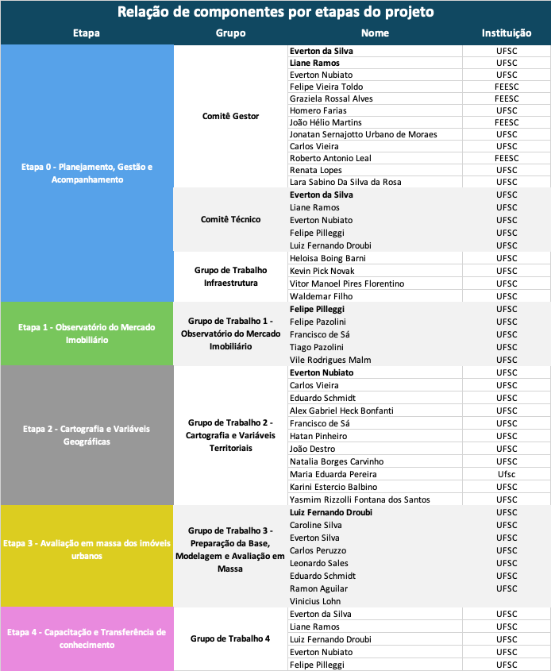

# Apresentação {.unnumbered}

A Universidade Federal de Santa Catarina – UFSC, no âmbito do Termo de Execução
Descentralizada (TED) firmado com a Receita Federal do Brasil – RFB, com gestão
administrativa e financeira da Fundação de Ensino e Engenharia de Santa Catarina
– FEESC, vem apresentar o Relatório Técnico referente ao período de execução do
projeto de desenvolvimento da metodologia de determinação do Valor de Referência
para o Cadastro Imobiliário Brasileiro.

O presente relatório contempla as atividades desenvolvidas no período
correspondente ao primeiro ciclo de execução do projeto, com destaque para a
fase inicial de mobilização, estruturação técnica, organização das bases de
dados, desenvolvimento da Prova de Conceito (POC) em Florianópolis/SC e avanço
das etapas relacionadas ao Observatório do Mercado Imobiliário, Bases
Cartográficas Territoriais e Modelagem.

Neste relatório estão apresentados os principais resultados alcançados no
período, incluindo os avanços metodológicos, a estruturação das bases de dados e
a evolução das atividades técnicas, considerando o acompanhamento sistemático
das etapas previstas no Plano de Gerenciamento do Projeto.

Os principais dados institucionais do projeto estão a seguir relacionados:

- Instrumento: Termo de Execução Descentralizada (TED) – RFB/UFSC

- Data da assinatura: 23/12/2026

- Início das atividades: 26/12/2025

- Duração: 60 meses

- Valor: 7.800.000,00

- Nº Contrato/ Convenio - FEESC: 174/2025

- Nº do Processo: 23080.064460/2019-37

- Coordenação Geral: Prof. Everton da Silva

- Instituição Executora: Universidade Federal de Santa Catarina – UFSC

- Gestão Administrativa: Fundação de Ensino e Engenharia de Santa Catarina – FEESC

- Objeto: Apoiar a Receita Federal na definição e execução de metodologia para 
apuração do Valor de Referência de imóveis urbanos, considerando determinações 
da Lei Complementar nº 214, de 16 de janeiro de 2025.

- Data de início do projeto: 26/12/2025

- Plano de Gerenciamento: Apresentado em 03/02/2026 e entregue/validado em 05/02/2026

A equipe executora do projeto no âmbito da Universidade Federal de Santa
Catarina (UFSC), com apoio da Fundação de Ensino e Engenharia de Santa Catarina
(FEESC), está estruturada de forma a garantir a adequada condução técnica,
científica e administrativa das atividades previstas no TED. Essa organização
contempla a atuação integrada de um Comitê Técnico, responsável pelo
desenvolvimento metodológico, execução das atividades técnicas e validação dos
produtos, e de um Comitê Administrativo, responsável pelo suporte à gestão do
projeto, incluindo acompanhamento financeiro, contratual e operacional.

O Comitê Técnico é composto por docentes e pesquisadores vinculados ao Grupo de
Pesquisa GOTT – Grupo de Observação e Transformação do Território, com
reconhecida experiência nas áreas de cadastro territorial, avaliação imobiliária
e geotecnologias. Já o Comitê Administrativo, vinculado à FEESC, assegura a
execução administrativa e financeira do projeto, garantindo conformidade com os
instrumentos institucionais e suporte às atividades técnicas.

A composição detalhada da equipe técnica executora da UFSC/FEESC, incluindo
alunos, técnicos, docentes e pesquisadores, organizada por etapa do plano de
trabalho, encontra-se descrita no quadro -@fig-quadro1, permitindo a
visualização detalhada da alocação de recursos humanos, conforme as frentes de
atuação definidas no projeto.

{#fig-quadro1}

O presente relatório está estruturado conforme as fases e etapas definidas no
Plano de Gerenciamento do Projeto (PGP), com base na organização metodológica do
TED, contemplando a descrição das atividades desenvolvidas, os resultados
alcançados e a análise do avanço técnico do projeto.

As etapas apresentadas estão diretamente relacionadas às metas e objetivos
estabelecidos no plano de trabalho, permitindo o acompanhamento sistemático da
execução e a avaliação da evolução do projeto em suas diferentes dimensões:
dados, cartografia, modelagem, infraestrutura e governança.
